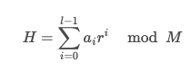

- [해시 테이블](#해시-테이블)
  * [해시(Hash)](#해시hash)
  * [해시 함수 만들기](#해시-함수-만들기)
  * [딕셔너리(dictionary)](#딕셔너리dictionary)
    + [파이썬 docs: hash(object)](#파이썬-docs-hashobject)
    + [오잉?](#오잉)
  * [해시 충돌](#해시-충돌)
  * [해시 테이블](#해시-테이블)
    + [버킷의 크기](#버킷의-크기)
    + [충돌 문제 해결](#충돌-문제-해결)
    + [파이썬에서의 해시 충돌?](#파이썬에서의-해시-충돌)

-------------------

# 해시 테이블

## 해시(Hash)

<u>**랜덤 길이**</u> 데이터를 <u>**고정 길이**</u>의 데이터로 매핑하는 것


- 이 때 해시 함수가 데이터 값을 input으로 받고 고정된 길이의 해시 값으로 매핑해준다.
- 해시 함수는 해시 알고리즘, 해시함수알고리즘 이라고 한다.
- 해시값을 통해 입력을 찾을 수 없으므로 보안 분야에도 사용된다. (hash digest... 등)
- 길이가 다른 입력데이터에 일정한 길이의 출력을 만들 수 있어서 데이터 축약 기능도 수행할 수 있다.

## 해시 함수 만들기
해시 함수를 직접 만들 수도 있을까?
네!

[백준 15829 Hashing](https://www.acmicpc.net/problem/15829)



```python
r, M = 31, 1234567891
L = int(input())
word = list(input())
hash_value = 0
for i in range(L):
    hash_value += ((ord(word[i]) - ord('a') + 1) * r ** i) % M
print(hash_value% M)
```


## 딕셔너리(dictionary)

파이썬의 딕셔너리를 생각해보자.

딕셔너리에 아이템을 넣고, 접근하고, 뺄 때 모두 시간복잡도가 O(1)이다. 이게 어떻게 가능한 걸까?

key값을 `해시 함수`를 통해 항상 같은 값으로 매핑하여, 그곳에 value를 저장할 수 있기 때문이다.

그렇다면 파이썬의 `해시 함수`는 뭘까?

> ### [파이썬 docs: hash(object)](https://docs.python.org/3/library/functions.html?highlight=hash#hash)
>
> ------
>
> ```
> Return the hash value of the object (if it has one). 
> Hash values are integers. 
> They are used to quickly compare dictionary keys during a dictionary lookup. 
> Numeric values that compare equal have the same hash value (even if they are of different types, as is the case for 1 and 1.0).
> ```
>
> hash()함수를 사용하면 오브젝트의 해시값을 계산해서 알려준다.
>
> - if it has one? python에서 모든게 hashable한 것은 아니다.
>
>   ```python
>   >>> dictionary = {}
>   >>> key = [1,2]
>   >>> dictionary[key] = 1
>   Traceback (most recent call last):
>     File "<stdin>", line 1, in <module>
>   TypeError: unhashable type: 'list'
>   ```
>
>   - python에선 <u>**immutable(변경이 불가능한) 값만 hashable**</u>하다!
>
> - 해시값은 정수고, dictionary를 살펴볼 때 key값을 빠르게 비교하기 위해 사용한다.

그럼 한번 hash 함수를 구경해보자!

```python
>>> hash("konkuk")
-3734272503573369823
>>> hash("ku")
-2414089773880885012
>>> hash("와!")
-8138568878266261821
>>> hash("good")
1119151410436183536
>>> hash("konkuk") # 항상 같은 값을 뱉는다.
-3734272503573369823
```

- 이 때 값은 컴퓨터 환경마다 다르고, 콘솔을 새로 실행할 때마다 바뀐다.

  ```python
  >>> hash("konkuk") 
  -8463985917580665906
  >>> hash("konkuk")
  -8463985917580665906
  ```

이렇게 나온 값을 이용해서 배열 인덱스에 접근하는 것처럼 빠르게(O(1)) 접근하고 사용할 수 있는 것이다.

### 오잉?

여기서 한 가지 의문이 들 수 있다.

보통 해시 함수는 입력값의 범위보다 출력 값의 범위가 좁으므로 수많은 값을 고정된 길이에 매핑하므로 <u>**반드시 겹치는 부분이 있을 수 밖에 없다는 것이다.**</u>

```
- 비둘기 집의 원리

N개의 상자에 N+1개의 물건을 넣으면 최소한 한 상자에는 물건이 두 개 이상 들어있다는 원리
```

  

한 번 파이썬 hash를 돌려보자..

```python
>>> hash(1.1)
230584300921369601
>>> hash(230584300921369601)
230584300921369601
```

1.1과 230584300921369601의 해시 값이 같다!

```python
>>> sys.hash_info
sys.hash_info(width=64, modulus=2305843009213693951, inf=314159, nan=0, imag=1000003, algorithm='siphash24', hash_bits=64, seed_bits=128, cutoff=0)
```

- 해시 정보는 위와 같았다.

```python
>>> hash(2305843009213693951)
0
>>> hash(0)
0
>>> hash(2305843009213693952)
1
>>> hash(1)
1
```

- 그렇다면 딕셔너리에 위 값들은 key로 쓰면 안되는걸까?

  - 그렇지 않다! 잘 구분하는 것을 볼 수 있다. 어떻게?

    
  
  ```python
  >>> dict = {2305843009213693951:0, 0:1, 2305843009213693952:2, 1:3}
  >>> dict
  {2305843009213693951: 0, 0: 1, 2305843009213693952: 2, 1: 3}
  >>> dict[0]
  1
  >>> dict[2305843009213693951]
  0
  ```

## 해시 충돌

이처럼 입력값이 다른데도 같은 해시값이 나오는 걸 해시 충돌이라고 한다.

하지만 해시 충돌의 가능성은 무조건 있음에도 해시 테이블을 사용한다. 적은 리소스로 많은 데이터를 효율적으로 관리하고, 검색, 삽입, 삭제를 빠르게 할 수 있기 때문이다.

> 예를 들어 Java에서 HashSet과 TreeSet을 살펴보면, TreeSet은 이진탐색트리를 사용하므로 O(log n)이 소요되지만 HashSet은 O(1)만 소요되므로, 정렬보다 검색, 삽입, 삭제가 중요한 경우에는 HashSet을 사용하는 것이 유리할 수 있다.

## 해시 테이블

딕셔너리처럼, 해시함수를 사용해서 key를 해시값으로 매핑하고, 이 해시값을 인덱스로 사용해서, value를 저장하는 자료구조다.

이 때 value가 저장되는 곳을 버킷 또는 슬롯이라고 한다.

### 버킷의 크기

키의 전체 개수와 버킷의 크기가 같다면 해시 충돌이 일어나지 않을 것이다. 하지만 보통 다뤄야할 데이터가 정말 많고, 메모리의 문제도 있으므로 보통은 실제 사용하는 키보다 해시테이블 크기가 작다.

### 충돌 문제 해결

그럼 피할 수 없는 충돌 문제를 어떻게 할까?

1. **체이닝** : 연결리스트로 노드를 계속 추가해나가는 방식 (제한 없이 계속 연결 가능, but 메모리 문제)

   그냥 같은 해시값을 갖는 애들을 링크드리스트처럼 모두 한 버킷에 때려넣는 것이다.

   

   앞에 데이터에 계속해서 연결하면서 체이닝한다.

   이 경우 문제점은, 새로운 값을 해시 테이블에 삽입하거나, 기존 값을 삭제, 탐색할 때마다 링크드리스트 삽입/삭제/탐색하는 시간이 추가로 든다는 것이다.

2. **Open Addressing** : 해시 함수로 얻은 주소가 아닌 다른 주소에 데이터를 저장할 수 있도록 허용 (해당 키 값에 저장되어있으면 다음 주소에 저장)

   위 체이닝 방법과 달리 한 버킷엔 한 엔트리만 들어간다.

   예를 들어 해시 충돌이 일어나면, 대신 해시값으로 나온 인덱스가 아닌 다음 인덱스에 값을 넣어볼 수 있다.

   - 문제점

     | 0    | 1    | 2    | 3    | 4    |
     | ---- | ---- | ---- | ---- | ---- |
     |      | a    |      |      |      |

     | 0    | 1             | 2    | 3    | 4    |
     | ---- | ------------- | ---- | ---- | ---- |
     |      | a <- b(충돌!) |      |      |      |

     | 0    | 1              | 2    | 3    | 4    |
     | ---- | -------------- | ---- | ---- | ---- |
     |      | a <- c (충돌!) | b    |      |      |

     | 0    | 1    | 2    | 3    | 4    |
     | ---- | ---- | ---- | ---- | ---- |
     |      | a    | b    | c    |      |

     - a와 b와 c의 해시값이 모두 1로 같다고 해보자.

     - 이 상태에서 b를 삭제하고 싶다면 어떻게할까?

       - 우선 b의 해시값인 1을 보고, b는 아니지만 해시 충돌이 있어서 다음 주소에 저장한 걸 수도 있으니까 다음 주소에서 b를 찾는다.

       - b를 찾았으니 b를 삭제한다.

         | 0    | 1    | 2    | 3    | 4    |
         | ---- | ---- | ---- | ---- | ---- |
         |      | a    | 0    | c    |      |

       - 여기서 c를 삭제하고 싶다면 어떻게 할까?

       - a를 보고, 다음 주소가 비워져있으므로 c가 없다고 생각할 것이다.

   - **탐사** : 정해진 고정 폭으로 옮겨 해시값의 중복을 피함

     - 선형 탐사: 위 open addressing처럼 고정폭을 옮겨서 저장한다.
       - **제곱 탐사** : 정해진 고정 폭을 <u>**제곱수**</u>로 옮긴다.
### 파이썬에서의 해시 충돌?

- 파이썬의 해시 테이블은 오픈 어드레싱 방식을 구현한다.

  > [cpython](https://hg.python.org/cpython/file/52f68c95e025/Objects/dictobject.c#l296)
  >
  > ```
  > Open addressing is preferred over chaining since the link overhead for
  > chaining would be substantial (100% with typical malloc overhead)
  > ```


- open addressing 중 하나인 linear probing 방식은 일반적으로 체이닝보다 성능이 좋지만(cache misses가 작을 수록 성능이 좋음), 슬롯의 80% 이상이 차게 되면 급격한 성능 저하가 일어나며, 체이닝과 달리 슬롯 이상의 데이터를 저장할 순 없다.
- 따라서 최근 루비나 파이썬 같은 모던 언어들은 오픈 어드레싱 방식을 택해서 성능을 높이고, 데이터를 적게 저장(load factor를 작게)해서 성능 저하 문제를 해결한다. 파이썬의 load factor는 0.66으로 자바보다 작으며 루비는 0.5로 훨씬 작다.

--------------

- 참고
  - [해싱, 해시함수, 해시테이블](https://ratsgo.github.io/data%20structure&algorithm/2017/10/25/hash/)
  - [KR] 자료구조 & 알고리즘 : 해시 테이블(Hash Table)](https://lucaseo.github.io/posts/2021-02-19-python-datastructure-hash-table/#42-open-addressing-%eb%b0%a9%ec%8b%9d)
