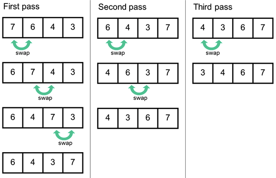
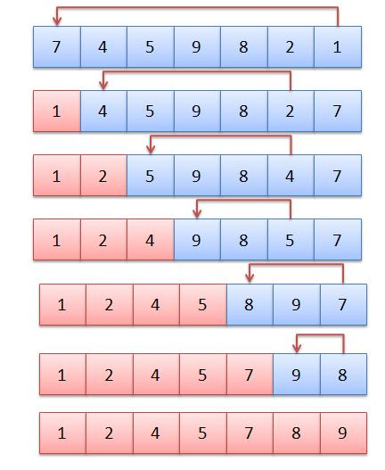
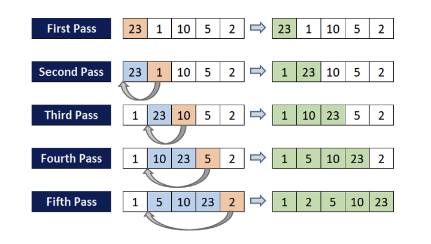
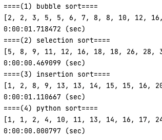

# 정렬 기초

## Bubble Sort

이웃하는 숫자를 모두 비교해 큰은 숫자를 뒤로 보내는 정렬 알고리즘

이 때 정렬이 이루어지는 모습이 마치 **거품** 같다고 하여 **Bubble Sort** 라는 이름이 붙었다. 

### 그림으로 보는 Bubble Sort



### 의사코드

```python
입력: 크기가 n인 배열 A
출력: 정렬된 배열 A

for j = 0 ~ n
    for i = 0 ~ n - j - 1
        if A[i] > A[i + 1]
            swap(A[i], A[i + 1])
```

### 시간복잡도

2중 for 문을 돌면서 크기 비교가 (n - 1) + (n - 2) + … 2 + 1 번 일어난다. 따라서 최악의 경우 버블 정렬의 시간복잡도는 O(n<sup>2</sup>) 이다. 

### 공간복잡도

주어진 배열 안에서 swap 으로 정렬이 수행되므로 공간 복잡도는 O(n) 이다.

## Selection Sort

주어진 배열에서 가장 작은 값을 **선택** 해 앞으로 보내는 정렬이다. 배열 전체에서 가장 작은 값을 0번 원소와 교체하고 이후 0번 원소를 제외한 나머지 원소 중 가장 작은 값을 1번 원소와 교체하는 방식으로 마지막에 두 개의 원소 중 작은 값을 선택해 자리를 바꿈으로 정렬을 완료한다.

### 그림으로 보는 Selection Sort



### 의사코드

```python
입력: 크기가 n인 배열 A
출력: 정렬된 배열 A

for i = 0 ~ n - 1
    min = A[i]
    for j = i + 1 ~ n
        if A[j] < min
            min = A[j]
    swap(A[i], min)
```

### 시간복잡도

버블정렬과 동일하게 (n - 1) + (n - 2) + … 2 + 1 번 크기 비교가 일어난다. 따라서 최악의 경우 선택정렬의 시간복잡도는 O(n<sup>2</sup>) 이다. 

### 공간복잡도

버블정렬과 동일하게 주어진 배열 안에서 swap 을 통해 정렬을 수행하므로 O(n) 이다.

## Insertion Sort

배열을 정렬된 앞 부분과 정렬되지 않은 뒷 부분으로 나누고 정렬되지 않은 부분의 가장 왼쪽 원소를 정렬된 부분의 적절한 위치에 **삽입** 하는 정렬 방식이다. 

### 그림으로 보는 Insertion Sort



### 의사코드

```python
입력: 크기가 n인 배열 A
출력: 정렬된 배열 A

for i = 1 ~ n
    currentElement = A[i]
    for j = i - 1 ~ -1
        if A[j] > currentElement
            swap(A[j], currentElement)
```

### 시간복잡도

매 반복마다 정렬된 부분의 길이만큼의 비교가 필요하다. 따라서 1 + 2 + … + (n - 2) + (n - 1) 의 비교가 일어난다. 최악의 경우 시간복잡도는 O(n<sup>2</sup>) 이다. 

### 공간복잡도

버블정렬과 동일하게 주어진 배열 안에서 swap 을 통해 정렬을 수행하므로 O(n) 이다.

## 수행속도 비교 (with python)

```python
def bubble(arr: list):
    for j in range(len(arr)):
        for i in range(len(arr) - j - 1):
            if arr[i] > arr[i + 1]:
                arr[i], arr[i + 1] = arr[i + 1], arr[i]
    return arr

def selection(arr: list):
    for i in range(len(arr)):
        min_value = arr[i]
        min_idx = i
        for j in range(i + 1, len(arr)):
            if arr[j] < min_value:
                min_value = arr[j]
                min_idx = j
        arr[i], arr[min_idx] = arr[min_idx], arr[i]
    return arr

def insertion(arr: list):
    for i in range(1, len(arr)):
        j = i
        while j > 0 and arr[j] < arr[j-1]:
            arr[j-1], arr[j] = arr[j], arr[j-1]
            j -= 1
    return arr

if __name__ == '__main__':
    print("====(1) bubble sort====")
    arr = np.random.randint(low=0, high=10000, size=4000).tolist()
    start = time.time()
    print(bubble(arr))
    end = time.time()
    print(datetime.timedelta(seconds=(end - start)), "(sec)")

    print("====(2) selection sort====")
    arr = np.random.randint(low=0, high=10000, size=4000).tolist()
    start = time.time()
    print(selection(arr))
    end = time.time()
    print(datetime.timedelta(seconds=(end - start)), "(sec)")

    print("====(3) insertion sort====")
    arr = np.random.randint(low=0, high=10000, size=4000).tolist()
    start = time.time()
    print(insertion(arr))
    end = time.time()
    print(datetime.timedelta(seconds=(end - start)), "(sec)")

    print("====(4) python sort====")
    arr = np.random.randint(low=0, high=10000, size=4000).tolist()
    start = time.time()
    print(sorted(arr))
    end = time.time()
    print(datetime.timedelta(seconds=(end - start)), "(sec)")
```

시간복잡도가 O(n<sup>2</sup>) 임을 감안해 크기 4000의 랜덤한 배열로 수행 속도를 비교해 보았다.



시간복잡도가 O(nlogn) 인 파이썬 기본 정렬과는 달리 (1), (2), (3) 정렬 방식 모두 굉장히 큰 시간이 소요됨을 확인할 수 있었다. 

## In Place Sorting

In Place Sorting 이란 정렬 방식 중 원소의 개수에 비해 충분히 무시할 만한 저장 공간만을 더 사용하는 알고리즘이다. 예를 들어 길이가 n 인 배열을 정렬하기 위해 O(1) 만큼의 저장 공간을 추가로 사용하는 알고리즘의 경우 In Place Sorting 알고리즘에 속한다. 

위에서 살펴본 Bubble Sort, Selection Sort, Insertion Sort 는 모두 In Place Sorting 알고리즘에 속한다. 반면 Merge Sort, Radix Sort 등은 In Place Sorting 알고리즘에 속하지 않는다.

## Stable Sorting

안정 정렬 (Stable Sort) 이란 중복된 값을 입력 순서와 동일하게 정렬하는 알고리즘을 말한다. 예를 들어 정렬할 배열이 `[5, 3, 7(1), 2(1), 11, 7(2), 29, 2(2)]` 라고 하면 정렬 이후 `[2(1), 2(2), 3, 5, 7(1), 7(2), 11, 29]` 의 순서가 되는것을 보장해야 한다. 

위에서 살펴본 Bubble Sort, Insertion Sort 와 Merge Sort 는 안정 정렬에 속한다. 반면 Selection Sort 와 Quick Sort 는 불안정 정렬에 속한다. 

참고로 자바에서는 Primitive Type 정렬의 경우 불안정 정렬인 Dual Pivot - Quick Sort 를 사용하고 Object Type 정렬에서는 안정 정렬인 Tim Sort 를 사용한다.