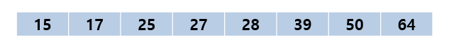

# Radix Sort (기수 정렬)

기수 정렬이란?
데이터를 구성하는 기본 요소 즉 기수 별로 비교 없이 수행하는 정렬 알고리즘이다.

- 장점
  - 기수로는 정수, 낱말, 천공카드 등 다양한 자료를 사용할 수 있으나 크기가 유한하고 사전순으로 정렬할 수 있어야 한다.
  - 기수 정렬은 정렬 알고리즘의 이론상 성능의 한계인 O(nlog₂n)을 넘어설 수 있는 유일한 알고리즘이다.

- 단점
  - 자릿수가 없는 것은 정렬할 수 없음. (부동 소숫점)
  - 중간 결과를 저장할 bucket 공간이 필요함.

## 정렬 과정

1. 0~9 까지의 Bucket(Queue 자료구조의)을 준비한다.

2. 모든 데이터에 대하여 가장 낮은 자리수에 해당하는 Bucket에 차례대로 데이터를 둔다.

3. 0부터 차례대로 버킷에서 데이터를 다시 가져온다.

4. 가장 높은 자리수를 기준으로 하여 자리수를 높여가며 2번 3번 과정을 반복한다.

1의 자리 먼저 정렬 후 배열 모습

10의 자리 정렬 후 배열 모습

> 참고 주소: https://jeonyeohun.tistory.com/105

전체 시간 복잡도는 O(w(n + k)) ( w는 기수의 크기, k는 기수의 도메인 크기)
보통은 O(dn)(d는 최대 자릿수) -> O(n)으로 본다.

## 정렬 방식

### LSD

작은 자릿수부터 정렬을 진행한다.

같은 길이의 키는 사전순으로 정렬된다.

정렬 이후에도 중복된 값들의 자리가 바뀌지 않는 안정 정렬이다.

### MSD

큰 자릿수부터 정렬을 진행한다.

문자열이나 고정 길이 정수 표현에 적합하다.

불안정 정렬이다.
