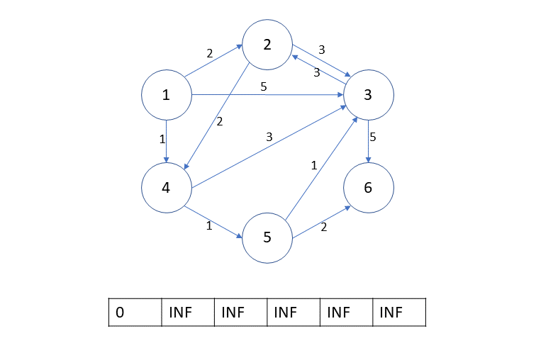
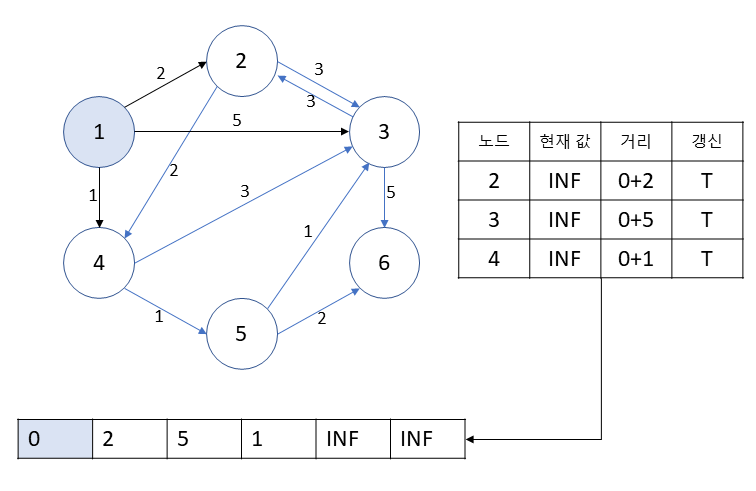
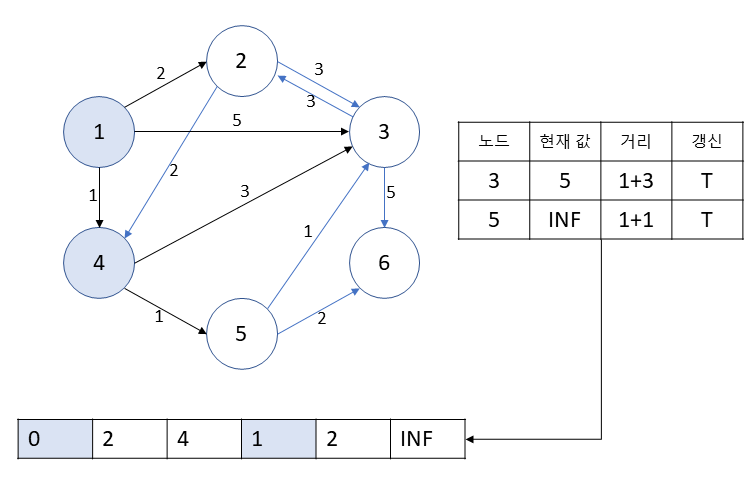
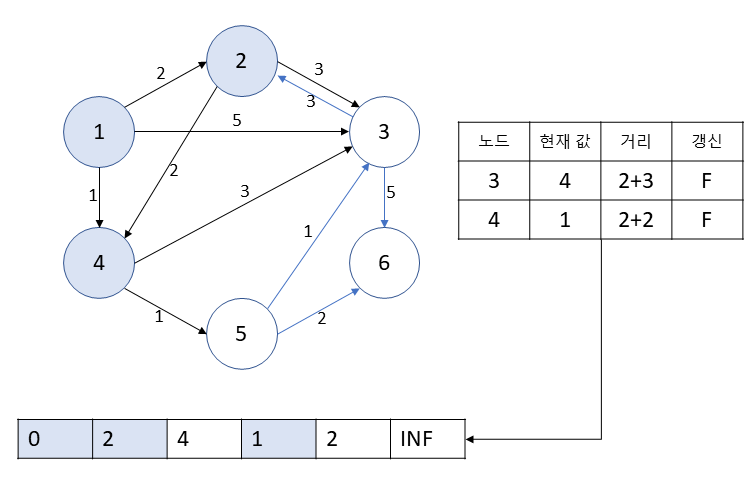
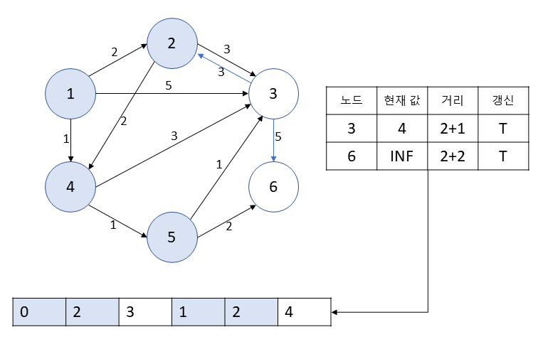
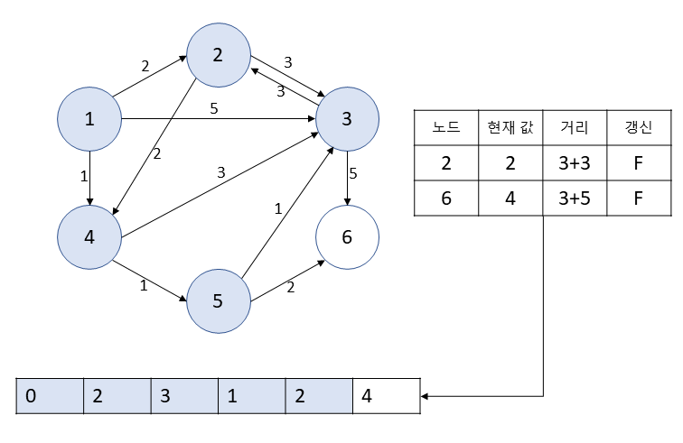
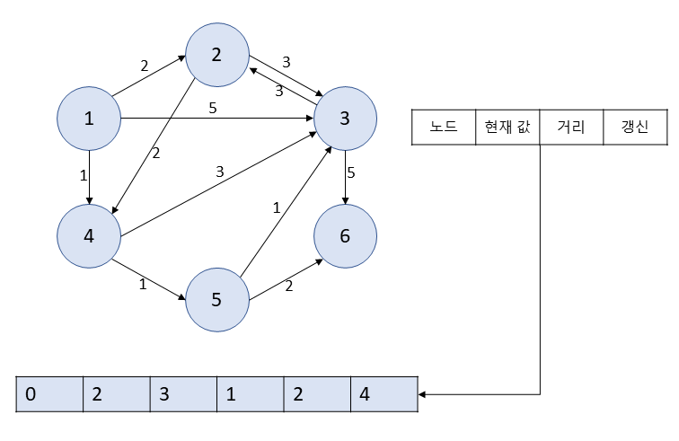

# [Algorithm] 다익스트라(Dijkstra) 알고리즘
---

## 다익스트라(Dijkstra) 알고리즘
- 그래프에서 정점 간의 최단 경로 탐색 알고리즘
- 특정한 하나의 정점에서 다른 모든 정점으로 가는 최단 경로를 구함
    - 가능한 모든 정점 쌍에 대한 최단 경로 탐색 알고리즘 👉 플로이드-와샬 알고리즘
- 음의 간선을 포함할 수 없다
    - 음의 간선은 포함하지만 음의 사이클은 없을 때의 최단 경로 탐색 알고리즘 👉 벨만-포드 알고리즘
- 다이나믹 프로그래밍, 그리디를 활용
    - 매 순간 가장 비용이 적은 정점을 선택해 임의의 과정을 반복
    - 최단 거리는 여러 개의 최단 거리로 이루어져 있기 때문에 다이나믹 프로그래밍을 활용
    - 하나의 최단 거리를 구할 때 그 이전까지 구했던 최단 거리 정보를 그대로 사용
    - 한 번 처리된 정점의 최단 거리는 고정되어 더 이상 바뀌지 않음

## 알고리즘
1. 출발 노드 설정
2. 출발 노드를 기준으로 각 노드의 최소 비용을 저장 (자기 자신은 0, 간선이 없다면 INF)
3. 방문하지 않은 노드 중에서 가장 비용이 적은(최단 거리가 가장 짧은) 노드 선택
4. 해당 노드를 거쳐서 다른 노드들로 가는 경우를 고려하여 최소 비용 갱신
5. 3번 ~ 4번 반복















## 시간복잡도
- 알고리즘의 3번에서 가장 비용이 적은 노드를 찾는 과정을 어떻게 구현하는 지에 따라 다름
- 가장 비용이 적은 노드를 선택하는 것은 최대 V번 반복되고, 이 과정에서 비교는 최대 E번 발생하므로 `선형 탐색`으로 구현하는 경우, $O(V^2+E)$
- `우선순위 큐(힙 구조)`를 활용하는 경우, $O(E+VlogV)$, $O(ElogV)$으로 만들 수 있다.
    - 비교는 최대 간선의 개수만큼 발생하고 반복하는 것은 우선순위 큐에 E번 넣고 E번 꺼내가는 것과 유사 👉 $O(E+2ElogE)=O(ElogE)$
    - 이때 중복 간선이 없다면 $E < V^2$이므로 $O(ElogE)=O(ElogV^2)=O(2ElogV)=O(ElogV)$
    - 간선을 모두 우선순위 큐에 넣었다가 빼내는 것이므로 정점의 개수는 많은데 간선은 적을 때 더욱 효율적이다.
>|우선순위 큐 구현 방식|삽입 시간|삭제 시간|
>|:---:|---|---|
>|리스트|O(1)|O(N)|
>|힙|O(logN)|O(logN)|

---
## 플로이드-와샬 알고리즘
- 변의 가중치가 음이거나 양인 그래프에서 최단 경로를 찾는 알고리즘
- 모든 정점 쌍 간의 최단 경로를 구할 수 있다.
- 다이나믹 프로그래밍을 활용
- 알고리즘
``` python
def Floyd_Warshall():  
    for m in range(1, n+1):  
        for start in range(1, n+1):  
            for end in range(1, n+1):  
                g[start][end] = min(g[start][end], g[start][m] + g[m][end])
```
- 시간복잡도  
    |최악|최선|평균|
    |:---:|:---:|:---:|
    |$V^3$|$V^3$|$V^3$|

---
## 벨만-포드 알고리즘
- 음의 가중치를 가지는 간선이 있으며 가중치 합이 음인 사이클이 존재하지 않는 경우 사용
- 가중치 합이 음인 사이클이 존재한다면 경로 합이 음수 무한대로 발산해서 그래프에서 최단 경로를 구할 수 없다.
- 특정한 하나의 정점에서 다른 모든 정점으로 가는 최단 경로를 구함
- 알고리즘
    1. 출발 노드 설정
    2. 최단 거리 테이블 초기화
    3. **모든 간선을 확인하여** 각 간선을 거쳐 다른 노드로 가는 비용을 최단 거리 테이블에서 갱신한다. (edge relaxation)
    4. 3번 과정을 (V-1)번 반복한다.
- 시간복잡도
    |최악|최선|
    |:---:|:---:|
    |$VE$|$E$|

---
- [출처](https://ko.wikipedia.org/wiki/데이크스트라_알고리즘)
- [출처](https://www.youtube.com/watch?v=acqm9mM1P6o&t=2210s)
- [출처](https://ko.wikipedia.org/wiki/플로이드-워셜_알고리즘)
- [출처](https://ko.wikipedia.org/wiki/벨먼-포드_알고리즘)