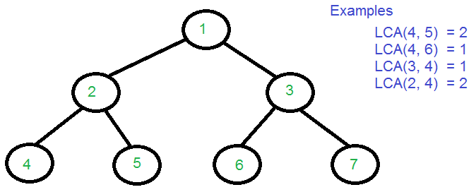
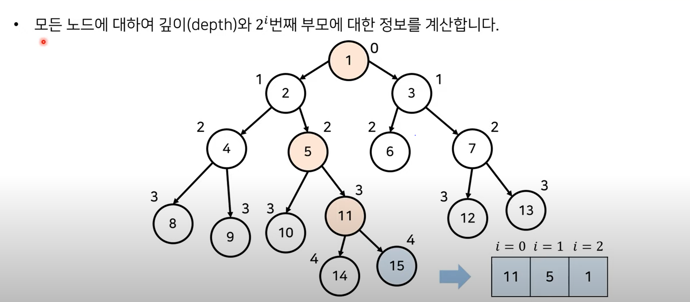

# LCA

Lowest Common Ancestor란?

    최소 공통 조상 찾는 알고리즘

    → 두 정점이 만나는 최초 부모 정점을 찾는 것


## 찾는 방법

어떻게 찾죠?

해당 정점의 depth와 parent를 저장해두는 방식이다. 현재 그림에서의 depth는 아래와 같을 것이다.

    ```c
    [depth : 정점]
    0 → 1(root 정점)
    1 → 2, 3
    2 → 4, 5, 6, 7
    ```

parent는 정점마다 가지는 부모 정점을 저장해둔다. 위의 예시에서 저장된 parent 배열은 아래와 같다.

    ```java
    // 1 ~ 7번 정점 (root는 부모가 없기 때문에 0)
    int parent[] = {0, 1, 1, 2, 2, 3, 3}
    ```

이제 이 두 배열을 활용해서 두 정점이 주어졌을 때 LCA를 찾을 수 있다. 과정은 아래와 같다.

    ```java
    // 두 정점의 depth 확인하기
    while(true){
        if(depth가 일치)
            if(두 정점의 parent 일치?) LCA 찾음(종료)
            else 두 정점을 자신의 parent 정점 값으로 변경
        else // depth 불일치
            더 depth가 깊은 정점을 해당 정점의 parent 정점으로 변경(depth가 감소됨)
    }
    ```

이런 방식으로 구현할 경우 시간복잡도는 `O(depth)`가 나온다.

이를 빠르게 하기 위해 이분탐색을 이용해보자.

## 개선된 LCA 알고리즘



각 노드가 거슬러 올라가는 속도를 2의 제곱 형태로 올라가도록 하여 O(logN)의 시간복잡도를 가집니다.

15칸을 올라가려면 8+4+2+1칸 순서로 올라감

메모리를 더 사용하여 각 노드에 대하여 2^i번째 부모에 대한 정보를 기록합니다.

공간 복잡도를 늘리고 시간 복잡도를 줄이는 Trade-off 기술
