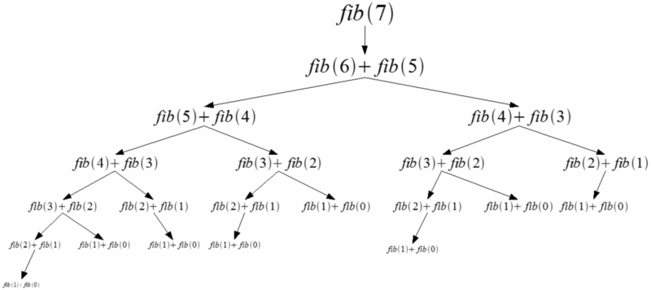

# LIS

LIS (Longest Increasing Subsequence) 란 주어진 수열을 가지고 만든 부분 수열이

1. 각 원소는 이전 원소보다 크다.
2. 부분 수열의 길이가 최대가 된다.

위의 두 조건을 모두 만족하는 부분 수열을 말한다.

예를 들어 `[10, 20, 40, 25, 20, 50, 30, 70, 85]` 로 구성된 수열에서 1번 조건을 만족하는 부분 수열을 나열해 보면 `[10, 20, 40]`, `[20, 50, 70, 85]`, `[30, 70, 85]` 등 수많은 조합을 생각해 볼 수 있다. 2번 조건까지 모두 만족하는 LIS는 `[10, 20, 25, 30, 70, 85]` 등이 있다.

## 구현

### 1. 완전탐색

배열을 입력받아 첫 번째 원소 부터 시작하여 증가 수열을 구성해 보고 이때 길이가 최대가 되는 경우를 탐색한다.

```python
def lis(arr):
    if not arr:
        return 0
    
    ret = 1
    for i in range(len(arr)):
        nxt = []
        for j in range(i + 1, len(arr)):
            if arr[i] < arr[j]:
                nxt.append(arr[j])
        ret = max(ret, 1 + lis(nxt))
    return ret
```

첫 원소가 arr[i] 라고 할 때 arr[i] 로 시작하는 LIS는 arr[i + 1] 로 시작하는 부분 수열 중 arr[i] 보다 큰 숫자들로 만들 수 있는 LIS + 1 임을 쉽게 알 수 있다.

### 시간복잡도



피보나치 함수를 재귀로 구현했을때와 마찬가지로 이미 계산된 값을 다시 재귀호출하여 계산하는 경우가 발생한다! 완전탐색으로 LIS를 구현할 경우 시간복잡도가 O(2<sup>n</sup>) 가 된다.

### 2. 동적 계획법

메모이제이션 기법을 적용해 이미 계산한 값을 중복 계산하는 일을 없앨 수 있다. 

```python
def lis(arr):
    arr = [-inf] + arr
    N = len(arr)
    cache = [-1] * N

    def find(start):
        if cache[start] != -1:
            return cache[start]

        ret = 0
        for nxt in range(start + 1, N):
            if arr[start] < arr[nxt]:
                ret = max(ret, 1 + find(nxt))

        cache[start] = ret
        return ret

    return find(0)
```

cache는 모든 원소가 -1로 초기화 된 1차원 리스트이다. arr[start] 위치에서 시작하는 LIS가 미리 계산되어 있으면 이 값을 활용할 수 있다. `find(start)` 함수는 arr[start] 위치에서 시작하는 LIS를 리턴한다. 이 때 find 함수는 캐시를 확인해 이미 계산 했으면 계산된 값을 바로 리턴한다. 

### 시간복잡도

완전 탐색 방법에서 생겼던 중복 계산 문제가 해결되었다! 0번 인덱스부터 시작해 배열 전체를 순회하면서 O(n) 짜리 부분 문제를 n개 생성하므로 O(n<sup>2</sup>)의 시간복잡도를 가진다.

### 3. 이분 탐색

지금까지 알아보았던 방식과는 약간 다르다. cache 배열을 준비하되 cache[i] 는 i번째 인덱스 부터의 LIS 가 아닌, 길이가 i인 증가수열 중 크기가 가장 작은 마지막 값이 들어간다. 

예를들어 `[5, 6, 7, 1, 2]` 수열에서 찾을 수 있는 길이가 1 이면서 크기가 가장 작은 증가수열의 마지막 값은 1이다. 길이가 2 이면서 크기가 가장 작은 증가수열의 마지막 값은 2이다. 마찬가지로 길이가 3 일때의 마지막 값은 7이다. 즉 현재까지의 cache 배열은 [1, 2, 7, inf, inf] 가 된다.

cache의 인덱스 i 중 cache[i]가 inf 가 아닌 최대의 i 가 우리가 구하고자 하는 LIS의 길이가 된다. 우리는 배열을 순회하면서 cache의 적절한 위치의 값을 갱신해주기만 하면 된다. 이 위치를 공식으로 나타내면 다음과 같다.

순회하는 다음 수를 n, 현재까지 찾은 LIS의 길이를 last 라고 했을 때

```python
if cache[last] < n:
    cache[last + 1] = n
elif cache[i - 1] < n <= cache[i]:
    cache[i] = n
```

첫 번째 공식은 이전에 찾은 임시 LIS의 마지막 값 보다 현재 순회하는 수가 크면 해당 수를 붙이는 것이다. 

두 번째 공식은 n이 부분수열의 최소값 최대값 중간에 있는 경우의 동작이다. n 뒤에 나올 숫자가 무엇일 지 크기가 어떨 지 현재까진 알 수 없기 때문에 cache의 값을 항상 최소로 유지시켜서 대비할 수 있다. 

이 때 우리의 임시 부분수열은 증가수열이기 때문에 이미 정렬되어 있다! 따라서 이분 탐색을 통해 새로운 값 n 이 들어갈 위치 i를 찾을 수 있다.

```python
def lis(arr):
    if not arr:
        return 0

    # cache[i] means smallest last number of lis subsequences whose length are i
    cache = [inf] * (len(arr) + 1)
    cache[0] = -inf
    cache[1] = arr[0]
    tmp_longest = 1

    # Find i that matches C[i-1] < n <= C[i]
    def search(lo, hi, n):
        if lo == hi:
            return lo
        elif lo + 1 == hi:
            return lo if cache[lo] >= n else hi

        mid = (lo + hi) // 2
        if cache[mid] == n:
            return mid
        elif cache[mid] < n:
            return search(mid+1, hi, n)
        else:
            return search(lo, mid, n)

    # arr 순회 및 LIS 탐색
    for n in arr:
        if cache[tmp_longest] < n:
            tmp_longest += 1
            cache[tmp_longest] = n
        else:
            next_loc = search(0, tmp_longest, n)
            cache[next_loc] = n

    return tmp_longest
```

### 시간복잡도

개선된 세 번째 알고리즘은 길이 n인 배열 arr을 순회하면서 O(logn) 인 이분 탐색을 수행하고 있다. 따라서 시간복잡도는 O(nlogn) 으로 가장 좋은 수행 결과를 보여준다.