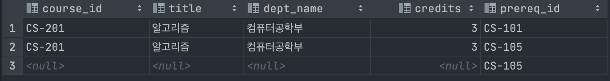

# SQL - JOIN

## 예시 테이블

- `course`


- `prereq`


```sql
CREATE DATABASE join_db;

USE join_db;

CREATE TABLE course(
    course_id varchar(20),
    title varchar(20),
    dept_name varchar(20),
    credits int,
    PRIMARY KEY (course_id)
);

INSERT INTO course values('CS-101', '데이터베이스', '컴퓨터공학부', 3);
INSERT INTO course values('CS-103', '데이터사이언스개론', '컴퓨터공학부', 3);
INSERT INTO course values('CS-105', '자료구조', '컴퓨터공학부', 3);
INSERT INTO course values('CS-201', '알고리즘', '컴퓨터공학부', 3);
INSERT INTO course values('CS-303', '컴퓨터공학세미나', '컴퓨터공학부', 1);

CREATE TABLE prereq(
    course_id varchar(20),
    prereq_id varchar(20),
    PRIMARY KEY (course_id, prereq_id)
);

INSERT prereq values('CS-201', 'CS-101');
INSERT prereq values('CS-201', 'CS-105');
INSERT prereq values('CS-204', 'CS-105');
```

# INNER JOIN

- 교집합으로, 기준 테이블과 join 테이블의 중복된 값을 보여준다.


```sql
SELECT c.course_id, title, dept_name, credits, p.prereq_id
FROM course c join prereq p on c.course_id = p.course_id;
```


# LEFT OUTER JOIN

- 왼쪽 테이블을 기준으로 join해서, 왼쪽 테이블에 모든 데이터가 나타난다.


```sql
SELECT c.course_id, title, dept_name, credits, p.prereq_id
FROM course c LEFT JOIN prereq p on c.course_id = p.course_id
```

# RIGHT OUTER JOIN




```sql
SELECT c.course_id, title, dept_name, credits, p.prereq_id
FROM course c RIGHT JOIN prereq p on c.course_id = p.course_id;
```

# FULL OUTER JOIN

- 합집합으로, join에서 빠진 데이터도 null을 이용해서 나타낸다. 즉 모든 데이터가 검색된다.


```sql
SELECT c.course_id, title, dept_name, credits, p.prereq_id
FROM course c LEFT JOIN prereq p on c.course_id = p.course_id
UNION
SELECT c.course_id, title, dept_name, credits, p.prereq_id
FROM course c RIGHT JOIN prereq p on c.course_id = p.course_id;
```

# CROSS JOIN

- 모든 경우를 표현해준다. 따라서 (1번 테이블 row 개수)*(2번 테이블 row 개수) 만큼 모두 나타난다.


```sql
SELECT c.course_id, title, dept_name, credits, p.prereq_id
FROM course c CROSS JOIN prereq p;

SELECT c.course_id, title, dept_name, credits, p.prereq_id
FROM course c, prereq p;
```

# SELF JOIN

- 자기 자신과 자기 자신을 조인한다.
- 자신이 갖고 있는 컬럼을 변형시켜 활용할 때 활용한다.


```sql
SELECT *
FROM course c1, course c2;
```


