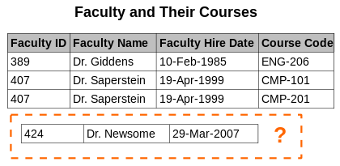
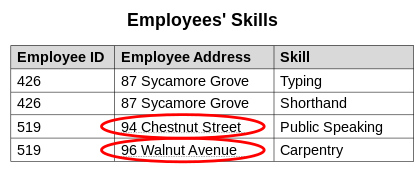
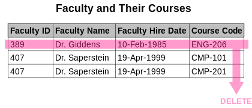
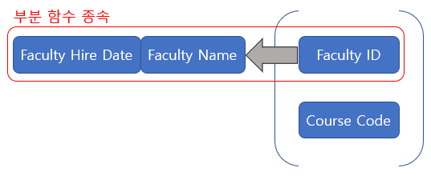

# [Database] 이상(Anomaly)
---
## 이상(Anomaly)
- 정규화 되지 않은 데이터베이스에서 발생하는 문제
- 테이블 안에서 데이터 중복성에 의해서 발생되는 데이터 불일치 현상
- 릴레이션 안에서 일부 속성들의 종속이나 데이터의 중복으로 인해 데이터 조작시 불일치가 발생하는 현상
- 애트리뷰트들의 종속관계를 하나의 릴레이션에 표현하기 때문에 발생하는 현상
 
      
## 종류
### 삽입 이상 (Insertion Anomaly)
- 불필요한 정보를 함께 저장하지 않고서는 어떤 정보를 저장이 불가능  

- 현재 테이블에서 아직 강의가 없는 교수는 수업 코드가 널(빈값)이어서 수업 코드가 식별컬럼(널 비허용)인 이 테이블에 추가할 수가 없게 됨  

### 갱신 이상 (Modification/Update Anomaly)
- 반복된 데이터 중에서 일부를 갱신할 때 데이터의 불일치가 발생  

- 같은 정보가 여러 튜플에서 표현 중일 때 갱신하면 논리적인 불일치가 발생한다.
- 현재 릴레이션에서 특정 직원의 주소 변경은 여러 레코드에 적용해야 한다. 하지만 업데이트가 부분적으로 성공하면 테이블은 모순 상태가 되고 해당 직원의 주소에 대한 질문의 대답이 달라질 수 있다.  

### 삭제 이상 (Deletion Anomaly)
- 필요한 정보를 함께 삭제하지 않고서는 어떤 정보를 삭제가 불가능  

- 현재 릴레이션에서 임의의 과정에서 레코드가 릴레이션에서 삭제된다면 그 교수에 대한 정보를 아예 잃어버릴 수 있다.

## 해결책
- **정규화**  

- 키 (Faculty ID, Course Code)
- (Faculty ID, Course Code) -> Faculty Name, Faculty Hire Date  
Faculty ID -> Faculty Name, Faculty Hire Date
- 키가 아닌 Faculty Name, Faculty Hire Date는 (Faculty ID, Course Code)에 함수적 종속이면서 (Faculty ID, Course Code)의 부분집합인 Faculty ID에서 다시 함수적 종속이므로 완전 함수적 종속이 아니다 

- 갱신 이상 발생: 이름을 바꿀때  
삭제 이상 발생: 수업이 하나인 교수의 정보 삭제 시 교수 정보도 삭제  
삽입 이상 발생: 수업이 하나도 없는 교수 삽입 불가능  

  

|Faculty ID|Faculty Name|Faculty Hire Date|
|---|---|---|
|389|Dr.Giddens|10-Feb-1985|
|407|Dr.Saperstein|19-Apr-1999|

|Faculty ID|Course Code|
|---|---|
|389|ENG-206|
|407|CMP-101|
|407|CMP-102|

---

- 키 (Employee ID, Skill)
- (Employee ID, Skill) -> Employee Address  
Employe ID -> Employee Address
- 키가 아닌 Employee Address는 (Employee ID, Skill)에 함수적 종속이면서 (Employee ID, Skill)의 부분집합인 Employee ID에서 다시 함수적 종속이므로 완전 함수적 종속이 아니다 
- 갱신 이상 발생: 직원 주소를 바꿀 때  
삭제 이상 발생: 스킬이 하나인 직원의 정보 삭제 시 직원 정보도 삭제  
삽입 이상 발생: 스킬이 하나도 없는 직원 삽입 불가능

|Employee ID|Employee Addresss|
|---|---|
|426|87 Sycamore Grove|
|519|94 Chestnut Street|

|Employee ID|Skill|
|---|---|
|426|Typing||
|426|Shorthand||
|519|Public Speaking|
|519|Carpentry|

### [출처](https://en.wikipedia.org/wiki/Database_normalization)
