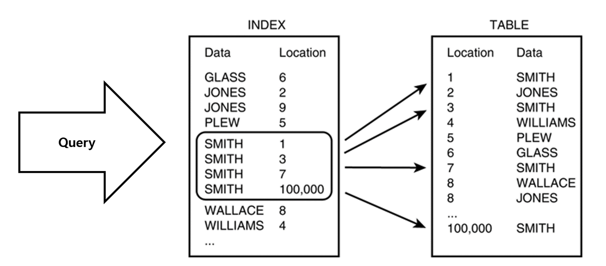

# 인덱스

인덱스는 테이블에서 검색을 빠르게 하기 위한 별도의 자료구조이다. 

책에서 인덱스 페이지에 각 키워드에 해당하는 페이지 번호가 쓰여져 있는 구조와 동일하다. 테이블의 특정 컬럼으로 인덱스를 만들면 해당 컬럼과 실제 주소를 (key, value) 형태로 저장한다.



인덱스는 내부적으로 데이터를 정렬시켜 저장하고 있기 때문에 빠른 탐색이 가능하다.

## 장점

인덱스를 사용하지 않은 경우 특정 조건에 맞는 데이터를 찾기 위해서 전체 테이블을 Full Scan 해야 했지만 인덱스를 사용하면 해당 조건에 맞게 이미 정렬되어있기 때문에 원하는 데이터를 빠르게 찾을 수 있다. MIN/MAX 값도 빠르게 찾을 수 있다.

## 단점

인덱스를 유지하기 위한 추가적인 작업이 필요하다. 테이블에 INSERT, UPDATE, DELETE 등의 DML 명령이 들어오면 정렬된 인덱스를 유지하기 위해 인덱스 내에서도 처리해주는 과정이 생긴다. 예를 들어 내부적으로 인덱스를 B Tree를 이용해 저장하고 있을 경우 트리 높이를 균형있게 조정하고 새로운 노드를 삽입하는 비용이 든다.

인덱스를 저장하는 추가 공간을 필요로 한다. 인덱스 또한 어딘가에 저장되어야 한다. (key, value) 형태이므로 일반적인 테이블 보다는 크기가 작지만 인덱스 개수가 많아지면 필요한 공간도 늘어난다.

### 인덱스 사용을 피해야 하는 경우

**선택도 (Selectivity)가 높은 경우**

> 선택도란 전체 데이터에서 조건절에 의해 선택되는 레코드의 비율을 의미
selectivity = 컬럼의 특점 값의 ROW 수 / 테이블의 총 ROW 수 * 100
> 

선택도가 높은 컬럼을 인덱스로 만들 경우 쿼리 성능 향상에 도움이 되지 않는다. 이렇게 만들어둔 인덱스는 DBMS가 아예 사용하지 않고 전체 테이블을 Full Scan 할 수도 있다. 일반적으로 선택도가 5 ~ 10% 인 컬럼을 인덱스로 만드는것이 좋다.

**삽입, 수정, 삭제가 빈번한 경우**

INSERT: 새로운 데이터에 대한 인덱스 추가

DELETE: 기존 데이터를 **사용하지 않음** 처리

UPDATE: 기존 데이터를 **사용하지 않음** 처리, 갱신된 데이터에 대해 인덱스 추가

위와 같이 DML 조작이 빈번하면 인덱스 크기가 점점 커진다. 

## 복합 인덱스

복합 인덱스는 컬럼 여러 개를 묶어서 하나의 인덱스로 만드는 것을 의미한다. 

이때 컬럼은 WHERE 절에서 조건으로 사용되는 컬럼, JOIN 절에 외래키로 사용되는 컬럼, ORDER BY 절에 사용되는 컬럼 등이 포함될 수 있다. 이렇게 여러 컬럼들로 복합 인덱스를 구성하면 선택도를 낮게 만들 수 있어 효율이 좋을 수 있다.

복합 인덱스를 만들 때는 컬럼들의 순서가 매우 중요하다.

**Equal 비교 컬럼을 다른 연산보다 우선**

```sql
SELECT *
FROM Sample
WHERE 컬럼1 = ?
AND 컬럼2 = ?
AND 컬럼3 > ?
AND 컬럼4 = ?
```

위 쿼리에서 컬럼 3에서 대소 비교를 했기 때문에 인덱스는 컬럼 3 까지만 사용되고 컬럼 4에서는 사용되지 않는다. 위 쿼리 전체가 인덱스를 타기 위해서는 인덱스의 컬럼이 (컬럼1, 컬럼2, 컬럼4, 컬럼3) 순서로 되어 있어야 한다.

## 인덱스 자료구조

### 해시테이블


탐색 시간으로는 다른 어떤 자료구조보다 빠른 해시테이블을 인덱스에서 사용할 수도 있다. 그러나 equal(=) 비교가 아닌 부등호 (<,>) 비교 요청이 들어올 경우 O(1)의 시간 복잡도를 보장하기 어렵다.

### B Tree


노드 하나에 여러 데이터가 저장될 수 있으며 데이터와 데이터 사이의 범위를 이용해 자식 노드를 가진다. B 트리는 밸런스를 유지하는 균형트리이기 때문에 O(logN) 만에 원하는 데이터를 탐색할 수 있다.

### B+ Tree


## 인덱스가 효율적인 이유

- 균형잡힌 트리를 사용하고 있기 때문
- 트리 깊이의 확장성

