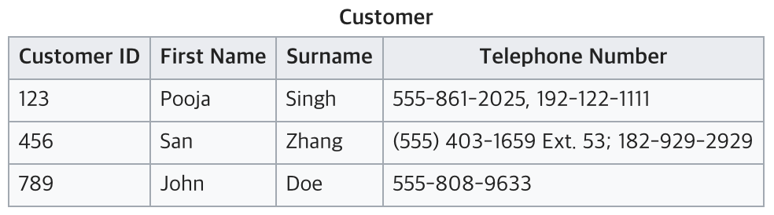
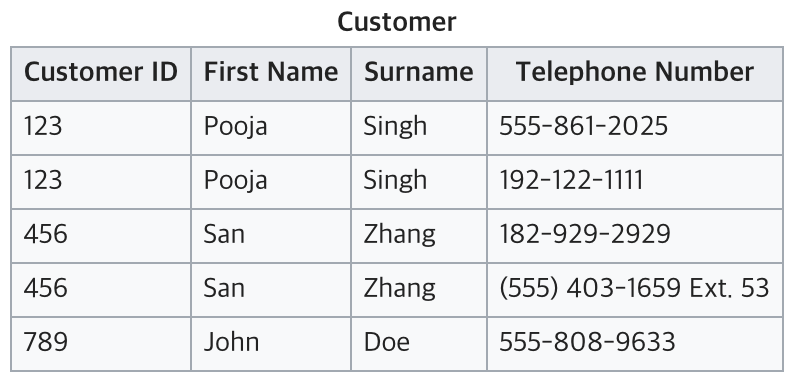
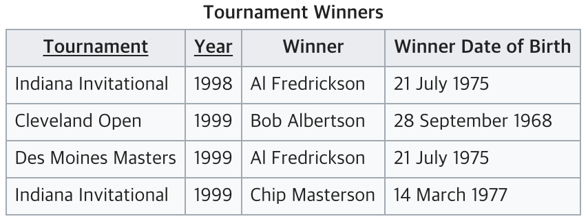
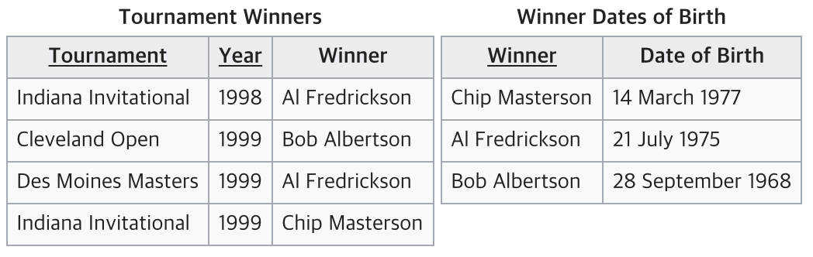

# 정규화

## 데이터 베이스 정규화란?

정규화 (Normalization)

데이터의 종복을 줄이고 무결성을 향상시키는 등 여러 목적을 달성하기 위해서 재디자인하는 것이다.

### 목적

- 불필요한 데이터를 제거, 데이터의 중복을 최소화 하기 위해서
- 데이터베이스 구조 확장 시 재디자인을 최소화
- 다양한 관점에서의 query를 지원하기 위해서
- 무결성 제약조건의 시행을 간단하게 하기 위해서
- 각종 이상 현상(Anomaly) 을 방지하기 위해서, 테이블의 구성을 논리적이고 직관적으로 한다.

> 💡 이상현상이란?
>
> - 삽입 이상(Insertion Anomaly)
튜플 삽입 시 특정 속성에 해당하는 값이 없어 NULL을 입력해야 하는 현상

> - 삭제 이상(Deletion Anomaly)
튜플 삭제 시 같이 저장된 다른 정보까지 연쇄적으로 삭제되는 현상

> - 갱신 이상(Update Anomaly)
튜플 갱신 시 중복된 데이터의 일부만 갱신되어 일어나는 데이터 불일치 현상

## 정규화의 과정

### 제 1 정규화 (First Normal Form, 1NF)

테이블 컬럼이 원자값(하나의 값)을 갖도록 테이블을 분리시키는 것을 말한다.

- 어떤 Relation에 속한 모든 Domain이 원자값(atomic value)만으로 되어 있다.
- 모든 attribute에 반복되는 그룹(repeating group)이 나타나지 않는다.
- 기본 키를 사용하여 관련 데이터의 각 집합을 고유하게 식별할 수 있어야 한다.

현재 테이블은 전화번호를 여러개 가지고 있어 원자값이 아니다. 따라서 1NF에 맞추기 위해서는 아래와 같이 분리할 수 있다.

⬇️

### 제 2 정규화 (Second Normal Form, 2NF)

제 2정규화를 수행 했을 경우 테이블의 모든 컬럼이 **완전 함수적 종속**을 만족한다. (부분 함수적 종속을 모두 제거되었다.)
이를 이해하기 위해서는 부분 함수적 종속과 완전 함수적 종속이라는 용어를 알아야 한다.

- 함수적 종속
X의 값에 따라 Y값이 결정될 때 X -> Y로 표현하는데, 이를 Y는 X에 대해 함수적 종속 이라고 한다. 예를 들어 학번을 알면 이름을 알 수 있는데, 이 경우엔 학번이 X가 되고 이름이 Y가 된다.
X를 결정자이라고 하고, Y는 종속자라고 한다. 다른 말로 X가 바뀌었을 경우 Y가 바뀌어야만 한다는 것을 의미한다.
- 함수적 종속에서 X의 값이 여러 요소일 경우, 즉, {X1, X2} -> Y일 경우, X1와 X2가 Y의 값을 결정할 때 이를 완전 함수적 종속 이라고 하고, X1, X2 중 하나만 Y의 값을 결정할 때 이를 부분 함수적 종속 이라고 한다.

Model과 Manufacturer를 알면 Model Full Name 속성을 참조하지 않아도 값을 알 수 있다. 때문에 Model Full Name은 Manufacturer과 Model에 **완전 함수적 종속**이다.
Manufacturer Country는 Manufacturer와만 종속관계가 있고 Model과는 연관이 없기 때문에 **부분 함수적 종속**이다.

### 제 3 정규화 (Third Normal Form, 3NF)

테이블(Relation)이 제 3정규형을 만족한다는 것은 아래 두 가지 조건을 만족하는 것을 의미한다.

- Relation이 제 2정규화 되었다.(The relation is in second normal form)
- 기본 키(primary key)가 아닌 속성(Attribute)들은 기본 키에만 의존해야 한다.

다음은 두번째 조건이 위반된 사례이다.

위 테이블에서 {Tournament, Year}가 후보키가 된다. 하지만 Winner Date of Birth은 기본키가 아닌 속성인 Winner를 거쳐 {Tournament, Year}에 의존하고 있는 것을 알 수 있는데, 이는 3NF를 위반한 것이다. 따라서 테이블을 둘로 나누어 주자.

> 출처
> https://wkdtjsgur100.github.io/database-normalization/
> https://ko.wikipedia.org/wiki/%EB%8D%B0%EC%9D%B4%ED%84%B0%EB%B2%A0%EC%9D%B4%EC%8A%A4_%EC%A0%95%EA%B7%9C%ED%99%94
> 