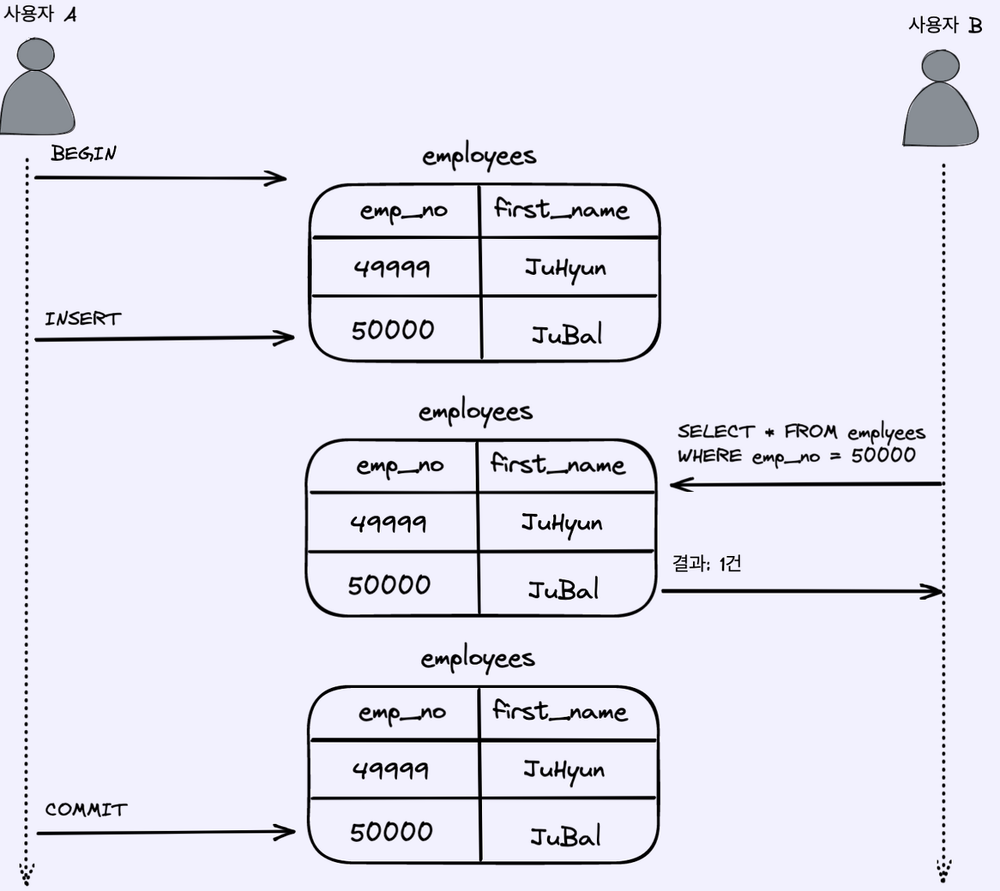
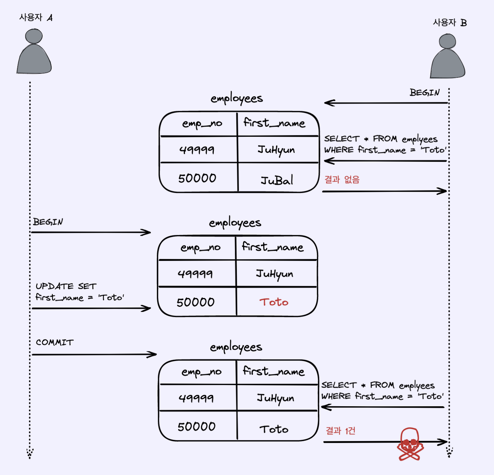
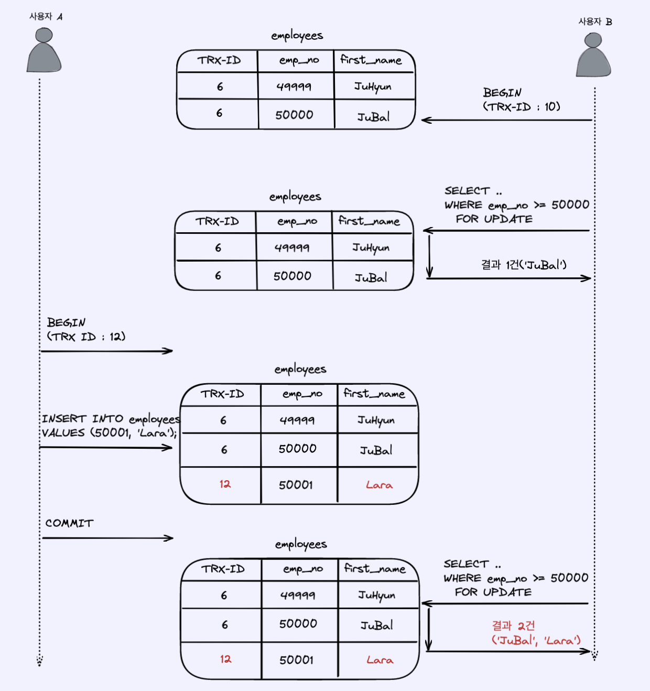
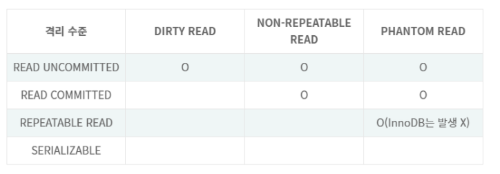

# 트랜잭션 격리 수준 (Transaction Isolation Level)

## Isolation level이란?

트랜잭션에서 일관성 없는 데이터를 허용하도록 하는 수준

## Isolation level의 필요성

데이터베이스는 ACID 특징과 같이 트랜잭션이 독립적인 수행을 하도록 한다.

따라서 Locking을 통해, 트랜잭션이 DB를 다루는 동안 다른 트랜잭션이 관여하지 못하도록 막는 것이 필요하다.

하지만 무조건 Locking으로 동시에 수행되는 수많은 트랜잭션들을 순서대로 처리하는 방식으로 구현하게 되면 데이터베이스의 성능은 떨어지게 될 것이다.

그렇다고 해서, 성능을 높이기 위해 Locking의 범위를 줄인다면, 잘못된 값이 처리될 문제가 발생하게 된다.

> 따라서 최대한 효율적인 Locking 방법이 필요함!

## Isolation level 종류

----

1. ### Read Uncommitted (레벨 0)

   > SELECT 문장이 수행되는 동안 해당 데이터에 Shared Lock이 걸리지 않는 계층

    트랜잭션에 처리중이거나, 아직 Commit되지 않은 데이터를 다른 트랜잭션이 읽는 것을 허용함

    ```
    사용자1이 A라는 데이터를 B라는 데이터로 변경하는 동안 사용자2는 아직 완료되지 않은(Uncommitted) 트랜잭션이지만 데이터B를 읽을 수 있다
    ```

    데이터베이스의 일관성을 유지하는 것이 불가능함

<br>

2. ### Read Committed (레벨 1)

    > SELECT 문장이 수행되는 동안 해당 데이터에 Shared Lock이 걸리는 계층

    트랜잭션이 수행되는 동안 다른 트랜잭션이 접근할 수 없어 대기하게 됨

    Commit이 이루어진 트랜잭션만 조회 가능

    대부분의 SQL 서버가 Default로 사용하는 Isolation Level임

    ```
    사용자1이 A라는 데이터를 B라는 데이터로 변경하는 동안 사용자2는 해당 데이터에 접근이 불가능함
    ```

<br>

3. ### Repeatable Read (레벨 2)

    > 트랜잭션이 완료될 때까지 SELECT 문장이 사용하는 모든 데이터에 Shared Lock이 걸리는 계층

    트랜잭션이 범위 내에서 조회한 데이터 내용이 항상 동일함을 보장함

    다른 사용자는 트랜잭션 영역에 해당되는 데이터에 대한 수정 불가능

    MySQL에서 Default로 사용하는 Isolation Level

<br>

4. ### Serializable (레벨 3)

    > 트랜잭션이 완료될 때까지 SELECT 문장이 사용하는 모든 데이터에 Shared Lock이 걸리는 계층

    완벽한 읽기 일관성 모드를 제공함

    다른 사용자는 트랜잭션 영역에 해당되는 데이터에 대한 수정 및 입력 불가능

    <br>

## 낮은 단계 Isolation Level을 활용할 때 발생하는 현상들

- Dirty Read

  > 커밋되지 않은 수정중인 데이터를 다른 트랜잭션에서 읽을 수 있도록 허용할 때 발생하는 현상
  >
  > 어떤 트랜잭션에서 아직 실행이 끝나지 않은 다른 트랜잭션에 의한 변경사항을 보게되는 경우  
  - 발생 Level: Read Uncommitted
  
  
    > 사용자 A는 emp_no = 50000 , first_name = 'JuBal' 인 새로운 사원을 삽입하고 있다.
    > 그리고 사용자 B는 사용자 A가 변경한 내용을 커밋하기도 전에 emp_no = 50000 인 사원을 검색하고 있다.
    > 이때 사용자 B의 SELECT 쿼리 결과에서는 사용자 A가 삽입한 커밋되지 않은 새로운 사원이 조회된다.
    > 여기서 문제는 만약 사용자 A가 작업 도중 문제가 발생하여 삽입한 내용을 롤백해도 사용자 B는 JuBal이 정상적인 사원이라 판단하고 계속해서 처리하게 된다.

- Non-Repeatable Read

  > 한 트랜잭션에서 같은 쿼리를 두 번 수행할 때 그 사이에 다른 트랜잭션 값을 수정 또는 삭제하면서 두 쿼리의 결과가 상이하게 나타나는 일관성이 깨진 현상
  - 발생 Level: Read Committed, Read Uncommitted
  
  
    >위 그림에서 사용자 B가 BEGIN 명령으로 트랜잭션을 시작하고 first_name = 'Toto'인 사원을 조회하면 일치하는 데이터가 존재하지 않습니다.
    >하지만 이후에 사용자 A가 emp_no = 50000인 사원의 이름을 'Toto'로 수정하고 커밋한 후 사용자 B는 동일한 쿼리로 조회하면 이번에는 결과가 1건이 조회가 됩니다.
    >이는 별다른 문제는 없어보이나 사용자 B가 하나의 트랜잭션내에서 동일한 SELECT 쿼리를 실행했을 때 항상  같은 결과를 보장해야 한다는 "REPEATABLE READ" 정합성에 어긋나게 됩니다.

- Phantom Read

  > 한 트랜잭션 안에서 일정 범위의 레코드를 두 번 이상 읽었을 때, 첫번째 쿼리에서 없던 레코드가 두번째 쿼리에서 나타나는 현상
  >
  > 트랜잭션 도중 새로운 레코드 삽입을 허용하기 때문에 나타나는 현상임
  - 발생 Level: Repeatable Read, Read Committed, Read Uncommitted
  
  
  >위 그림에서 사용자 B는 트랜잭션 시작(BEGIN) 후 SELECT 쿼리를 수행하고 있습니다. 
  따라서 이전 REPEATABLE READ 격리 수준에서의 설명처럼 동일한 트랜잭션 내에서는 결과가 동일해야 합니다.
    >하지만 위 그림에서 사용자 B가 실행하는 두 번의 SELECT .. FOR UPDATE 쿼리 결과는 서로 다릅니다.
    이렇게 다른 트랜잭션에서 수행한 변경 작업에 의해 레코드가 보였다가 안보였다가 하는 현상을 PHANTOM READ(PHANTOM ROW)라고 합니다.
    >SELECT .. FOR UPDATE 쿼리는 SELECT하는 레코드에 쓰기 잠금을 걸어야 하는데, 언두 레코드에는 잠금을 걸 수 없습니다.
    >따라서 위와 같은 쿼리는 언두 영역의 변경 전 데이터를 가져오는 것이 아니라 현재 레코드의 값을 가져오게 됩니다


