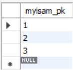
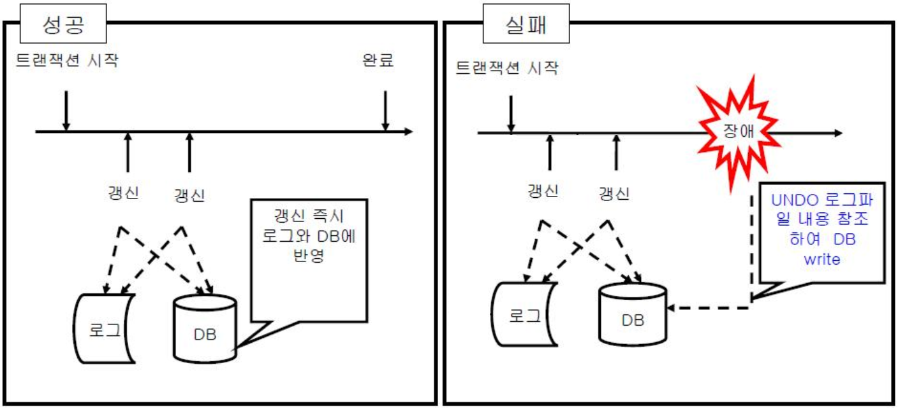

# [Database] 트랜잭션(Transaction)
---

## 트랜잭션이란
- DBMS에서 상호작용 단위, 논리적 작업 단위
- 여러 쿼리로 구현되더라도 하나의 동작처럼 작동해야 하는 단위
```
은행에서의 계좌이체 - 계좌이체 자체는 여러 단계로 구현될 수 있지만 전체적으로는 한 동작으로 이루어져야 함
```

---
## 트랜잭션 특징
### Atomicity(원자성)
트랜잭션이 데이터베이스에 모두 반영되거나, 하나도 반영되지 않아야 함  
트랜잭션과 관련된 작업들이 부분적으로 실행되다가 중단되지 않는 것  
하나의 작업이라도 실패하면 트랜잭션 전부를 취소  

>    ```
>    계좌 이체를 할 때, 전체적으로 모든 작업이 성공할 수도 실패할 수도 있지만, 
>    보내는 쪽에서 돈을 빼오는 것을 성공하고 받는 쪽에 돈을 넣는 것을 실패하는 경우와 같이 
>    일부 작업만 성공, 실패하는 경우는 없어야 함
>    ```
<br>

### Consistency(일관성)
트랜잭션이 실행을 성공적으로 완료하면 데이터베이스는 일관성을 유지  
트랜잭션 수행 이전과 이후의 데이터베이스 상태는 일관성이 유지되는 서로 다른 상태가 됨  

>    ```
>    보존해야 하는 일관성은 기본 키, 외래 키 제약 뿐만 아니라 
>    계좌 이체에서 두 계좌의 잔고의 합은 계좌 이체 전후가 동일하다는 것도 포함
>    ```
<br>

### Isolation(독립성)
트랜잭션 수행 시 다른 트랜잭션의 작업이 끼어들지 못하게 하는 것  
트랜잭션 밖의 작업은 중간 내용의 데이터를 볼 수 없음(참조할 수 없음)  

>    ```    
>    계좌 이체 도중에는 양 쪽 계좌를 볼 수 없음
>    ```
<br>

### Durability(영구성, 지속성)
트랜잭션이 실행을 성공적으로 완료하면 결과는 영원히 반영되는 것  
트랜잭션이 성공적으로 커밋되면 해당 트랜잭션에 의한 변경은 향후 어떤 소프트웨어나 하드웨어 장애가 발생되더라도 보존되어야 한다.  

<br>

---


``` MySQL

create table tab_myisam (
	pk int not null,
	primary key (pk)
) engine = MyISAM;
insert into tab_myisam (pk) values (3);

create table tab_innodb (
	pk int not null,
	primary key (pk)
) engine = INNODB;
insert into tab_innodb (pk) values (3);

insert tab_myisam (myisam_pk) values (1), (2), (3);
insert tab_innodb (innodb_pk) values (1), (2), (3);

```
|InnoDB|MyISAM|
|---|---|
|||

둘 다 에러는 발생하지만 결과가 다르다.  
트랜잭션이라고 해서 꼭 여러 개의 쿼리로 이루어져있어야 하는 것은 아니다.  

---
## 트랜잭션 연산 및 상태
### Commit 연산  
하나의 트랜잭션이 성공적으로 끝났고 데이터베이스가 일관된 상태에 있을 때, 이 트랜잭션이 갱신한 것을 트랜잭션 관리자에게 알려주는 연산
### Rollback 연산  
하나의 트랜잭션이 비정상작으로 종료되어 데이터베이스의 일관성을 깨뜨렸을 때, 트랜잭션이 행한 모든 연산을 취소하는 연산 -> 원자성 유지
<br>


---
## 장애 유형
- 트랜잭션 장애
- 시스템 장애
- 미디어 장애  
<br>

---
## 회복 기법
### Immediate update(즉시 갱신)  



트랜잭션 수행 도중 변경하게 되면 변경 정보를 로그 파일에 저장하고, 트랜잭션이 부분 완료되기 전이라도 모든 변경 내용을 즉시 데이터베이스에 반영하는 기법  
로그 파일을 참조하여 REDO와 UNDO 연산 모두 실행  
장애로 완료되지 못한 트랜잭션의 변경은 복구하는 UNDO와 커밋은 했지만 실제 반영여부는 알 수 없으므로 REDO 모두 필요

### Deferred update(지연 갱신)  


트랜잭션이 부분 완료 상태에 이르기까지 발생한 모든 변경 내용을 로그 파일에만 저장하고 데이터베이스에는 커밋이 발생할 때까지 저장을 지연하는 기법  
데이터베이스에는 저장하지 않았으므로 회복 과정에서 UNDO 연산이 필요 없음  
트랜잭션의 원자성 보장

### Checkpoint recovery

  

데이터베이스 트랜잭션 동작 과정에 주기적으로 Checkpoint를 기록하여 데이터베이스 장애 시 로그를 기반으로 회복하는 기법  
Checkpoint 까지는 트랜잭션들이 성공적으로 실행되었고 디스크에 확실히 저장된 상태  
가장 최근 Checkpoint 지점을 찾아 그 시점 이후의 로그만을 회복  
Checkpoint 기록 시 실행중인 트랜잭션 + 이후 시작한 트랜잭션을 UNDO, Checkpoint 이후 완료한 트랜잭션을 REDO

### Media recovery  
디스크와 같이 비휘발성 저장 장치의 내용이 손상되는 장애 발생 시 회복을 위한 기법  
데이터베이스 내용을 백업, 미러링, RAID 등을 사용해 별도의 물리적 저장장치에 덤프  
미디어 장애 발생 시 가장 최근 덤프로 복구하고 로그 기반으로 REDO  

<br>

---

## REDO와 UNDO

DBMS는 페이지 단위로 디스크에 데이터를 저장하고 일부분을 메인 메모리에 유지한다.  

메인 메모리에 유지하는 페이지를 관리하는 페이지 버퍼 관리자라는 모듈이 존재  

페이지 버퍼 관리자의 버퍼 관리 정책이 트랜잭션 관리에 중요한 결정을 함  
<br>
### UNDO
수정된 페이지를 디스크에 쓰는 기점을 기준으로 두 개의 정책으로 나누어 볼 수 있다.  

- STEAL : 수정된 페이지를 언제든지 디스크에 쓸 수 있는 정책
- ¬STEAL : 수정된 페이지들을 최소한 트랜잭션 종료 시점까지는 버퍼에 유지하는 정책  

¬STEAL은 간단하게 트랜잭션이 완료될 때까지 디스크에 수정된 페이지를 쓰지 않지만 그렇게 되면 매우 큰 메모리 버퍼가 필요하다는 문제가 있다.  

대부분의 DBMS는 STEAL을 사용하고 어느 시점에도 디스크에 써질 수 있기 때문에 로깅과 복구를 수반한다.  

STEAL은 트랜잭션이 아직 진행 중일지라도 변경된 페이지들이 버퍼 관리자에 의해 디스크에 출력한다.  

하지만 트랜잭션이 비정상적으로 종료되었다면, 디스크에 출력한 페이지는 원상복구되여야 한다. ⬅ **Atomicity**  

이때의 복구를 `UNDO`라고 한다.

<br>

### REDO

트랜잭션이 종료되는 시점에 해당 트랜잭션이 수정한 페이지들을 디스크에도 쓸 것인가 여부로 두 가지 정책이 구분된다.  

- FORCE : 수정했던 모든 페이지를 트랜잭션 커밋 시점에 디스크에 반영하는 정책
- ¬FORCE : 수정했던 페이지를 트랜잭션 커밋 시점에 디스크에 반영하지 않는 정책

FORCE는 트랜잭션이 커밋되면 수정되었던 페이지들이 이미 디스크 상의 데이터베이스에 반영되었으므로 복구가 필요 없다.  

¬FORCE는 커밋한 트랜잭션의 내용이 디스크 상의 데이터베이스 상에 반영되어 있지 않을 수 있기 때문에 복구가 필요하다.  

하지만 커밋한 트랜잭션의 수정은 어떤 경우에도 유지되어야 한다. ⬅  **Durability**

이미 커밋한 트랜잭션의 수정을 재반영하는 복구 작업은 `REDO`라고 한다.  

데이터베이스 백업으로부터 복구하는 미디어(아카이브) 복구 시에는 REDO가 요구되므로 대부분의 DBMS는 ¬FORCE를 사용한다.

---
## 트랜잭션 병행제어
여러 트랜잭션들이 동시에 실행되면서도 데이터베스의 일관성을 유지할 수 있게하는 기법
## 목적
데이터베이스 일관성 유지하면서 데이터베이스 공유 최대화, 시스템 활용도 최대화, 사용자 응답시간 최소화
## 트랜잭션 간섭으로 인한 문제점
|종류|내용|
|:---:|:---|
|갱신 분실(Dirty Write)|같은 데이터에 동시에 여러 트랜잭션이 갱신하려고 함|
|비완료 의존성(Dirty Read)|아직 커밋되지 않은 트랜잭션의 내용을 읽으려고 함|
|모순성(Non-repeatable Read)|동일 트랜잭션에서 동일한 대상을 여러 번 읽을 때 그 사이에 변경 또는 삭제가 반영되어 값이 변경됨|
|팬텀 읽기(Phantom Read)|동일 트랜잭션에서 동일한 대상을 여러 번 읽을 때 그 사이에 삽입되어 값이 변경됨
|연쇄 복귀(Cascade Rollback)<br> 회복 불가(Unrecoverable)|여러 트랜잭션이 실행되던 중 하나의 트랜잭션이 취소될 때 다른 트랜잭션들도 연쇄적으로 취소되는 현상 <br> 연쇄복귀 되어야 하는 트랜잭션들 중에서 트랜잭션이 종료되어 회복이 불가능해 지는 현상|

## 독립성 보장 기법
### 로킹(Locking)
운영체제에서의 세마포어와 비슷한 개념  

트랜잭션이 어떤 데이터에 접근할 때 Lock & 수행을 마치면 Unlock  

로킹이 되어 있는 데이터에는 다른 트랜잭션이 접근할 수 없음  

트랜잭션은 로킹이 된 데이터에 대해서만 연산 수행  

로킹 단위: 필드, 레코드, 파일, 데이터베이스 모두 로킹 단위가 될 수 있음  

로킹 단위가 크면 관리하기 용이(로킹 오버헤드 감소)하지만 병행성 수준(동시성 수준) 낮아짐  

로킹 단위가 작으면 병행성(동시성 수준)이 높아지지만 관리가 까다로움(로킹 오버헤드 증가)  

교착상태가 발생할 수 있다

### 2단계 로킹 규약(Two-Phase Locking Protocol)
여러 트랜잭션이 공유하고 있는 데이터에 동시에 접근할 수 없게 함  

Lock과 Unlock이 동시에 이루어지면 일관성이 보장되지 않으므로 Lock만 가능한 단계와 Unlock만 가능한 단계를 구분  

두 단계가 섞이지 않도록 함  


|단계|Lock|UnLock|
|:---|:---:|:---:|
|확장단계(상승단계, growing phase)|O|X|
|축소단계(하강단계, shrinking phase)|X|O|

직렬가능성을 보장한다.     

---
## 로그
로그는 로그 레코드들의 연속이고 데이터베이스의 모든 갱신 작업을 기록한다.  

이론적으로는 손실이 발생하지 않는 저장매체에 저장해야 하지만 현실 상에는 존재하지 않으므로 DBMS가 여러 개의 로그를 유지하는 방법 등을 사용하기 하지만 성능 상의 이유로 결국엔 하나의 로그를 유지한다.  

로그 레코드는 고유 식별자를 가지며 로그에 append된다.  

로그 레코드는 갱신 이전의 이미지와 갱신 이후의 이미지를 모두 가지고 있어서 UNDO나 REDO 할 때 이미지를 덮어쓰는 방식을 사용할 수도 있고 갱신 연산 그 자체를 저장하여 UNDO시에는 역연산을 REDO시에는 연산을 실행하는 방식을 수도 있다.  

갱신 연산을 저장하는 방법이 로그 레코드의 크기가 작아서 효율적이기도 하고 로그 레코드의 위치가 항상 같으라는 보장이 없으므로 이미지 저장 방식보다 쉽다.  

DBMS는 이렇게 다양한 로그들 중에서 하나만 골라서 사용하는 것이 아니라 몇십 종류씩 가지고 백 여개의 복구 연산을 가진다.  

DBMS는 로그 레코드를 위한 로그 버퍼를 유지했다가 트랜잭션이 커밋할 때, 데이터베이스에 변경할 때, 로그 버퍼가 찼을 때, Checkpoint 연산할 때 등 블럭 단위로 출력한다.  

로그 레코드가 손실되면 안되기 때문에 로그 레코드 작성 시 동기화를 신경쓰기 때문에 느리다.  

그래서 매 커밋마다 쓰지 않고 커밋 요구를 모아서 한번에 처리하거나 비동기로 지속성을 일부 포기하기도 한다.  


---
- 출처  
[https://ko.wikipedia.org/wiki/데이터베이스_트랜잭션](https://ko.wikipedia.org/wiki/데이터베이스_트랜잭션)  
[https://d2.naver.com/helloworld/407507](https://d2.naver.com/helloworld/407507)  
[https://writemylife.tistory.com/50](https://writemylife.tistory.com/50)  
[https://itwiki.kr/w/트랜잭션](https://itwiki.kr/w/트랜잭션)  
[https://victorydntmd.tistory.com/129](https://victorydntmd.tistory.com/129)  


