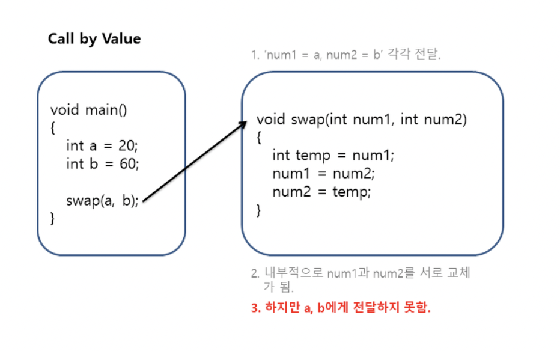

# [Java] Call by value / Call by reference

함수 호출 방법은 크게 두가지가 있다.

## Call by value

> 값에 의한 호출
> 
- 인자로 받은 값을 복사하여 처리
    - 물이 찬 컵과 똑같은 물 한컵을 준비해서 사용

- 아래 코드는 swap이 되지 않는다.

```c
#include <stdio.h>

void swap(int num1, int num2){
	int temp = num1;
	num1 = num2;
	num2 = temp;
}

int main(){
	int a = 10;
	int b = 20;
	
	printf("before : %d, %d\n", a, b);
	
	swap(a, b);
	
	printf("after : %d, %d\n", a, b);
	
	return 0;
}

/*
  before : 10, 20
  after : 10, 20
*/
```

- 지역변수(a, b)와 매개변수(num1, num2)는 값이 `Stack`에 할당✨
- swap 함수를 호출하는 순간 a, b 값을 num1, num2라는 새로운 값으로 복사하는 것!
- swap 내부적으로 처리가 일어나고 아무것도 넘기지 않기 때문에 a,b 값에는 변화 X
    - 그럼 a, b에 어떻게 접근할 수 있을까?✨

- `in Stack`
    - a = 10, b = 20
    - num1 = 20, num2 = 10



- C에는 콜바이 레퍼런스가 없다 ^^ 고쳐!

## Call by reference

> 참조에 의한 호출
> 
- 인자로 받은 값의 주소를 참조하여 직접 처리
    - 물이 찬 컵을 직접 가져다가 사용

- a, b를 직접 참조해서 swap 해보자

```c
#include <stdio.h>

void swap(int *num1, int *num2){
	int temp = *num1;
	*num1 = *num2;
	*num2 = temp;
}

int main(){
	int a = 10;
	int b = 20;
	
	printf("before : %d, %d\n", a, b);
	
	swap(&a, &b);
	
	printf("after : %d, %d\n", a, b);
	
	return 0;
}

/*
  before : 10, 20
  after : 20, 10
*/
```

- 값이 복사되는 점은 동일 → **복사되는 값이 데이터의 주소 값✨**
- `in Stack`
    - a = 10, b = 20
    - num1 = 0x00, num2 = 0x04

num1이 가리키는 값과 num2가 가리키는 값을 바꾸겠다!✨


## Java에서의 호출

- Person이라는 객체의 age라는 field 값을 변경해보자
    - p의 age 값이 바뀌었다 → call by reference ?

```java
class Example {
    public static void main(String[] args) {
        Person p = new Person(10);

        System.out.println("before : "+ p.age);

        getOlder(p);

        System.out.println("after : "+ p.age);
    }

    private static void getOlder(Person p){
        p.age++;
    }
}

/*
  before : 10
  after : 11
*/
```

### Java 메모리 구조

**Static**

**Stack**

- 메소드 내에서 정의하는 **primitive data type (int, double, byte, long, boolean 등)**
- 지역변수, 매개변수
- 해당 메소드가 호출 될 때 메모리에 할당되고 종료되면 메모리가 해제 됨

**Heap**

- 참조형 데이터
- 객체, 배열
- JVM의 Garbage Colletion에 의해 메모리 해제
- 데이터 자체는 Heap 영역에 있어도, 이 데이터를 가리키는 주소값 (참조값)은 Stack에 존재


- p = new Person(10)


- getOrder() 호출 후
    - p 값이 바뀐건가? 아니다!✨
    - p를 참조하는 값 (0x0004) 주소는 그대로임 → call by value


```
결국 call by value인지 call by reference인지 확인하는 법 
→ 직접 객체(값)의 주소가 바뀌는지 확인해야 한다‼️
```

- 직접 p의 값(주소값)을 바꿀 수도 있을까?

```java
class Example {
    public static void main(String[] args) throws Exception{
        Person p = new Person(10);

        System.out.println("before : "+ p.age);

        changePerson(p);

        System.out.println("after : "+ p.age);
    }

    private static void changePerson(Person p){
        p = new Person(50);
    }
}

// before : ?, after : ?
```


- p = new Person(50)
- 다른 인스턴스를 참조하도록 한다면?
    - main의 p (0x0004)가 0x000C로 값이 바뀌면 call by reference일 것


- 결과는,, changeOlder 함수가 종료되도 p는 0x0004로 그대로 남는다 → **Java는 Call by value!**
