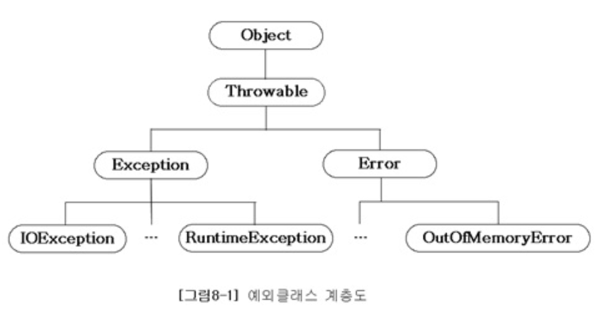
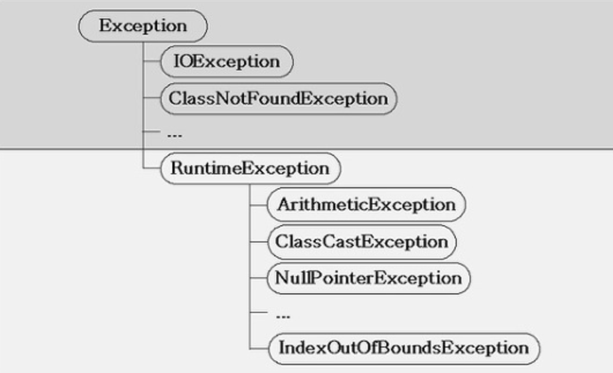

# Error & Exception

- [기본 개념](#-----)
  * [프로그램 에러](#-------)
    + [프로그램 에러의 종류](#-----------)
    + [실행 도중 발생하는 에러](#-------------)
  * [Exception과 Error 클래스의 상속 구조](#exception--error-----------)
    + [Error](#error)
    + [Exception](#exception)
  * [Exception Handling](#exception-handling)
    + [try-catch](#try-catch)
    + [예외 발생시키기 `throw`](#----------throw-)
    + [메서드에 예외 선언 `throws`](#------------throws-)
    + [`chained exception`](#-chained-exception-)
    + [사용자 정의 예외](#---------)
- [예외 잘 쓰기](#-------)
  * [`try-with-resources`를 이용하자](#-try-with-resources-------)
  * [Checked Exception?](#checked-exception-)
  * [예외 활용법 - 이펙티브 자바](#----------------)
    + [표준 예외를 사용하라 (Item 72)](#------------item-72-)
    + [추상화 수준에 맞는 예외를 던져라 (Item 73)](#-------------------item-73-)
    + [예외를 무시하지 말라 (Item 77)]()

# 📌 기본 개념

## 프로그램 에러

- 프로그램이 실행 중 어떤 원인에 의해서 오작동을 하거나 비정상적으로 종료되는 경우, 그 때 원인을 프로그램 에러 또는 오류라고 한다.

### 프로그램 에러의 종류

1. 컴파일 에러(compile-time error)

2. 런타임 에러(runtime error)

3. 논리적 에러(logical error)

   컴파일도 잘되고 실행도 잘되지만 의도와 다르게 동작

   - 예: 상품 재고가 음수가 됨

### 실행 도중 발생하는 에러

컴파일을 정상적으로 마쳐도 프로그램 실행 시에 에러가 발생할 수 있다. 이런 런타임 에러를 방지하기 위해서는 프로그램의 실행도중 발생할 수 있는 모든 경우의 수를 고려하여 이에 대한 대비를 해야 한다.

자바에선 런타임에 발생할 수 있는 오류를 <u>**Error와 Exception**</u> 두 가지로 구분했다.

1. Error - 에러

   일단 발생하면 복구할 수 없는 심각한 오류

   예)  OutOfMemoryError, StackOverflowError

2. Exception - 예외

   발생하더라도 수습할 수 있는 정도. 프로그래머가 미리 적절한 코드를 작성해놓으면 프로그램의 비정상적인 종료를 막을 수 있음

## Exception과 Error 클래스의 상속 구조



- 자바에선 실행 시 발생할 수 있는 오류(Exception과 Error)도 객체이다. 그리고 모든 클래스의 조상은 Object이므로, Exception과 Error클래스도 Obejct의 자손이다.
- `Throwable` 클래스는 모든 에러와  예외의 super클래스다. Throwable을 상속한 타입이여야 자바의 throw문에서 던져질 수 있고, catch절의 인자로 전달될 수 있다. Throwable은 만들어졌을 때 쓰레드의 execution stack의 스냅샷을 갖고 있어 StackTrace 정보를 갖고 있다.
  - throwable을 상속해서 쓸 수도 있지만 사용하지 말자. 

### Error


시스템 레벨에서 발생하여 개발자가 어떻게 할 수 없는 것

- 예

  OutOfMemoryError: JVM에 설정된 메모리의 한계 벗어남

  - 힙 사이즈 부족, 너무 많은 class 로드, 가용가능한 swap이 없을 때 

  이를 해결하기 위해 dump 파일 분석, jvm 옵션 수정등을 할 수 있다.

### Exception



- 모든 Exception의 최고 조상은 Exception 클래스이다.
- 예외 클래스는 또 두 개의 그룹으로 나눠질 수 있다.
  1. `RuntimeException` 클래스와 자손들
  2. RuntimeException 클래스와 자손들이 아닌, `Exception` 클래스와 자손들

#### `RuntimeException` 클래스들: Unchecked Excpetion

- 주로 프로그래머의 실수에 의해서 발생 가능
- 예
  - IndexOutOfBoundsException: 자바의 배열 범위 벗어남
  - NullPointerException: null 참조
  - ClassCastException: 변환할 수 없는 클래스로 변환
  - ArithmeticException: 정수를 0으로 나눔
  - IllegalArgumentException: 잘못된 인자 전달 시 발생
  - IllegalStateException: 객체의 상태가 메소드 호출에는 부적절
  - UnsupportedOperationException: 객체가 요청된 operation을 지원하지 않는 경우
- Unchecked: 예외처리를 필수적으로 하지 않아도 컴파일 된다
- `Error`와 그 자손들도 Unchecked 에러이다. try-catch 블럭으로 처리할 수 없기 때문이다.
  - 에러는 보통 JVM이 자원 부족 등 더 이상 수행을 계속할 수 없는 상황을 나타낼 때 사용한다. 따라서 Error 클래스를 상속해 하위 클래스를 만드는 일은 자제하자.


#### `Exception` 클래스들: Checked Exception

- 주로 외부의 영향, 프로그램 사용자의 동작에 의해 발생
- 예
  - IOException
  - FileNotFoundException
  - ClassNotFoundException
  - DataFormatException

- Checked: 예외 처리를 하지 않으면 컴파일 되지 않는다.

## Exception Handling

- 정의: 프로그램 실행 시 발생할 수 있는 예외의 발생에 대비한 코드를 작성하는 것

- 목적: 예외의 발생으로 인한 실행 중인 프로그램의 갑작스런 종료를 막고, 정상적인 실행상태를 유지할 수 있도록 하는 것

발생한 예외를 처리하지 못하면 프로그램은 비정상적으로 종료되며, 처리되지 못한 예외(uncaugt exception)는 JVM의 예외처리기(UncaughtExceptionHandler)가 받아서 예외의 원인을 화면에 출력한다.

예외 발생 시엔 직접 try-catch문을 이용해 처리하거나, 예외를 던져서 호출하는 쪽이 책임을 지게 할 수 있다.

### try-catch

- if문과 달리 try나 catch 블럭 내에 포함된 문장이 하나뿐이어도 괄호를 생략할 수 없다.

- if-else처럼 catch 문을 여러개 적을 수 있고 예외의 종류와 일치하는 catch 블럭이 있으면 예외가 처리된다.

- 예외가 발생하면 try 블럭에서 나머지는 실행되지 않는다.

- 처리 과정

  - 예외가 발생하면 발생한 예외에 해당하는 클래스의 인스턴스가 만들어 진다. 그리고 예외가 발생한 문장이 try-catch문의 try블럭에 포함되어 있다면 이 예외를 처리할 수 있는 catch블럭이 있는지 찾는다.
  - 첫번째 catch블럭부터 내려가면서 catch블럭의 괄호내에 선언된 참조변수의 종류와, 생성된 예외 인스턴스에 `instanceof` 연산자를 이용해 검사 결과가 true가 나올 때까지 반복한다.
  - 모든 예외는 Exception 클래스의 자손이므로 Exception 클래스 타입의 참조 변수를 선언해놓으면 어떤 예외가 발생하더라도 처리된다.

#### Method

try-catch 시 유용하게 쓸 수 있는 Exception 메서드들


- `printStackTrace()`: 예외 발생 당시의 Call Stack에 있었던 메서드의 정보와 예외 메세지 출력
- `getMessage()`: 발생한 예외클래스의 인스턴스에 저장된 메세지 String 반환
- `getStackTrace()`: printStackTrace를 보완하여 StackTraceElement[]라는 문자열 배열로 변경해서 출력하고 저장

#### 멀티 catch블럭

`|` 기호를 이용해서 여러 catch 블럭을 하나로 합칠 수 있다. (`|`는 여기서 논리 연산자가 아닌 기호이다.) 개수에는 제한이 없다.

```java
try {
  ...
} catch (ExceptionA e | ExceptionB e) {
  e.printStackTrace();
}
```

- | 기호로 연결된 예외 클래스가 조상과 자손 관계라면 컴파일 에러. 조상 클래스만 적어도 되므로 불필요한 코드라는 의미의 에러다.

### 예외 발생시키기 `throw`

throw를 사용해서 고의로 예외를 발생시킬 수 있다.

```java
throw new Exception("메세지");
// 혹은
Exception e = new Exception("메세지");
throw e;
```

이 때 생성자에 String을 넣어 주면, 이 String이 Exception 인스턴스에 메세지로 저장되며, `getMessage()` 를 통해 얻을 수 있다.

### 메서드에 예외 선언 `throws`

예외 처리를 현재 메소드가 직접 처리하지 않고 호출한 곳에다가 예외의 발생 여부를 통보한다.

```java
void method() throws Exception1, Exception2 {
  //...
}
```

일반적으로 메서드에 예외 선언 시 RuntimeException들은 적지 않는다. 적어도 상관은 없지만 처리를 안해줘도 되므로 반드시 처리해주어야 하는 예외만 선언한다.

이 때 Checked Exception이 메서드의 선언부에 명시되어 있다면, 예외를 던진 계층부터 처리한 계층까지의 모든 메소드에서 시그니처를 수정하고 처리를 해줘야 한다.

메서드 내부에서 처리해도 되는 건 자체적으로 try-catch로 처리하고, 메서드의 인자가 잘못되어 다시 받아야 하는 것 같이 메서드 내에서 자체적으로 해결이 안될 때 예외를 메서드에 선언해서 호출한 메서드에서 처리하도록 할 수 있다.

- 메서드 내부와 호출한 쪽에서 모두 처리해야할 경우엔, 메서드 내부 catch블럭에서 처리 후 또 throw를 하여 호출한 쪽에서도 처리하게 할 수 있다. (exception re-throwing)

### `chained exception`

한 예외가 다른 예외를 발생시킬 수도 있다. 예를 들어 예외 A가 예외 B를 발생시켰다면 A를 B의 원인 예외라고 한다. 이 때 원인 예외를 지정해서 다른 예외를 발생시킬 수 있다.

```java
try {
  
} catch (SpaceException e) {
  // 새로운 예외 생성
  InstallException ie = new InstallException("설치중 예외 발생");
  // 발생한 예외를 원인 예외로 지정한다.
  ie.initCause(e);
  throw ie;
}
```

이 방식은 checked예외를 unchecked 예외로 바꾸기 위해서도 사용할 수 있다. 

```java
throw new RuntimeException(new ChecekdException(".."));
```

위 `initCause` 대신에 RuntimeException의 생성자로 `Throwable` 타입의 원인을 넘길 수도 있다.

### 사용자 정의 예외

- Exception이나 RuntimeException을 상속해서 예외 클래스를 만들 수 있다. 하지만 가능하면 새로운 예외 클래스를 만들기보다 기존의 예외 클래스를 활용하자.
- **<u>이 때 Exception을 상속해야할까 RuntimeException을 상속해야할까?</u>**
  - **<u>Exception을 상속하면 Checked예외로 꼭 처리해줘야 한다.</u>**

--------

# 📌 예외 잘 쓰기

## `try-with-resources`를 이용하자

자바 라이브러리에는 `close`를 호출해 직접 닫아줘야 하는 자원이 많다.

- `InputStream`, `OutputStream`, `Connection` 등

자원이 닫힘을 보장하기 위해 try-finally를 많이 사용했다. `finally` 블럭을 사용하면 try-catch 문과 함께 예외의 발생여부에 상관없이 실행되어야할 코드를 포함시킬 수 있다. try나  catch 블럭에서 return문이 실행되더라도 finally 블럭은 실행된다. 

하지만 finally문에서도 예외가 발생할 수 있다.

```java
InputStream in = null;
try {
  in = new FileInputStream(src);
} catch (FileNotFoundException e) {
  throw new RuntimeException(e);
} finally {
  try {
    in.close();
  } catch (IOException e) {
    throw new RuntimeException(e);
  }
}
```

코드가 복잡해져서 보기 좋지 않고, 더 나쁜 건 try블럭과  finally블럭에서 모두 예외가 발생하면 try 블럭의 예외가 무시된다. 그럼 StackTrace 내역에 첫번째 예외에 대한 정보가 남지 않아 디버깅이 어려울 것이다.

이러한 점을 개선하기 위해 자바 7에서 `try-with-resources`가 나왔다. 

객체가 `AutoCloseable` 인터페이스를 구현해서 `close()` 함수를 만들어놨다면, try-with-resources문에 의해 자동으로 close()가 호출 된다.

```java
try( InputStream in = new FileInputStream(src)) {
  //...
} catch (FileNotFoundException e) {
  throw new RuntimeException(e);
} catch (IOException e) {
  throw new RuntimeException(e);
}
```

훨씬 읽기 수월하고, try 블럭 내와 close시 발생한 예외 중에 try 블럭 내에서 발생한 예외가 기록된다. 또한 close시 발생한 예외가 없어지는 게 아니고 스택 추적 내역에 Suppressed로 남고, `Throwable` 의 `getSuppressed` 메서드를 이용해서 가져올 수도 있다.

## Checked Exception?

> ### 자바의 정석 -> unchecked 예외를 더 사용하는 추세

메서드의 선언부에 예외를 선언하면 메서드를 사용하는 사람이 선언부를 보고 쉽게 에측할 수 있다. 기존엔 어떤 종류의 예외가 발생할 가능성이 있는 지 충분히 예측하기 힘들었다. 따라서 자바에선 메서드 선언부에 예외를 명시하여 메서드 caller에게 처리를 강요하므로 프로그래머들의 짐을 덜어주고, 보다 견고한 프로그램 코드를 작성할 수 있도록 도와준다.

기존엔 주로 Exception을 상속받아 Checked 예외로 작성하는 경우가 많았지만, 요즘은 예외처리를 선택적으로 할 수 있도록 RuntimeException을 상속받아 작성하는 쪽으로 바뀌어가고 있다. <u>**Checked 예외는 반드시 예외처리를 해주어야 하므로 예외처리가 불필요한 경우에도 try-catch문을 넣어서 코드가 복잡해지기 때문이다.**</u> 

자바가 처음 탄생했을 때는 프로그래밍 경험이 적은 사람들도 보다 견고한 프로그램을 작성할 수 있도록 예외처리를 강제한 것이다. 하지만 요즘은 자바가 탄생하던 약 20년 전과 많이 달라졌다. 그 때 자바를 설계하던 사람들은 주로 가전제품, 데스크탑에서 실행될 것이라 생각했지만 현재는 모바일이나 웹 애플리케이션 분야에서 주로 쓰인다.

이처럼 프로그래밍 환경이 달라진 만큼 필수적으로 처리해야만 할 것 같았던 예외들이 선택적으로 처리해도 되는 상황으로 바뀌곤 한다. 따라서 unchecked 예외가 더 환영받고 있다.

> ### [Oracle Java Documentation](https://docs.oracle.com/javase/tutorial/essential/exceptions/runtime.html) -> 필요할 때 구분해서 쓰기

If a client can reasonably be expected to recover from an exception, make it a checked exception. If a client cannot do anything to recover from the exception, make it an unchecked exception.

- 만약 <u>**클라이언트가 예외를 복구할 수 있다고 예상되는 경우 checked exception.**</u>
- <u>**클라이언트가 아무것도 할 수 없다면 unchecked exception**</u>

만약 클라이언트가 인자로 넘겨준 파일 이름을 이용해서 작동하는 메소드라면, 파일 이름이 틀렸을 때 Checked Exception을 반환해서 클라이언트쪽에서 다른 파일 이름을 주거나, 알맞게 처리하도록 할 수 있다.

> ### 클린코드: Use Unchecked Exceptions -> Checked는 그냥 쓰지마

- Checked Exception을 사용하면 안되는 이유

  - <u>**없어도 견고하게 작성 가능**</u>

    처음 자바에서 checked exception이 소개됐을 때는 굉장히 좋은 아이디어 같았다. 물론 조금의 이득은 있을 수 있다. 하지만 이제 checked exception이 없이도 '견고한' 소프트웨어를 작성할 수 있다는 게 밝혀졌다. C#, C++, Python, 최신 JVM 언어 등은 checked exception이 없지만 견고한 소프트웨어를 작성할 수 있다. 

  - <u>**OCP 원칙 위배 & 캡슐화 깨짐**</u>

    Checked Exception은 OCP 원칙을 위배한다. 만약 메서드에서 checked exception을 throw하면 그 메서드를 호출하고 또 호출하는 모든 메서드에 catch나 throw를 추가해야 한다. 단순히 이렇게 변경되는 것 뿐 아니라, low 레벨에서 어떤 예외를 throw하는 지를 상위 레벨까지 다 알고 있다는 의미가 되므로 캡슐화가 깨지게 된다.


- 아주 중요한 라이브러리를 작성할 때는 유용할 수 있지만 일반적인 애플리케이션 개발에서는 Checked Exception으로 인한 비용이 이익을 뛰어 넘는다.

> ### 이펙티브 자바 -> Checked대신 빈 Optional은 어떨까?

- 복구할 수 있는 상황이면 Checked, 프로그래밍 언어라면 Unchecked. 확실하지 않으면 Unchecked. Checked 예외라면 복구에 필요한 정보를 알려주는 메서드도 제공해야 한다.
- Checked 예외를 잘 사용하면 프로그램의 안정성이 높아지지만 남용하면 불편해진다. 또한 Checked 예외를 발생하는 메서드는 stream 안에서 사용할 수가 없다. 따라서 검사 예외를 회피해보자.
  - <u>**검사 예외 대신 빈 Optional을 반환하자.**</u>
  - Optional만으로는 상황을 처리하기에 충분한 정보를 제공할 수 없을 때만 Checked Exception과 추가 정보가 있는 메서드도 제공하자.

> ### 코틀린 인 액션

- 최신 JVM 언어와 마찬가지로 코틀린은 checked와 unchecked 예외를 구분하지 않는다.
- 실제 자바 프로그래머들은 의미 없는 예외를 던지거나 그냥 무시한다. 따라서 실제로는 오류 발생을 방지하지 못하는 경우가 많다.
  - Stream, Reader 등을 close할 때 IOException은 체크 예외이므로 잡아야 한다. 하지만 프로그래머가 할 수 있는 일은 없으므로 대부분 무시한다.
  - 문자를 숫자로 변경한다거나 할 때 발생하는 NumberFormatException은 체크예외가 아니라 컴파일러가 강제하지 않는다. 하지만 입력값이 잘못되는 경우는 흔히 있는 일이므로 오히려 이걸 잡아내야 한다.

- 따라서 코틀린은 구분하지 않게 설계되었다.

> ### 결론 ⁉️

- <u>**Checked 예외는 앵간하면 쓰지말고 써야할 때는 빈 Optional을 써보자. 그래도 써야할 때는 메서드를 같이 제공해주자.**</u>

## 예외 활용법 - 이펙티브 자바

### 표준 예외를 사용하라 (Item 72)

예외도 직접 정의하는 것보다 표준 예외를 재사용하는 것이 좋다.

- 많이 사용되는 예외들

  - `IllegalArgumentException`: 호출자가 인자로 부적절한 값 넘길 때
    - 예: 반복 횟수를 지정하는 매개변수에 음수
  - `IllegalStateException` : 대상 객체의 상태가 호출한 메서드를 수행하기에 적합하지 않을 때
    - 예: 제대로 초기화되지 않은 객체를 사용하려 함

  - 모든 경우를 위 두개로 퉁칠 수도 있지만 특수한 상황에서는 해당하는 예외를 사용하자.

    - null을 허용하지 않는데 null 값을 건넸다 -> IllegalArgumentException보다는 NPE

    - 어떤 시퀀스의 허용 범위를 넘는 값 -> IndexOutOfBoundsException

  - `UnsupportedOperationException` : 클라이언트가 요청한 동작을 대상 객체가 지원하지 않을 때. 보통 객체는 자신이 정의한 메서드를 모두 지원하니 흔하진 않다. 보통은 구현하려는 인터페이스의 메서드 일부를 구현할 수 없을 때 쓴다. 
    - 예: 원소를 넣을 수만 있는 List 구현체에 누가 remove 메서드 호출

### 추상화 수준에 맞는 예외를 던져라 (Item 73)

수행하려는 일과 관련 없어 보이는 예외가 튀어나오면 당황스러울 것이다. 이는 메서드가 저수준 예외를 처리하지 않고 바깥으로 전파해버릴 때 종종 일어난다. 이는 내부 구현 방식을 드러내어 윗 레벨 API를 오염시킨다.

이 문제를 피하려면 <u>**상위 계층에서는 저수준 예외를 잡아 자신의 추상화 수준에 맞는 예외로 바꿔 던져야 한다**</u>. -> 예외 번역(exception translation)

그리고 저수준 예외가 디버깅에 도움이 된다면 exception chaining을 사용하자. 그럼 Throwable의 getCausea 메서드를 통해 필요하면 저수준 예외를 꺼내볼 수 있다.

그렇다고 예외 번역을 남용해선 안된다. 가능하면 저수준 메서드가 반드시 성공하도록 해서 아래 계층에선 에외가 발생하지 않도록 하자. 

- <u>**상위 계층 메서드의 매개변수 값을 아래 계층 메서드로 건네기 전에 미리 검사하는 것도 좋다.**</u>

### 예외를 무시하지 말라 (Item 77)

try문으로 감싼 후 catch 블록에서 아무것도 하지 않는 게 예외를 무시하는 것이다.
만약 예외를 무시할 필요가 있다면 (Stream을 닫을 때처럼) catch 블록 안에 그렇게 결정한 이유를 주석으로 남기고 예외 변수의 이름을 ignored로 사용하자.

```java
try {
  //..
} catch (FirstException | SecondException ignored) {
  //어쩌구저쩌구
}
```
