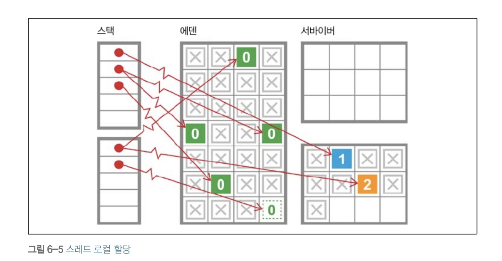
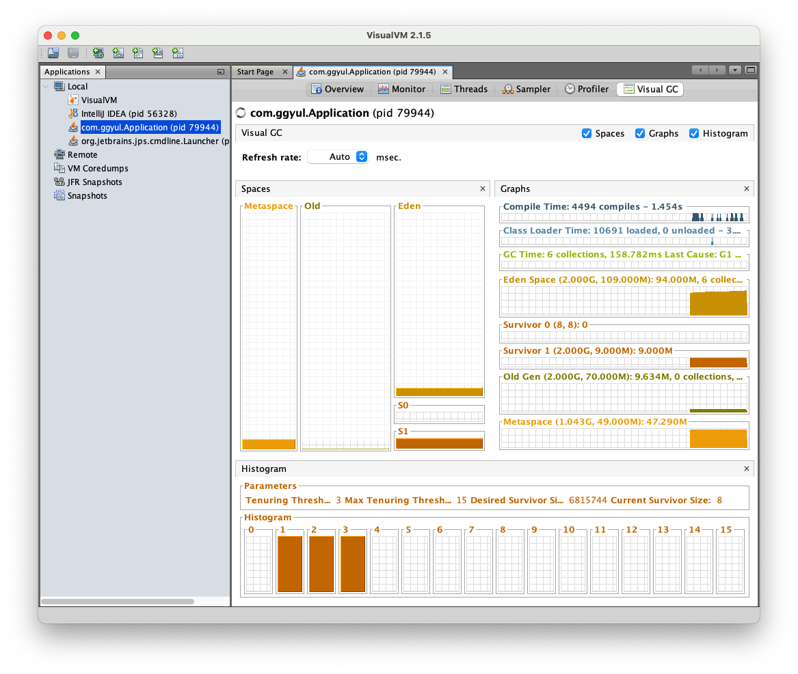

# Java Garbage Collection

자바 플랫폼이 처음 출시됐을 때 가비지 수집(GC)은 상당한 반감을 샀다. 언어 수준에서 의도적으로 수집기 작동을 제어하지 못하게 만들었다는 사실이 알려지면서 여론은 더 나빠졌다. 하지만 세월이 지나면서 이제는 메모리 관리는 컴파일러나 런타임의 영역이라고 보는 시각이 지배적이다.

## Garbage Collection의 두 가지 기본 원칙

모든 GC 구현체는 당연한 말이지만 다음 두 가지 기본 원칙을 준수해야 한다.

1. 알고리즘은 반드시 모든 가비지를 수집해야 한다
2. 살아 있는 객체는 절대로 수집해선 안 된다.

## Java Garbage Collection 적용 범위

기본적으로 JVM의 메모리는 총 5가지 영역(class, stack, heap, native method, PC)으로 나뉘는데, <u>**GC는 힙 메모리만 다룬다.**</u>

일반적으로 다음과 같은 경우에 GC의 대상이 된다.

1. 객체가 NULL인 경우
2. 블럭 실행 종료 후, 블럭 안에서 생성된 객체
3. 부모 객체가 NULL인 경우, 포함하는 자식 객체

> `System.gc()` ?
> 가끔 명시적으로 객체를 해제할 때 해당 객체를 null로 지정하거나 System.gc()를 호출하기도 한다. null로 지정하는 건 큰 문제는 안 되지만, System.gc()메서드를 호출하는 것은 성능에 큰 영향을 끼치므로 절대로 사용해선 안 된다.
> System.gc()는 점유중인 쓸모없는 객체를 해제시켜주는 static system의 메소드인데, System.gc()를 직접 호출하면 속도가 750~850ms로 자동 호출되는 gc보다 5,000배 이상의 성능 차이가 발생한다고 한다. 
>
> - [자바 성능을 결정짓는 코딩 습관과 튜닝 이야기](http://www.yes24.com/Product/Goods/2842880)

----

이제 자바 가비지 수집의 기초 이론을 소개하고, 자바 플랫폼에서 가비지 수집을 완전히 이해/제어하기가 어려운 이유를 말해보자. 또 핫스팟이 런타임에 객체를 힙에 나타내는 방법과 그 기본 특성을 알아보자.

끝으로는 핫스팟에서 가장 단순한 상용 수집기인 병렬 수집기를 소개하고 다양한 워크로드에서의 쓰임새를 알아보자.

## Garbage Collection의 동작 방식

세부적인 동작 방식은 다르지만, 기본적으로 가비지 컬렉션이 실행될 때는 다음의 동작 방식들을 따른다.

### Stop The World

가바지를 수집하는 동안엔 JVM이 애플리케이션 실행을 멈춘다. stop-the-world가 발생하면 GC를 실행하는 스레드를 제외한 모든 애플리케이션 스레드가 중단된다.  GC 작업을 와료한 이후에야 중단했던 작업을 다시 시작한다. <u>**어떤 GC 알고리즘을 사용하더라도 stop-the-world는 발생한다.**</u> 대부분 GC 튜닝이란 이 stop-the-world 시간을 줄이는 것이다.

### Mark and Sweep

- 살아 있는 객체를 식별(Mark)

- 힙의 앞 부분부터 확인해서 살아 있는 것만 남김(Sweep)

### Compaction(압착)

살아남은 객체들은 GC 사이클 마지막에 연속된 단일 영역으로(대부분 그 영역의 첫 부분부터) 배열되며, 객체 쓰기가 가능한 빈 공간의 시작점을 가리키는 포인터가 있다. 이 과정을 통해 메모리 단편화(memory fragmentation)을 방지할 수 있다.

## Weak Geneartional Hypothesis: 약한 세대별 가설

소프트웨어 시스템의 런타임 작용을 관찰한 결과 알게 된 경험 지식이다.

<u>**JVM 메모리 관리의 이론적 근간이 된다.**</u>

- 대부분의 객체는 아주 짧은 시간만 살아있고, 나머지는 기대 수명이 훨씬 길다.
- 오래된 객체에서 젊은 객체로의 참조는 아주 적게 존재한다.

이 법칙의 결론은 가비지를 수집하는 힙은 빨리 죽는 객체들은 쉽고 빠르게 수집할 수 있게 설계되어야 하고, 장수 객체와 단명 객체를 완전히 떼어 놓는 게 좋다는 것이다.

따라서 핫스팟(JVM)은 몇 가지 메커니즘을 응용해서 위 가설을 활용한다.

- 크게 2개로 물리적 공간을 나눈다.

  - Young 영역(Yong Generation 영역): 새롭게 생성한 객체의 대부분이 여기에 위치한다. 대부분의 객체가 금방 접근 불가능 상태가 되기 때문에 매우 많은 객체가 Young 영역에 생성되었다가 사라진다. 이 영역에서 객체가 사라질때 Minor GC가 발생한다고 말한다.

  - Old 영역(Old Generation 영역): 접근 불가능 상태로 되지 않아 Young 영역에서 살아남은 객체가 여기로 복사된다. 대부분 Young 영역보다 크게 할당하며, 크기가 큰 만큼 Young 영역보다 GC는 적게 발생한다. 이 영역에서 객체가 사라질 때 Major GC(혹은 Full GC)가 발생한다고 말한다.
  - 이 때, Old 영역이 Young 영역보다 크게 할당되는 이유는 Young 영역의 수명이 짧은 객체들은 큰 공간을 필요로 하지 않으며 큰 객체들은 Young 영역이 아니라 바로 Old 영역에 할당되기 때문이다.

- 객체마다 generational count를 센다: 객체가 지금까지 무사 통과한 가비지 수집 횟수

> **Hotspot JVM?**
>
>  미국의 Longview Technologies LLC라는 회사에서 처음 발표된 JVM이다. 1999년에 처음 발표되었으며, 당해연도에 SUN에 인수되어 1.3 버전부터 SUN의 기본 JVM으로 자리 잡게 되었다. <u>**Hotspot JVM은 가장 일반적인 JVM**</u> 중 하나로써 Windows, Linux, Max, Unix 운영체제에도 구동이 가능하다. Hotspot JVM과 양대산맥을 이루는 JVM은 IBM JVM이 있다. WebSphere 등 IBM 솔루션에서는 IBM JVM을 기본으로 사용하지만, 그 외 대부분의 솔루션에서는 Hotspot JVM을 사용한다.

## Card Table

Old 영역에 있는 객체가 Young 영역의 객체를 참조하는 경우는 아주 적지만 존재할 것이다. 이 때 Young 영역에서 Minor GC가 실행될 때 모든 Old 영역에 존재하는 객체를 검사해서 참조되지 않는 Young 영역의 객체를 찾는 것은 비효율적이다.

따라서 핫스팟은 카드 테이블이라는 자료 구조에 Old 객체가 Young 객체를 참조하는 정보를 기록한다. 카드 테이블은 JVM이 관리하는 바이트 배열로, 각 원소는 Old 영역의 512바이트 영역을 가리킨다. 

카드 테이블에는 OId 영역에 있는 객체가 Young 영역의 객체를 참조할 때마다 정보가 표시된다. Young 영역의 GC를 실행할 때는 Old 영영에 있는 모든 객체의 참조를 확인하지 않고, 이 카드테이블만 뒤져서 GC 대상인지 식별한다.

## Young 영역의 구성

young 영역은 3개의 영역으로 나뉜다.

- Eden 영역
- Survivor 영역 2개

이 영역의 처리 절차는 다음과 같다. (Minor GC)

1. 새로 생성한 대부분의 객체는 Eden 영역에 위치한다.

2. Eden 영역에서 GC가 한 번 발생한 후 살아남은 객체는 Survivor 영역 중 하나로 이동된다.

3. Eden 영역에서 GC가 발생하면 이미 살아남은 객체가 존재하는 Survivor 영역(위의 Survivor 영역)으로 객체가 계속 쌓인다.

4. 하나의 Survivor 영역이 가득 차게 되면 그 중에서 살아남은 다른 객체를 Survivor 영역으로 이동한다. (방출) 그리고 가득 찬 Survivor 영역은 아무 데이터도 없는 상태로 된다.

5. 이 과정을 반복하다가 계속해서 살아남은 객체는 Old 영역으로 이동(Promotion)하게 된다. 

   Minor GC에서 객체가 살아남은 횟수를 의미하는 age를 Object Header에 객체의 생존횟수로 기록한다. 그리고 이 age를 보고 Promotion 여부를 결정한다.


이 절차를 확인해보면 Survivor 영역 중 하나는 항상 반드시 비어 있는 상태이다. 만약 두 Survivor 영역에 모두 데이터가 존재한다면 시스템이 정상적인 상황이 아니라고 생각하면 된다.

이 때 핫스팟에선 이 처리 절차를 더 효율적으로 하기 위한 두 가지 기술이 사용된다.

### bump-the-pointer

bump-the-pointer는 Eden 영역에 할당된 마지막 객체를 추적한다. 마지막 객체는 Eden 영역의 맨 위에 있다. 그리고 그 다음에 생성되는 객체가 있으면 해당 객체의 크기가 Eden 영역에 넣기 적당한지만 확인한다. 따라서 새로운 객체를 생성할 때 마지막에 추가된 객체만 점검하면 되므로 매우 빠르게 메모리 할당이 이루어진다.

### TLABs(Thread-Local Allocation Buffers)

멀티 스레드 환경에선 어떨까? 만약 여러 스레드에서 사용하는 객체를 Eden 영역에 저장하려면, Eden 영역에 접근할 때마다 락이 발생할 것이다. 따라서 성능이 매우 떨어지게 된다. 이를 핫스팟에선 TLABs를 이용해 해결했다.

핫스팟은 에덴을 여러 버퍼로 나누어서 각각의 스레드가 Eden 영역의 작은 덩어리를 사용하게 한다. 각 스레드에는 자기가 갖고 있는 TLAB에만 접근할 수 있으므로 락 없이 메모리 할당이 가능하다. 

핫스팟은 TLAB 크기를 동적으로 조정해서 한 스레드가 메모리를 엄청나게 소모하고 있으면 더 큰 TLAB를 건네준다.






- VisualVM에서 Visual GC 플러그인을 다운받으면 애플리케이션의 공간을 위처럼 볼 수 있다.

### 결론

Eden 영역에 최초로 객체가 만들어지고, Survivor 영역을 통해서 Old 영역으로 오래 살아남은 객체가 이동한다!

## Old 영역에 대한 GC (Major GC)

Old 영역은 기본적으로 데이터가 가득 차면 GC를 실행한다. Young 영역은 일반적으로 Old 영역보다 크기가 작기 때문에 GC가 보통 0.5~1초 사이에 끝난다. 따라서 Minor GC는 애플리케이션에 큰 영향을 주지 않는다. 하지만 Old 영역은 Young 영역보다 크며 Young 영역을 참조할 수도 있다. 따라서 Major GC가 일반적으로 시간이 더 오래 걸리고, 10배 이상의 시간을 사용한다.

이 때 GC 방식에 따라서 처리 절차가 달라진다.

- Serial GC
  - 운영 서버에서 절대 사용하면 안 되는 방식이다. 데스크톱의 GPU 코어가 하나만 있을 때 사용하기 위한 방식이다.
- Parallel GC
- ParallelOld GC
- Concurrent Mark & Sweep GC(이하 CMS)
- G1(Garbage First) GC 
  - Java 9 버전부터 기본 가비지 컬렉터

### Serial GC

- GC 방식

  - Young 영역: 위에서 설명한 방식 사용

  - Old 영역: Mark-Sweep-Compact 알고리즘  

- 적은 메모리, CPU 코어 개수 적을 때 적합

```bash
java -XX:+UseSerialGC -jar Application.java
```

## 병렬 수집기

- 병렬 수집기는 애플리케이션 스레드를 모두 중단시킨 다음(STW), 가용 CPU 코어를 총동원해 가능한 한 빨리 메모리를 수집한다.

1. Parallel GC (Throughput GC)

   Serial GC와 기본적인 알고리즘은 같다. Serial GC는 GC를 처리하는 스레드가 하나지만, Parallel GC는 GC를 처리하는 스레드가 여러 개이다. 그러므로 Serial GC보다 빠르게 객체를 처리한다. 메모리가 충분하고 코어의 개수가 많을 때 유리하다. 옵션을 통해 애플리케이션의 최대 지연 시간, GC를 수행할 쓰레드의 갯수 등을 설정할 수 있다.

   ```bash
   java -XX:+UseParallelGC -jar Application.java
   
   // 사용할 쓰레드의 갯수
   -XX:ParallelGCThreads=<N>
   
   // 최대 지연 시간
   -XX:MaxGCPauseMillis=<N>
   ```

   Parallel GC가 GC의 오버헤드를 상당히 줄여주었고, Java8까지 기본 가비지 컬렉터로 사용되었다. 그럼에도 Application이 멈추는 것을 피할 수 없었고, 이를 개선하기 위해 다른 알고리즘이 더 등장하게 되었다.

2. Parallel Old GC

   위 Parallel GC와 비교하여 Old 영역의 GC 알고리즘만 다르다. 이 방식은 Mark-Summary-Compaction 단계를 거친다. Summary단계는 <u>**앞서 GC를 수행한 영역에 대해서 별도로 살아있는 객체를 식별**</u>한다는 점에서 Sweep 단계와 다르다.

## GMC(Concurrent Mark Sweep) GC

CMS GC는 Parallel GC와 마찬가지로 여러 개의 쓰레드를 이용한다. 하지만 기존의 Serial/Parallel GC와는 다르게 Mark Sweep 알고리즘을 Concurrent하게 수행한다.


CMS GC가 수행될 때는 자원이 GC를 위해서도 사용되므로 응답이 느려질 순 있지만 응답이 멈추지는 않게 된다. 하지만 다른 GC 방식보다 메모리, CPU를 더 많이 필요로 하고 Compaction 단계를 수행하지 않는다. 따라서 장기적으로 운영되다가 조각난 메모리들이 많아(memory fragmentation) compation 단계가 수행되면 Stop The World 시간이 길어지는 문제가 발생할 수 있다.

```bash
// deprecated in java9 and finally dropped in java14
java -XX:+UseConcMarkSweepGC -jar Application.java
```

## G1(Garbage First) GC 

자바 수집기는 이 때까지 본 것처럼 힙을 Young/Old 영역으로 나눠서 관리했는데, G1은 힙을 배치하는 방식 자체가 완전히 다르다. G1 GC는 Eden 영역에 할당하고, Survivor로 카피하는 과정은 사용하지만 <u>**물리적으로 메모리 공간을 나누지 않는다.**</u> 대신  Region이라는 개념을 도입해서 Heap을 균등하게 여러 개의 지역으로 나누고, 각 지역을 역할과 함께 논리적으로 구분해서 객체를 할당한다.


Region에 Humonogous와  Available/Unused라는 2가지 역할이 추가되었다.

- Humonogous: Region 크기의 50%를 초과하는 객체를 저장하는 Region
- Available/Unused: 사용되지 않는 Region

G1 GC의 핵심은 Heap을 동일한 크기의 Region으로 나누고, <u>**가비지가 많은 region에 대해 우선적으로 GC를 수행하는 것**</u>이다.

G1 GC도 다른 가비지 컬렉션과 마찬가지로 2가지 GC로 나누어 수행된다.

### Minor GC

한 지역에 객체를 할당하다가 <u>**해당 지역이 꽉 차면**</u> 다른 지역에 객체를 할당하고, Minor GC가 수행된다. 이 때 가비지가 가장 많은 지역을 찾아서 Mark and Sweep을 수행한다. 

Eden 지역에서 GC가 수행되면 Mark and Sweep을 수행 후 살아남은 객체를 다른 지역으로 이동한다. 복제되는 지역이 Avaiable/Unused 지역이면 해당 지역은 이제 Survivor 영역이 되고, Eden 영역은 Available/Unused 지역이 된다.

### Major GC(Full GC)

시스템이 계속 운영되다가 객체가 너무 많아 빠르게 메모리를 회수할 수 없을 때  Major GC가 실행된다.

기존의 다른 GC 알고리즘은 모든 Heap 영역에서 GC가 수행되어 처리 시간이 오래 걸렸지만, G1 GC는 어느 영역에 가비지가 많은 지를 알고 있기 때문에 GC를 수행할 지역을 조합해서 GC를 수행한다. 게다가 이러한 작업이 Concurrent하게 수행되므로 애플리케이션의 지연도 최소화할 수 있다.

- Concurrent: 애플리케이션 스레드와 동시에 실행된다는 것

G1 GC는 다른 GC 방식에 비해 잦게 호출되겠지만, 작은 규모의 메모리 정리 작업 + Concurrent하게 수행되므로 지연이 크지 않고, 가비지가 많은 지역을 알고 있어 해당 지역에 대해 정리를 하므로 훨씬 효율적이다.

```bash
java -XX:+UseG1GC -jar Application.java
```

G1 GC는 GC 방식 중에 가장 처리 속도가 빠르고 큰 메모리 공간에서 멀티 프로레스 기반으로 운영되는 애플리케이션을 위해 고안되었다. 따라서 Java9부터 기본 가비지 컬렉터로 사용되게 되었다.

------

## 참고

- https://github.com/GimunLee/tech-refrigerator/blob/master/Language/JAVA/Garbage%20Collection.md#garbage-collection
- https://d2.naver.com/helloworld/1329
- https://mangkyu.tistory.com/118
- https://wookoa.tistory.com/169
- https://cyk0825.tistory.com/88?category=1124085
- http://www.yes24.com/Product/Goods/72161685