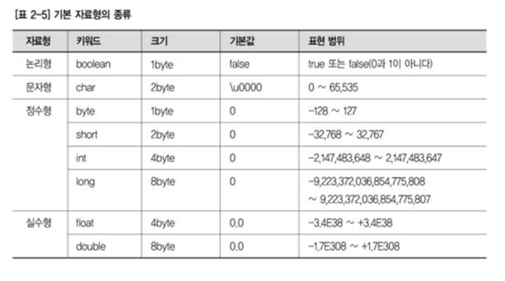
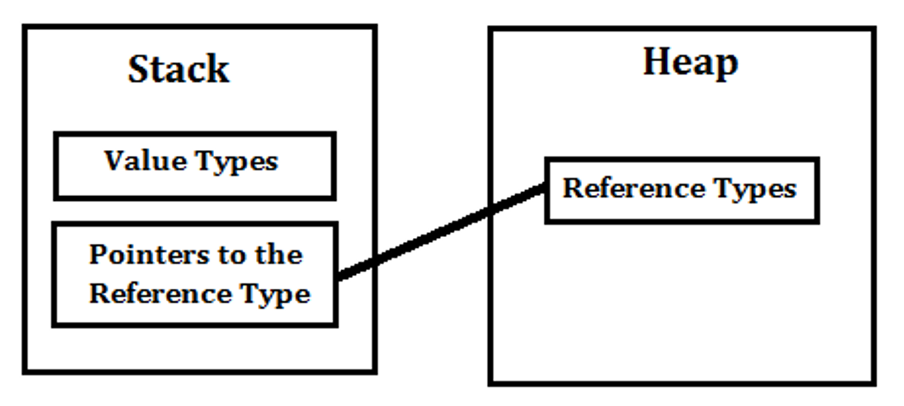

# Primitive type, Record

## Abstract

자바에는 기본형(Primitive type)과 참조형(Reference type)이 있습니다. 

일반적인 분류는 다음처럼 가집니다.

> Java Data Type
ㄴ Primitive Type
    ㄴ Boolean Type(boolean)
    ㄴ Numeric Type
        ㄴ Integral Type
            ㄴ Integer Type(short, int, long)
            ㄴ Floating Point Type(float, double)
        ㄴ Character Type(char)
ㄴ Reference Type
    ㄴ Class Type
    ㄴ Interface Type
    ㄴ Array Type
    ㄴ Enum Type
    ㄴ etc.
> 

## Primitive type (기본형 타입)

- JAVA에서는 총 8가지의 Primitive type을 미리 정의하고 제공합니다.
- 자바에서 기본 자료형은 반드시 사용하기 전에 선언(Declared)되어야 합니다.
- OS에 따라 자료형의 길이가 변하지 않습니다.
- **비객체** 타입입니다. 따라서 null 값을 가질 수 없습니다. 만약 Primitive type에 Null을 넣고 싶다면 Wrapper Class를 활용합니다.
- 스택(Stack) 메모리에 저장됩니다.



- boolean
    - 논리형인 boolean의 기본값은 false이며 참과 거짓을 저장하는 타입입니다. 주로 yes/no, on/off 등의 논리 구현에 주로 사용되며 두가지 값만 표현하므로 가장 크기가 작습니다.
    - boolean은 실제로 1bit면 충분하지만, 데이터를 다루는 최소 단위가 1byte이므로 메모리 크기가 1byte입니다.
- byte
    - byte는 주로 이진데이터를 다루는데 사용되는 타입입니다.
- short
    - short는 C언어와의 호환을 위해 사용되는 타입으로 잘 사용되지는 않는 타입입니다.
- int
    - int 형은 자바에서 정수 연산을 하기 위한 기본 타입입니다. 즉, byte 혹은 short 의 변수가 연산을 하면 연산의 결과는 int형이 됩니다.
- long
    - 수치가 큰 데이터를 다루는 프로그램(은행 및 우주와 관련된 프로그램)에서 주로 사용합니다.
    - long 타입의 변수를 초기화 할 떄에는 정수값 뒤에 알파벳 L을 붙여서 long 타입(즉, 8byte)의 정수 데이터임을 알려주어야 합니다. 만일 정수값이 int의 값의 저장 범위를 넘는 정수에서 L을 붙이지 않는다면 컴파일 에러가 발생합니다.
    
    `long l = 2147483648; // 컴파일 에러 발생`
    
    `long l = 2147483648L;`
    
- float, double
    - 실수를 가수와 지수 형식으로 저장하는 부동소수점 방식으로 저장됩니다.
    - 가수를 표현하는데 있어 double형이 float형보다 표현 가능 범위가 더 크므로 double형이 보다 정밀하게 표현할 수 있습니다.
    - 자바에서 실수의 기본 타입은 double형이므로 float형에는 알파벳 F를 붙여서 float 형임을 명시해주어야 합니다.
        
        `float f = 1234.567;  // 무조건 double 타입으로 이해하려고 하므로 컴파일 에러가 발생합니다.
        float f = 1234.567F; // float type이라는 것을 표시해야 합니다.`
        

## Reference type (참조형 타입)

- JAVA에서 Primitive type을 제외한 타입들이 모두 Reference type 입니다.
- Reference type은 JAVA에서 최상인 java.lang.Object클래스를 상속하는 모든 클래스들을 말합니다.
물론 new로 인하여 생성하는 것들은 메모리 영역인 Heap 영역에 생성을 하게되고, Garbage Collector가 돌면서 메모리를 해제합니다.
- **클래스 타입(class type)** , **인터페이스 타입(interface type)** , **배열 타입(array type)** , **열거 타입(enum type)** 이 있습니다.
- 빈 객체를 의미하는 Null이 존재합니다.
- 문법상으로는 에러가 없지만 실행시켰을 때 에러가 나는 런타임 에러가 발생합니다. 예를 들어 객체나 배열을 Null 값으로 받으면 NullPointException이 발생하므로 변수 값을 넣어야 합니다.
- Heap 메모리에 생성된 인스턴스는 메소드나 각종 인터페이스에서 접근하기 위해 JVM의 Stack 영역에 존재하는 Frame에 일종의 포인터(C의 포인터와는 다릅니다.)인 참조값을 가지고 있어 이를 통해 인스턴스를 핸들링합니다.



## String Class

클래스형에서도 String 클래스는 조금 특별합니다. 이 클래스는 참조형에 속하지만 기본적인 사용은 **기본형** 처럼 사용합니다. 그리고 **불변(immutable)하는** 객체입니다. 

String 클래스에는 값을 변경해주는 메소드들이 존재하지만 해당 메소드를 통해 데이터를 바꾼다 해도 새로운 String 클래스 객체를 만들어내는 것입니다. 

일반적으로 기본형 비교는 == 연산자를 사용하지만 String 객체간의 비교는 .equals() 메소드를 사용해야 합니다.

# Record

## 레코드란?

**ㆍ** 불변(immutable) 데이터 객체를 쉽게 생성할 수 있도록 하는 새로운 유형의 클래스

**ㆍ** JDK14에서 preview로 등장하여 JDK16에서 정식 스펙으로 포함

```java
public class Person {
    private final String name;
    private final int age;
    
    public Person(String name, int age) {
        this.name = name;
        this.age = age;
    }
    
    public String getName() {
        return name;
    }
    
    public int getAge() {
        return age;
    }
}
```

### 상태(name, age)를 보유하는 불변 객체를 생성하기 위한 많은 코드를 작성함

- 모든 필드에 final을 사용하여 명시적으로 정의
- 필드 값을 모두 포함한 생성자
- 모든 필드에 대한 접근자 메서드(getter)
- 상속을 방지하기 위해 클래스 자체를 final로 선언하기도함
- 로깅 출력을 제공하기 위한 toString 재정의
- 두 개의 인스턴스를 비교하기 위한 hashCode, equals 재정의

### 레코드를 이용한 불변 객체

```java
public record Person(String name, int age) {
}
```

- 레코드 클래스를 사용하면 훨씬 간결한 방식으로 동일한 불변 데이터 객체 정의할 수 있음
    - 이름(Person), 헤더(String name, int age), 바디({})
- 컴파일러는 헤더를 통해 내부 필드를 추론
    - 생성자를 작성하지 않아도 되고 toString, equals, hashCode 메소드에 대한 구현을 자동으로 제공
    

### 레코드의 제한

- 레코드는 암묵적으로 final 클래스(상속불가)이고, abstract 선언 불가
- 다른 클래스를 상속(extends) 받을 수 없음, 인터페이스 구현(implements)은 가능

출처

[https://scshim.tistory.com/372](https://scshim.tistory.com/372)

[https://github.com/GimunLee/tech-refrigerator/blob/master/Language/JAVA/Primitive type %26 Reference type.md#primitive-type--reference-type](https://github.com/GimunLee/tech-refrigerator/blob/master/Language/JAVA/Primitive%20type%20%26%20Reference%20type.md#primitive-type--reference-type)