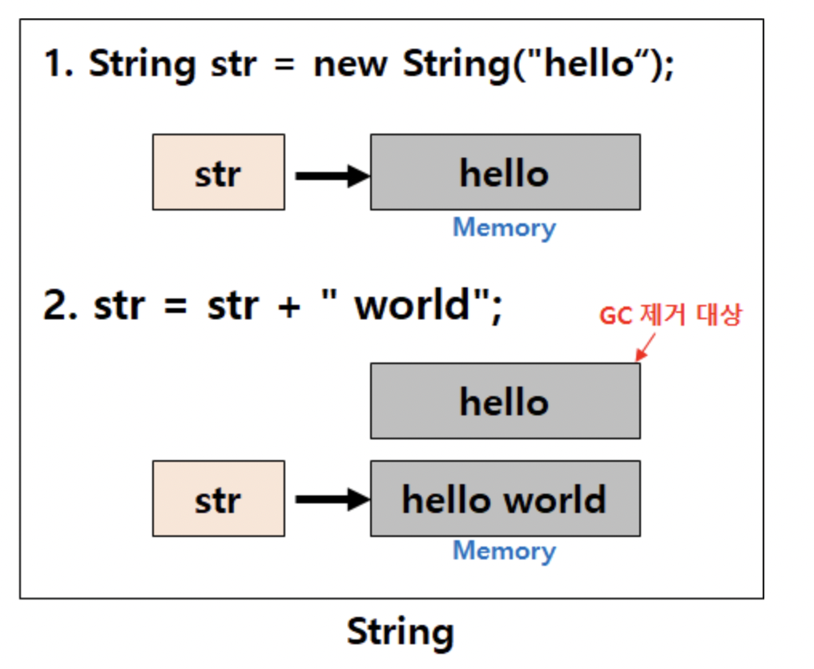

# [Java] String / StringBuffer / StringBuilder

## String

- String은 Reference Type이다!

- String 표현법 ✨
    - **리터럴 표기법**
        - 객체 생성 없이 고정값을 그대로 대입
        - **JVM Constant Pool(String Pool)** 영역에 할당 (heap 내부 저장 영역, 과도한 String 객체의 수를 줄이고자 문자열이 있는지 Pool을 체크)
        - 다음에 “Java”라는 문자열을 선언 할 때 이미 a가 선언되어 있으므로 a를 참조한다 (cache된 문자열 리턴)
    - **객체 표기법**
        - new 키워드를 통해 “Java”라는 문자열을 heap 영역에 할당 (일반 객체와 동일)
        - “Java”라는 문자열을 또 선언하면 기존의 문자열을 참조하지 않고 매번 새로 생성

```java
// 리터럴
String a = "Java";
String b = "Java";

// 객체
String a = new String("Java");
String b = new String("Java");
```

- == vs equals
    - `==` : 동일한 메모리 공간인지 비교
    - `equals()` : 객체의 내용 비교

```java
// 리터럴
a == b -> true
a.equals(b) -> true

// 객체
a == b -> false
a.equals(b) -> true
```

<aside>
💡 String vs StringBuffer / StringBuilder의 차이점 → **String은 Immutable(불변) 하다!**

</aside>

- str이 가리키는 값이 “hello world”로 바뀌는걸까?

```java
String str = "hello";
str = str + "world";
```

- “hello word” 라는 값을 가지는 **새로운 메모리 영역을 가리키게 된다.✨**
    - “hello”에 할당되어 있던 메모리 영역은 GC에 의해 사라지게 됨
    - 한번 생성된 객체 내부의 내용을 변화시킬 수 없고 **새로운 String 인스턴스가 생성**되므로 불변하다고 한다.



- 그래서 문자열 추가, 수정, 삭제 등의 연산이 빈번하게 발생하는 경우 → String을 사용하면 heap 메모리 부족을 야기,,

## StringBuffer

<aside>
💡 그래서 **mutable(가변)**한 StringBuffer / StringBuilder 도입

</aside>

- `append()`, `delete()` 등의 API로 동일 객체내의 변경이 가능하다.
- **문자열 추가, 수정, 삭제 등의 연산이 빈번한 경우**라면 StringBuffer/StringBuilder 사용

```java
StringBuffer sb = new StringBuffer("hello");
sb.append(" world")
```

- str을 가리키는 참조값은 변화하지 않는다.


- `append()` 내부 살펴보기
    - 문자열을 추가하게 되면 `len`(문자열의 길이) 만큼 문자열을 저장하는 배열의 공간을 늘려주고, 늘려준 공간에 추가 할 문자열을 넣어줌 → **값이 변경되는 가변성, 같은 주소 공간 참조✨**

```java
public AbstractStringBuilder append(String str) {
        if (str == null) {
            return appendNull();
        }
        int len = str.length();
        ensureCapacityInternal(count + len);
        putStringAt(count, str);
        count += len;
        return this;
    }
```

## StringBuilder

<aside>
💡 StringBuffer는 동기화 키워드를 지원하여 **thread-safe** 하다.

</aside>

- String 또한 Immutable하기 때문에 멀티쓰레드 환경에서 안전하다.

**StringBuilder는 동기화를 지원하지 않는다. → 단일 쓰레드에서 성능이 뛰어나다. ✨**

- 단일 쓰레드 환경에서 StringBuffer를 사용하면 성능이 매우 떨어지게 됨

- StringBuffer의 `synchronized` 키워드


## 정리

- String vs StringBuffer / StringBuilder
    - **Immutable vs Mutable**

- StringBuffer vs StringBuilder
    - **동기화 유무 (Synchronization)**

- `String` : 문자열 연산이 적고, 멀티쓰레드 환경 (Thread-safe)
- `StringBuffer` : 문자열 연산이 많고, 멀티쓰레드 환경 (Thread-safe)
- `StringBuilder` : 문자열 연산이 많고, 단일쓰레드 혹은 동기화를 고려하지 않는 경우

(참고)

- JDK 1.5 이후부터 String 객체를 사용하더라도 StringBuilder로 컴파일 되도록 변경되었음 → String을 사용해도 StringBuilder와 성능상의 차이가 없음

- **Single Statement(한 줄)**로 문자열을 + 연산하면 컴파일러가 자동으로 StringBuilder로 최적화

```java
String str = "1, " + "2, " + "3, " + ,,,;
```

- But, **반복문 내에서 문자열을 계속 더해갈 때는** 최적화 하지 못하고 String은 객체를 계속 더하게 됨 → StringBuilder를 사용해야 함

```java
String str = "";
for (int i=0; i<100; i++) {
	str += ", " + i;
}
```
