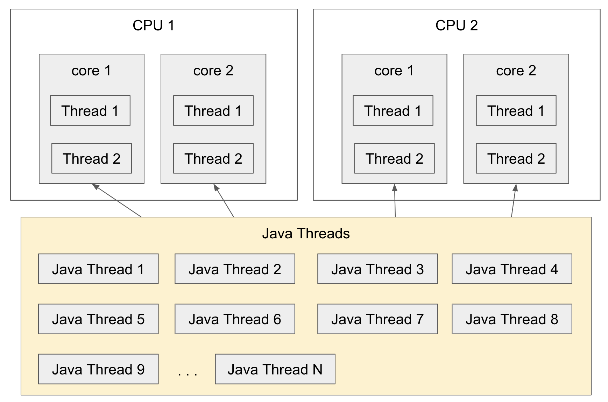
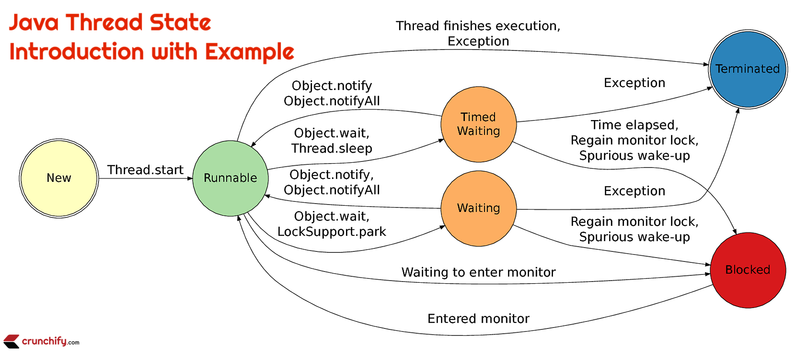

# Java - Thread and Lock

## Java의 Thread

자바의 쓰레드는 Concurrent하게 작동합니다. 

자바 스레드(소프트웨어적 스레드)는 동시성의 성질을 가지고 있기 때문에, 자바에서는 멀티 스레드와 관련된 프로그래밍을 병렬성 프로그래밍이라 하지 않고 `동시성 프로그래밍`이라고 한다.

자바는 JVM을 통해 멀티 쓰레드를 구성하여 concurrent 하게 동작하여 동시에 여러 작업을 수행할 수 있습니다. 하지만 동시에 수행되는 쓰레드의 수행순서는 보장되어 있지 않습니다.



### Main Thread

JVM은 main() 메소드를 찾아 Main Thread를 동작시킵니다. 기본적으로 Main Thread는 다른 쓰레드와 
차별화 되어 있는게 아니라 처음에 수행되는 쓰레드입니다. 그러므로 메인 쓰레드의 종료와 다른 쓰레드의 종료는 관련없이 별개로 
동작합니다. 메인 쓰레드가 종료되어도 다른 모든 쓰레드가 종료되어야 JVM의 동작이 멈춥니다.

### 스레드 구현

---

자바에서 스레드 구현 방법은 2가지가 있다.

1. Runnable 인터페이스 구현
2. Thread 클래스 상속

둘다 run() 메소드를 오버라이딩 하는 방식이다.

```java
public class MyThread implements Runnable {
    @Override
    public void run() {
        // 수행 코드
    }
}
```

```java
public class MyThread extends Thread {
    @Override
    public void run() {
        // 수행 코드
    }
}
```

## 스레드 생성

---

하지만 두가지 방법은 인스턴스 생성 방법에 차이가 있다.

Runnable 인터페이스를 구현한 경우는, 해당 클래스를 인스턴스화해서 Thread 생성자에 argument로 넘겨줘야 한다.

그리고 run()을 호출하면 Runnable 인터페이스에서 구현한 run()이 호출되므로 따로 오버라이딩하지 않아도 되는 장점이 있다.

```java
public static void main(String[] args) {
    Runnable r = new MyThread();
    Thread t = new Thread(r, "mythread");
}
```

Thread 클래스를 상속받은 경우는, 상속받은 클래스 자체를 스레드로 사용할 수 있다.

또, Thread 클래스를 상속받으면 스레드 클래스의 메소드(getName())를 바로 사용할 수 
있지만, Runnable 구현의 경우 Thread 클래스의 static 메소드인 currentThread()를 호출하여 현재 
스레드에 대한 참조를 얻어와야만 호출이 가능하다.

```java
public class ThreadTest implements Runnable {
    public ThreadTest() {}
    
    public ThreadTest(String name){
        Thread t = new Thread(this, name);
        t.start();
    }
    
    @Override
    public void run() {
        for(int i = 0; i <= 50; i++) {
            System.out.print(i + ":" + Thread.currentThread().getName() + " ");
            try {
                Thread.sleep(100);
            } catch (InterruptedException e) {
                e.printStackTrace();
            }
        }
    }
}
```

## 스레드 실행

> 스레드의 실행은 run() 호출이 아닌 start() 호출로 해야한다.
> 

***Why?***

우리는 분명 run() 메소드를 정의했는데, 실제 스레드 작업을 시키려면 start()로 작업해야 한다고 한다.

run()으로 작업 지시를 하면 스레드가 일을 안할까? 그렇지 않다. 두 메소드 모두 같은 작업을 한다. 

**하지만 run() 메소드를 사용한다면, 이건 스레드를 사용하는 것이 아니다.**

Java에는 콜 스택(call stack)이 있다. 이 영역이 실질적인 명령어들을 담고 있는 메모리로, 하나씩 꺼내서 실행시키는 역할을 한다.

만약 동시에 두 가지 작업을 한다면, 두 개 이상의 콜 스택이 필요하게 된다.

**스레드를 이용한다는 건, JVM이 다수의 콜 스택을 번갈아가며 일처리**를 하고 사용자는 동시에 작업하는 것처럼 보여준다.

즉, run() 메소드를 이용한다는 것은 main()의 콜 스택 하나만 이용하는 것으로 스레드 활용이 아니다. (그냥 스레드 객체의 run이라는 메소드를 호출하는 것 뿐이게 되는 것..)

start() 메소드를 호출하면, JVM은 알아서 스레드를 위한 콜 스택을 새로 만들어주고 context switching을 통해 스레드답게 동작하도록 해준다.

우리는 새로운 콜 스택을 만들어 작업을 해야 스레드 일처리가 되는 것이기 때문에 start() 메소드를 써야하는 것이다!

> start()는 스레드가 작업을 실행하는데 필요한 콜 스택을 생성한 다음 run()을 호출해서 그 스택 안에 run()을 저장할 수 있도록 해준다.
> 

## 스레드의 실행제어

> 스레드의 상태는 5가지가 있다
> 
- NEW : 스레드가 생성되고 아직 start()가 호출되지 않은 상태
- RUNNABLE : 실행 중 또는 실행 가능 상태
- BLOCKED : 동기화 블럭에 의해 일시정지된 상태(lock이 풀릴 때까지 기다림)
- WAITING, TIME_WAITING : 실행가능하지 않은 일시정지 상태
- TERMINATED : 스레드 작업이 종료된 상태



스레드로 구현하는 것이 어려운 이유는 바로 동기화와 스케줄링 때문이다.

스케줄링과 관련된 메소드는 sleep(), join(), yield(), interrupt()와 같은 것들이 있다.

start() 이후에 join()을 해주면 main 스레드가 모두 종료될 때까지 기다려주는 일도 해준다.

### 동기화

멀티스레드로 구현을 하다보면, 동기화는 필수적이다.

동기화가 필요한 이유는, **여러 스레드가 같은 프로세스 내의 자원을 공유하면서 작업할 때 서로의 작업이 다른 작업에 영향을 주기 때문**이다.

스레드의 동기화를 위해선, 임계 영역(critical section)과 잠금(lock)을 활용한다.

임계영역을 지정하고, 임계영역을 가지고 있는 lock을 단 하나의 스레드에게만 빌려주는 개념으로 이루어져있다.

따라서 임계구역 안에서 수행할 코드가 완료되면, lock을 반납해줘야 한다.

### synchronized 활용

> synchronized를 활용해 임계영역을 설정할 수 있다.
> 

서로 다른 두 객체가 동기화를 하지 않은 메소드를 같이 오버라이딩해서 이용하면, 두 스레드가 동시에 진행되므로 원하는 출력 값을 얻지 못한다.

이때 오버라이딩되는 부모 클래스의 메소드에 synchronized 키워드로 임계영역을 설정해주면 해결할 수 있다.

```java
//synchronized : 스레드의 동기화. 공유 자원에 lock
public synchronized void saveMoney(int save){    // 입금
    int m = money;
    try{
        Thread.sleep(2000);    // 지연시간 2초
    } catch (Exception e){

    }
    money = m + save;
    System.out.println("입금 처리");

}

public synchronized void minusMoney(int minus){    // 출금
    int m = money;
    try{
        Thread.sleep(3000);    // 지연시간 3초
    } catch (Exception e){

    }
    money = m - minus;
    System.out.println("출금 완료");
}
```

### wait()과 notify() 활용

> 스레드가 서로 협력관계일 경우에는 무작정 대기시키는 것으로 올바르게 실행되지 않기 때문에 사용한다.
> 
- wait() : 스레드가 lock을 가지고 있으면, lock 권한을 반납하고 대기하게 만듬
- notify() : 대기 상태인 스레드에게 다시 lock 권한을 부여하고 수행하게 만듬

이 두 메소드는 동기화 된 영역(임계 영역)내에서 사용되어야 한다.

동기화 처리한 메소드들이 반복문에서 활용된다면, 의도한대로 결과가 나오지 않는다. 이때 wait()과 notify()를 try-catch 문에서 적절히 활용해 해결할 수 있다.

```java
/**
* 스레드 동기화 중 협력관계 처리작업 : wait() notify()
* 스레드 간 협력 작업 강화
*/

public synchronized void makeBread(){
    if (breadCount >= 10){
        try {
            System.out.println("빵 생산 초과");
            wait();    // Thread를 Not Runnable 상태로 전환
        } catch (Exception e) {

        }
    }
    breadCount++;    // 빵 생산
    System.out.println("빵을 만듦. 총 " + breadCount + "개");
    notify();    // Thread를 Runnable 상태로 전환
}

public synchronized void eatBread(){
    if (breadCount < 1){
        try {
            System.out.println("빵이 없어 기다림");
            wait();
        } catch (Exception e) {

        }
    }
    breadCount--;
    System.out.println("빵을 먹음. 총 " + breadCount + "개");
    notify();
}
```

조건 만족 안할 시 wait(), 만족 시 notify()를 받아 수행한다.

### Java 고유 락 (Intrinsic Lock)

---

#### Intrinsic Lock / Synchronized Block / Reentrancy

Intrinsic Lock (= monitor lock = monitor) : Java의 모든 객체는 lock을 갖고 있음.

*Synchronized 블록은 Intrinsic Lock을 이용해서, Thread의 접근을 제어함.*

```java
public class Counter {
    private int count;
    
    public int increase() {
        return ++count;		// Thread-safe 하지 않은 연산
    }
}
```

### Reentrancy

재진입 : Lock을 획득한 Thread가 같은 Lock을 얻기 위해 대기할 필요가 없는 것

(Lock의 획득이 **`호출 단위`**가 아닌 **Thread 단위**로 일어나는 것)

== mutex

```java
public class Reentrancy {
    // b가 Synchronized로 선언되어 있더라도, a 진입시 lock을 획득하였음.
    // b를 호출할 수 있게 됨.
    public synchronized void a() {
        System.out.println("a");
        b();
    }
    
    public synchronized void b() {
        System.out.println("b");
    }
    
    public static void main (String[] args) {
        new Reentrancy().a();
    }
}
```

### Structured Lock vs Reentrant Lock

**Structured Lock (구조적 Lock) : 고유 lock을 이용한 동기화**

(Synchronized 블록 단위로 lock의 획득 / 해제가 일어나므로)

따라서,

A획득 -> B획득 -> B해제 -> A해제는 가능하지만,

A획득 -> B획득 -> A해제 -> B해제는 불가능함.

이것을 가능하게 하기 위해서는 **Reentrant Lock (명시적 Lock) 을 사용**해야 함.

### Visibility

- 문제 : 하나의 Thread가 쓴 값을 다른 Thread가 볼 수 있느냐 없느냐. (볼 수 없으면 문제가 됨)
- 가시성 : 여러 Thread가 동시에 작동하였을 때, 한 Thread가 쓴 값을 다른 Thread가 볼 수 있는지, 없는지 여부
- 원인 :
    1. 최적화를 위해 Compiler나 CPU에서 발생하는 코드 재배열로 인해서.
    2. CPU core의 cache 값이 Memory에 제때 쓰이지 않아 발생하는 문제.
- 해결: 
Lock  Structure Lock과 Reentrant Lock은 Visibility를 보장.

> 추가 정보
[https://enumclass.tistory.com/169](https://enumclass.tistory.com/169)
>