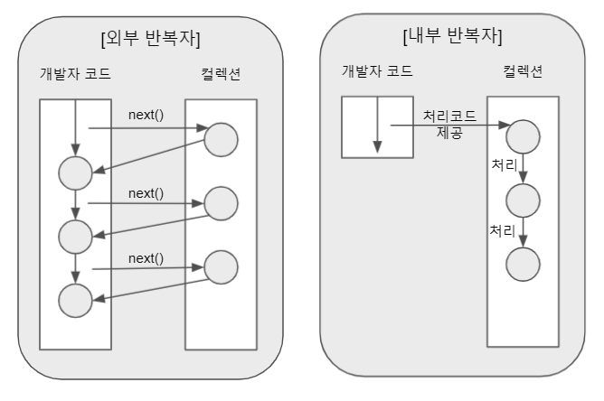
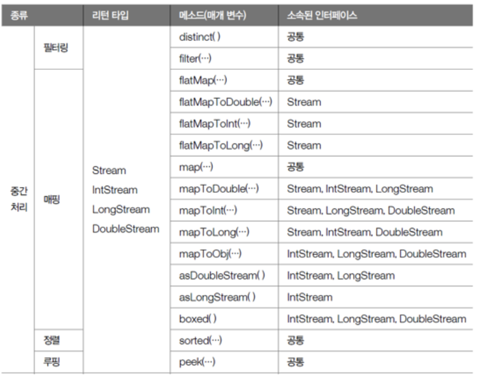
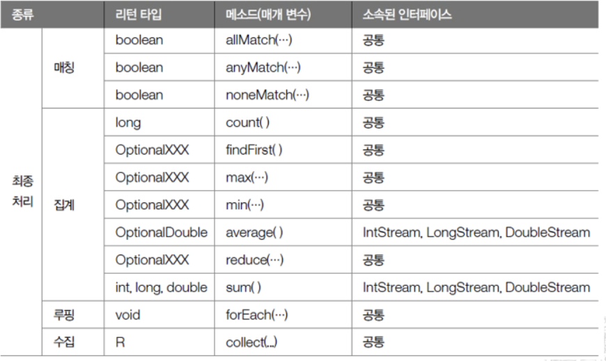

# 스트림

> 컬렉션 (배열 포함) 의 저장 요소를 하나씩 참조해서 함수형 스타일의 람다식으로 처리할 수 있도록 해주는 반복자
> 

자바 8부터 생긴 API이다. 컬렉션을 스트림으로 변환하고 요소들을 병렬로 처리하며 결과를 다시 컬렉션으로 모아주는 역할을 한다.

## 특징

### 람다식으로 요소 처리를 할 수 있다.

스트림에서 제공하는 요소 처리 메서드는 함수형 인터페이스를 매개 타입으로 받고 있다. 따라서 람다식이나 메서드 참조를 이용한  요소 처리 내용을 매개값에 전달할 수 있다.

**c.f. 함수형 인터페이스**

추상 메서드가 딱 한개인 인터페이스. default 메서드나 static 메서드는 여러 개 있어도 괜찮다. 

자바에서는 `@FunctionalInterface` 어노테이션을 제공하는데 이 어노테이션을 붙인 인터페이스는 함수형 인터페이스여야 한다. 두 개 이상의 추상 메서드가 선언되어 있으면 컴파일 오류가 발생한다. 함수형 인터페이스를 만드는데 있어 이 어노테이션이 필수는 아니지만 인터페이스 검증과 유지보수 측면에서 장점이 있다.

```java
@FunctionalInterface
public interface Predicate<T> {

    /**
     * Evaluates this predicate on the given argument.
     *
     * @param t the input argument
     * @return {@code true} if the input argument matches the predicate,
     * otherwise {@code false}
     */
    boolean test(T t);
}
```

### 선언형 코드

스트림을 사용하면 how 보다 what에 집중할 수 있다. 100개의 숫자가 들어있는 리스트에서 크기가 50 이상인 숫자만 골라내는 두 코드를 비교해보자.

```java
public List<Integer> filter50Above(List<Integer> list) {
        List<Integer> result = new ArrayList<>();
        for (Integer integer : list) {
            if (integer >= 50) {
                result.add(integer);
            }
        }
        return result;
    }

    public List<Integer> filter50AboveStream(List<Integer> list) {
        return list.stream()
                .filter(integer -> integer >= 50)
                .collect(Collectors.toList());
    }
```

단순한 비교는 어렵지만 스트림을 사용한 구현이 더 간결해 보인다.

### 내부 반복

스트림은 내부 반복 방식을 사용한다. 

**c.f. 외부 반복자, 내부 반복자**

외부 반복자는 개발자가 코드로 직접 컬렉션의 요소를 반복해서 가져오는 코드이다. for-each 문, while문,  Iterator 등이 외부 반복자에 속한다. 

반면 내부 반복자는 처리해야 할 코드만 제공하고 실제 반복은 컬렉션 내부에서 알아서 처리되는 방식이다. 



내부 반복자를 사용하면 어떻게 요소를 반복시킬 것인지는 컬렉션에게 맡기고 개발자 입장에서는 요소 처리 코드에만 집중할 수 있다. 내부 반복자는 요소의 반복 순서를 변경하거나 CPU 코어에게 요소를 분배시켜 병렬 처리를 할 수 있도록 도와준다. 

### 스트림 처리

스트림은 컬렉션의 요소에 대해 중간 처리와 최종 처리를 수행한다. 중간 처리에는 맵, 필터, 정렬, 리밋 등이 속하고 최종 처리에는 반복, 카운팅, 집계처리 등이 속한다. 

스트림은 중간 처리와 최종 처리를 파이프라인으로 해결한다. 즉 여러 개의 스트림이 파이프라인으로 연결되어 있다. 중간 처리 스트림 함수들은 리턴 값으로 새로운 스트림 객체를 반환하기 때문에 스트림 함수들을 체이닝 (chaining) 할 수 있고 이 과정을 파이프라인 이라고 부른다. 

중간 처리 스트림은 생성되는 시점에 바로 중간 처리 (매핑, 필터링, 정렬 등) 되는 것이 아니고 최종 처리가 시작되기 전까지 지연된다. 최종 처리가 시작될 때 비로소 컬렉션의 요소가 하나씩 중간 스트림에서 처리된다. 

이를 **Lazy Evaluation** 이라고 말한다. 주어진 코드를 바로 실행하는것이 아니라 결과값이 필요할 때 까지 계산을 늦추어 불필요한 연산을 피할 수 있다. 다만 JVM이 내부적으로 지연 연산을 위한 준비 작업을 수행하기 때문에 무조건 성능이 좋다고 단정할 수는 없다. 

참고: [https://bugoverdose.github.io/development/stream-lazy-evaluation/](https://bugoverdose.github.io/development/stream-lazy-evaluation/)

## 사용법

중간 처리 메서드와 최종 처리 메서드의 구분은 리턴 타입으로 알 수 있다. 리턴 타입이 Stream인 메서드 들이 중간 처리 메서드이다.

### 중간 처리 메서드



### 최종 처리 메서드



## 스트림 병렬 처리

멀티 코어 CPU 환경에서 전체 데이터를 쪼개어 서브 데이터로 만들고 각각의 코어에서 병렬적으로 처리하는것을 말한다. 하나의 CPU 코어 안에서 여러 개의 스레드가 실행되는 동시성 (Concurrency)과 구분된다. 

자바 병렬 스트림은 CPU 코어의 수 만큼 데이터를 나누고 각각의 서브 데이터를 분리된 스레드에서 병렬 처리한다. 쿼드코어 CPU의 경우 서브 데이터는 4개가 생성되고 4개의 스레드에서 병렬로 실행한다.

### 성능

하나의 코어에서 실행되는 순차 처리보다 병렬 처리가 빠르다고 보장할 수 없다. 병렬 처리는 내부적으로 스레드풀을 생성하고 스레드를 만드는 오버헤드가 따라오기 때문이다. 컬렉션의 요소가 적고 요소당 처리 시간이 짧으면 순차 처리가 더 빠를 수 있다. 

## 스트림 함수형 인터페이스 종류

스트림을 사용할 때 자주 사용되는 함수형 인터페이스를 알아보자.

### Predicate

```java
@FunctionalInterface
public interface Predicate<T> {
    boolean test(T t);
}
```

인자 하나를 받아서 boolean 타입을 리턴한다. 

filter, allMatch, anyMatch 메서드 등의 인자로 쓰인다.

### Consumer

```java
@FunctionalInterface
public interface Consumer<T> {
    void accept(T t);
}
```

인자 하나를 받아서 아무것도 리턴하지 않는다. Consumer (소비자) 라는 이름에 걸맞게 인자 하나를 받아 소비만 하고 끝낸다.

forEach, peek 메서드 등의 인자로 쓰인다.

### Function

```java
@FunctionalInterface
public interface Function<T, R> {
    R apply(T t);
}
```

인자 하나를 받아서 R 타입을 리턴한다. R 타입이 int, double, long으로 고정되어있는 `ToXXXFunction<T>` 인터페이스도 있다.

map, flatMap 메서드 등의 인자로 쓰인다.

c.f. mapToInt, mapToLong, mapToDouble 에서는 각자에 맞는 ToXXXFunction을 인자로 사용한다.

### Supplier

```java
@FunctionalInterface
public interface Supplier<T> {
    T get();
}
```

인자를 받지 않고 T 타입 객체를 리턴한다. Supplier (공급자) 라는 이름에 걸맞게 아무 인자도 받지 않고 객체를 리턴한다.

collect 메서드의 인자로 쓰인다.

이외에도 reduce의 인자로 쓰이는 BinaryOperator, sorted의 인자로 쓰이는 Comparator 등 다양한 함수형 인터페이스가 있다.

## 함수형 인터페이스 사용

### 직접 구현

```java
public class MyImpl implements Predicate<Integer> {
    @Override
    public boolean test(Integer integer) {
        return integer >= 50;
    }
}

MyImpl predicate = new MyImpl();
List<Integer> result = integers.stream()
        .filter(predicate)
        .collect(Collectors.toList());
```

### 익명 클래스 사용

```java
List<Integer> result = integers.stream()
                .filter(new Predicate<Integer>() {
                    @Override
                    public boolean test(Integer integer) {
                        return integer >= 50;
                    }
                })
                .collect(Collectors.toList());
```

### 람다식 사용

```java
List<Integer> result = integers.stream()
                .filter(integer -> integer >= 50)
                .collect(Collectors.toList());
```