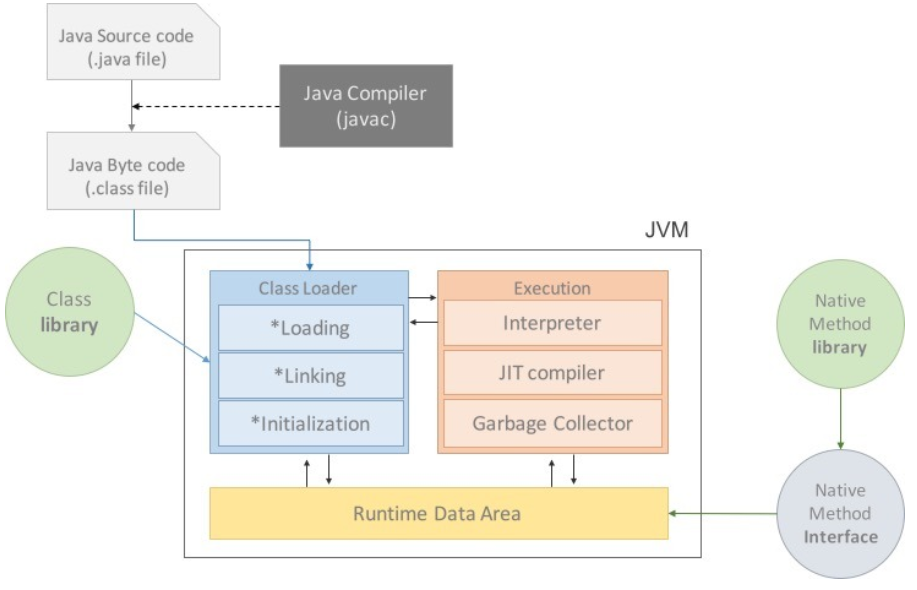

# [JAVA] JVM(자바 가상 머신)

---

## Java Virtual Machine

- 시스템 메모리를 관리하면서 자바 기반 애플리케이션을 위해 이식 가능한 실행 환경 제공

## 자바는 OS에 종속받지 않는다.

- .class는 어느 OS에서나 동작 가능
- .java를 컴파일해서 생성한 .class는 각 OS에 맞는 JVM이 알맞은 실행파일로 바꿔줌
- 바이트코드(명령어가 1바이트라서)는 실시간 인터프리터 또는 JIT 컴파일러를 통해 바이너리 코드로 변환

## JVM 구성요소

## 자바 컴파일 과정

- .java 파일 작성
- 자바 컴파일러가 .java 파일을 컴파일해서 .class 파일(바이트코드) 생성
    
    바이트코드는 아직 컴퓨터는 읽을 수 없지만 JVM은 해석 가능
    
    1바이트 크기의 연산자와 피연산자들로 이루어져 바이트코드라고 부름
    
- 바이트코드를  JVM의 클래스로더로 이동
- 클래스로더는 동적 로딩을 통해 필요한 클래스들을 로딩 및 링크하여 런타임 데이터 영역(JVM의 메모리)에 올림
    - 로드 : 바이트코드를 가져와 JVM의 메모리에 로드
    - 검증 : 자바 언어 명세 및 JVM 명세에 명시된 대로 구성되어 있는지 검사
    - 준비 : 클래스가 필요로 하는 메모리 할당
    - 분석 : 클래스의 상수 풀 내 모든 심볼릭 레퍼런스를 다이렉트 레퍼런스로 변경
    - 초기화 : 클래스 변수들을 적절한 값으로 초기화(static)
- 실행엔진은 JVM 메모리에 올라온 바이트 코드들을 명령어 단위로 하나씩 가져와 실행
    - 인터프리터 : 바이트코드를 명령어 단위로 읽어서 실행, 명령어 하나씩 해석하고 수행하므로 해석은 빠르지만 결과의 실행은 느림
    - JIT 컴파일러
        - 프로그램을 실제 실행하는 시점에 기계어로 변환하는 컴파일러
        - 인터프리터 방식으로 실행하다가 어느 시점에 바이트코드 전체를 컴파일하여 기계어로 변경하고 이후에는 인터프리팅하지 않고 기계어로 직접 실행하는 방식
        - 기계어 실행이 인터프리팅보다 빠르고, 기계어는 캐시에 보관되기 때문에 한 번 컴파일된 코드는 빠르게 수행됨
        - JIT 컴파일러가 컴파일하는 과정이 인터프리팅보다 느리므로 한 번 실행되는 코드라면 컴파일이 아닌 인터프리팅이 유리하므로 JVM이 내부적으로 해당 메서드가 얼마나 자주 수행되는지 체크하고 컴파일을 수행

### JRE, JVM

- JDK > JRE > JRE
- JDK = JRE + 컴파일러, jdb,javadoc
- JRE = JVM + 자바 클래스 라이브러리

[https://d2.naver.com/helloworld/1230](https://d2.naver.com/helloworld/1230)
