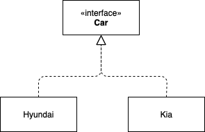
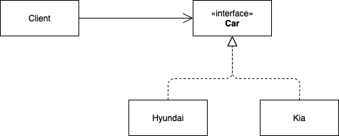

# 타입 캐스팅 & 오토 박싱

## 타입 캐스팅 (형변환)

타입 캐스팅이란 어떤 값의 타입을 우리가 원하는 다른 타입으로 바꿀 수 있는 기능이다. 타입 캐스팅에는 **explicit casting** 과 **implicit casting** 이라는 두 형태가 있다.

### Explicit Casting

*type var = (type) exp*

위와 같은 형태로 사용하는 형변환이다. 명시적 형변환을 할 때 L value의 타입이 더 넓다면 값의 손실이 발생하지 않지만 반대의 경우 값의 손실이 발생한다.

```java
// 1. int형 값을 double에 저장
int a = 10;
double b = (double) a; // b에는 3.0이 저장됨

// 2. double형 값을 int에 저장
double c = 3.14;
int d = (int) c; // d에는 3이 저장됨
```

위의 1번 예시같은 상황을 **Widening Conversion**, 2번 예시같은 상황을 **Narrowing Conversion** 이라고 말하기도 한다. 

### Implicit Casting

위에서 살펴보았던 Widening Conversion의 경우 명시적으로 형변환을 표현 해주지 않아도 자동으로 형변환이 일어난다. 참고로 Narrowing Conversion의 경우 명시적인 형변환을 하지 않으면 컴파일러가 컴파일 타임에 오류를 내보낸다.

또한 implicit casting은 다양한 타입이 혼용된 R value 식에서도 일어난다. 

```java
// 1. double 형과 int 형이 혼용된 R value
double a = 3.14 + 1; // 이 수식은 묵시적으로 3.14 + 1.0 으로 변환된다.

// 2. String concatenation
String s = 1 + "3"; // 문자열이 포함된 경우 "1" + "3" 의 문자열 concatenation이 된다.
// s = 13
```

## 레퍼런스 타입의 캐스팅

레퍼런스 타입의 형변환은 클래스 계층 구조에서 super-sub 관계에 있는 객체들 간에서 이루어질 수 있다. 아무런 연관이 없는 객체간의 형변환을 시도하면 컴파일 오류가 발생한다.



위와 같은 클래스 계층 구조가 있다고 하자.

### Explicit Casting

Narrowing Conversion을 하려는 경우 명시적 형변환이 필요하다. 여기서 Narrowing 이란 부모 타입을 자식 타입에 대입하려는 경우를 말한다.

```java
Car car = hyundaiCar; // Hyundai의 인스턴스 hyundaiCar가 생성되어 있다고 가정
Hyundai hyundai = (Hyundai) car;
```

이때 Hyundai 형으로 생성된 인스턴스를 Kia 형으로 형변환 하면 어떻게 될까?

```java
Car car = hyundaiCar; // Hyundai의 인스턴스 hyundaiCar가 생성되어 있다고 가정
Kia kiaCar = (Kia) car; // -> ClassCastException!!
```

### Implicit Casting

Widening Conversion을 하려는 경우는 명시적으로 형변환을 하지 않더라도 묵시적인 형변환이 일어난다. 여기서 Widening 이란 자식 타입을 부모 타입에 대입하려는 경우를 말한다.

```java
Kia kia = new Kia();
Car car = kia;
```

이제 이 Car 객체를 사용하는 Client가 추가되었다고 하자.



```java
public class Client {
    private final Car car;

    public Client(Car car) {
        this.car = car;
    }

    public void drive() {
        car.go();
    }

    public void stop() {
        car.stop();
    }
    
}
```

Client는 go(), stop() 등 공통 메시지만 알고 있으면 된다. 그리고 이 공통 메시지는 Car 인터페이스에 정의되어 있다. Client가 실제로 사용하는 객체가 Hyundai 인지 Kia 인지는 몰라도 된다. 클라이언트는 그저 car의 go()와 stop() 을 호출 할 뿐이고 car에 들어있는 객체가 Hyundai의 인스턴스인지 Kia의 인스턴스 인지에 따라 다른 동작이 수행된다.

> **c.f.** 참고로 Car 인터페이스를 구현하는 Hyundai와 Kia 에서 어떻게 go()와 stop()을 구현할 지는 자율적이다. 그러나 의도와 다르게 구현해서는 안된다! (LSP 위반) 
> 
> super 타입을 sub 타입으로 바꿔도 프로그램이 다르게 동작해서는 안된다. 
> 
> 위의 예시에서 Car 인터페이스의 의도는 go()를 하면 차가 앞으로 가고 stop()을 하면 멈추는 것을 의도하고 작성되었다. sub 클래스에서 각자의 구현에 따라 go()를 하면 3초만에 움직이기 시작할 수도 있고 0.1초만에 움직이기 시작할 수도 있다. 그러나 갑자기 차가 뒤로 움직인다면 의도와 다르게 잘못 구현된 것이다.

이렇게 프로그래밍 할 수 있는것이 객체지향 프로그래밍에서 말하는 **다형성** 이다. 

## 오토 박싱

### Wrapper Types

프리미티브 타입을 오브젝트 타입으로 사용하기 위해 한 번 감싸준 (wrapping) 타입을 말한다.

| 베이스 타입  | 래퍼 타입 클래스 명 |
|---------|-------------|
| boolean | Boolean     |
| char    | Character   |
| byte    | Byte        |
| short   | Short       |
| int     | Integer     |
| long    | Long        |
| float   | Float       |
| double  | Double      |

### 오토 박싱, 언박싱

자바에서는 베이스 타입과 래퍼 타입 간의 묵시적 형변환을 지원한다. 이를 **automatic boxing**과 **unboxing** 이라고 한다. 특히 제네릭 타입과 관련되어 필수적으로 사용된다. 

예를 들어 아주 빈번하게 사용되는 자바 컬렉션인 Map의 시그니처를 살펴보자.

```java
public interface Map<K, V> {
    ...
    V put(K key, V value);
    V get(Object key);
    ...
}
```

제네릭 타입으로 선언된 K 클래스와 V 클래스를 명시해 주고 사용해야 한다.

```java
Map<String, Integer> map = new HashMap<>();
map.put("a", 10);
int val = map.get("a"); // -> 10
```

Map의 V 위치에 래퍼 클래스인 Integer로 선언하였지만 실제로 사용할 때는 map.put(”a”, 10) 으로 프리미티브 타입을 넘겨주었다. 또한 map.get(”a”)의 리턴 타입은 원래 V 타입으로 Integer를 리턴하지만 프리미티브 타입인 int로 받을 수 있다. 

이런 식으로 래퍼 클래스에 프리미티브 타입을 넣었을 때 **automatic boxing** 이 일어나고,

프리미티브 타입으로 래퍼 타입을 받는 경우 **automatic unboxing**이 일어난다.