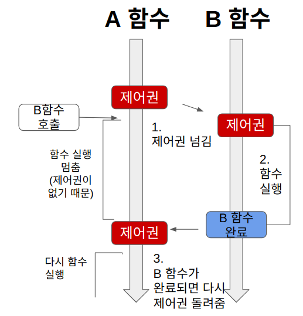
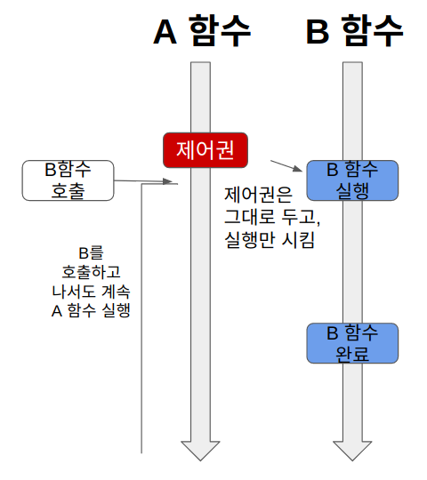
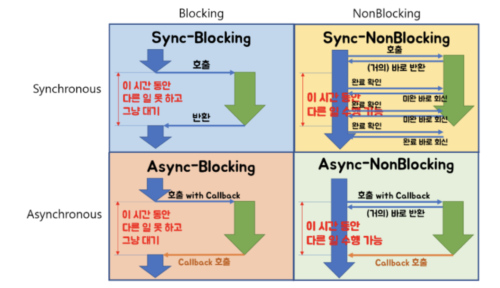
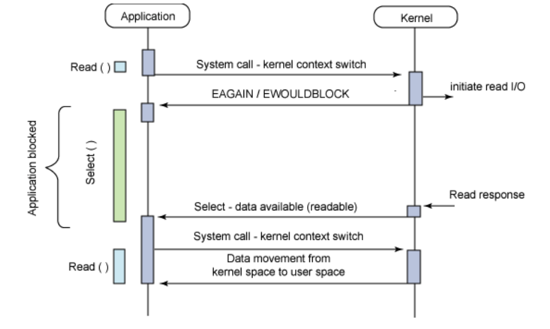
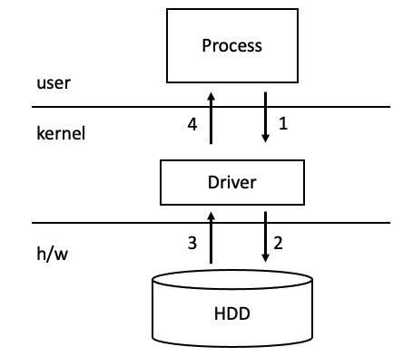
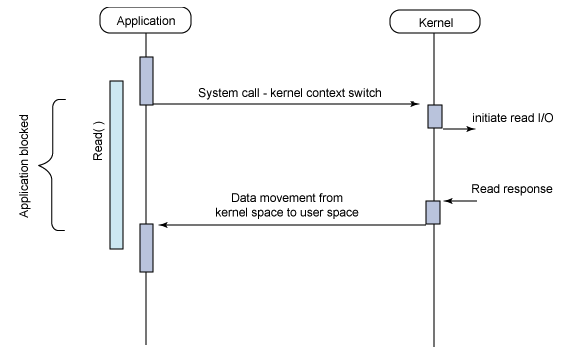
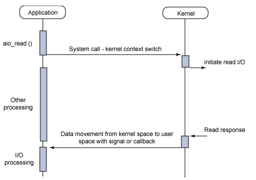
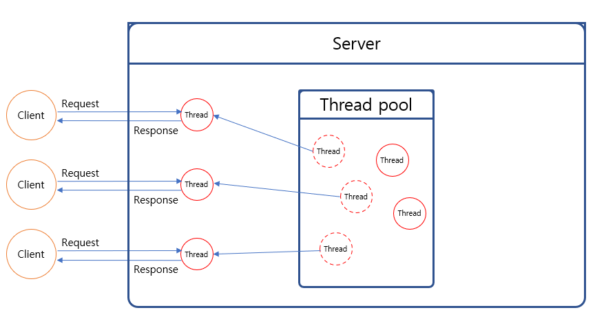

# Blocking, Non-Blocking
## Blocking vs Non-Blocking & Sync vs Async
간단하게 각 용어의 개념부터 짚고 넘어가자.

### Blocking



``` java
public void functionA() {
	...
	int n = functionB(); // functionB가 리턴할 때 까지 A는 블락
	...
}

public int functionB() {
	// do something
}
```

함수 A가 함수 B를 호출하면 B가 실행되는 동안 함수 A의 흐름은 정지된다. 함수 B가 종료되고 리턴하면 A는 이어서 실행된다.

### Non-Blocking



``` java
public void functionA() {
	...
	int n = functionB(); // <- 호출과 동시에 바로 리턴!!
	...
}

public int functionB() {
	// do something
}
```

함수 A가 함수 B를 호출 하면 함수 B의 실행과 상관 없이 즉시 리턴하고 A의 코드를 이어서 실행한다.

### Synchronous
함수 A가 함수 B를 호출하면 Blocking이든 Non Blocking 이든 함수 B의 종료를 함수 A가 신경쓴다.

### Asynchronous
함수 A가 함수 B를 호출할 때 콜백 함수를 함께 전달해 함수B의 작업이 완료되면 콜백 함수가 실행되도록 한다.
함수 A는 함수 B의 종료 여부를 직접 신경쓰지 않는다.

### 조합


### 1) Sync - Blocking
이해하기 쉽다. A가 B의 리턴값을 필요로 하므로 동기적이다. B를 호출하면 A는 Block 되고 B가 종료되면 이어서 실행한다.

### 2) Async - Non Blocking
A는 B를 호출해도 Block 되지 않고 이어서 코드를 실행한다. B의 작업이 종료되면 A가 넘겨준 콜백 함수를 실행한다.

### 3) Sync - Non Blocking
A는 B를 호출해도 Block 되지 않고 이어서 코드를 실행한다. 그런데 A는 B의 리턴값이 필요하기 때문에 중간중간 종료 여부를 확인해야 한다.

### 4) Async - Blocking
일반적인 어플리케이션 레벨 개발에서는 자주 사용되지 않는다.



시스템 콜 중 
``` c
int select (int nfds, fd_set *readfds, fd_set *writefds, 
        fd_set *exceptfds, struct timeval *timeout);
```

함수의 동작이 async - blocking 모델의 예시이다.

## Blocking I/O vs Non Blocking I/O


### Blocking I/O



위에서 살펴보았다시피 Blocking 방식에서는 I/O 작업을 수행하는 동안 어플리케이션이 Block 된다.

### Non Blocking I/O



Non Blocking 방식에서는 커널의 I/O 작업과 무관하게 어플리케이션은 이어서 수행이 가능하다. I/O 작업이 종료되면 콜백 함수가 실행된다.

## Blocking Server vs Non Blocking Server
대표적인 웹 프레임워크인 Spring과 node.js의 동작 방식을 기준으로 생각해보자. 

### Spring
스프링은 기본적으로 스레드 풀 기반으로 동작한다. 클라이언트의 각 요청 마다 스레드가 할당되며 이 스레드가 작업을 처리한다.




### node.js
자바스크립트 기반  런타임이기 때문에 싱글 스레드 환경이다. 싱글 스레드 이면서도 여러 클라이언트의 요청을 처리할 수 있어야 하기 때문에 Async - Non Blocking 모델이 사용된다.

클라이언트로부터 요청이 들어오면 비 동기적으로 요청을 처리하고 작업이 완료되면 콜백 함수를 호출한다. 한 요청에 대한 작업이 끝나기를 기다리지 않기 때문에 동시에 들어오는 여러 요청을 처리할 수 있다.


### 성능 비교
* 단순하게 스프링과 node를 비교하긴 어렵지만 CPU 보다 I/O 작업이 많은 경우에는 node가 유리하다고 한다.
* 반면 싱글 스레드 구조를 갖는 node 에서 CPU를 필요로 하는 요청이 많이 들어온다면 다른 요청 처리가 지연될 수 있다. 
