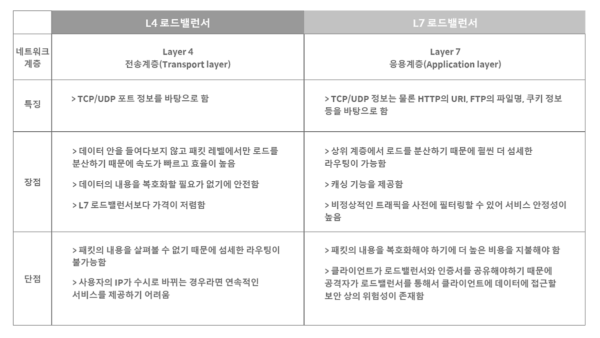

# Load Balancing

## 로드 밸런싱이란?

> 서버가 처리해야 할 업무 혹은 **요청(Load)을 여러 대의 서버로 나누어(Balancing) 처리하는 것**을 의미한다.
> 한 대의 서버로 부하가 집중되지 않도록 트래픽을 관리해 각각의 서버가 최적의 퍼포먼스를 보일 수 있도록 하는 것이 목적이다.

서비스의 규모가 커지고, 이용자 수가 늘어나게 되면 기존의 서버만으로는 원활한 서비스 동작이 불가능하게 되고, 이에 대처할 수 있는 방법은 크게 두 가지로 나뉜다.

- 기존의 서버 성능을 확장하는 `Scale-up` 방식
- 기존의 서버와 동일하거나 낮은 성능의 서버를 증설하는 `Scale-out` 방식싱

이때 Scale-out 방식을 통해 증가한 트래픽에 대처하기로 했다면, 여러 대의 서버로 트래픽을 균등하게 분산해주는 로드 밸런싱이 반드시 필요하다.

## 로드 밸런싱의 종류

### L4 로드 밸런서

- Layer 4 전송 계층 ( Transport Layer )
- 네트워크 계층(IP, IPX)이나 전송 계층(TCP, UDP)의 정보(IP주소, 포트번호, MAC주소, 전송 프로토콜)를 바탕으로 로드를 분산한다.

#### L4에서의 로드 밸런싱 방법

- Round Robin
  - 순서대로 돌아가며 배정하는 방식
  - 서버들이 동일한 스펙을 갖고 있고, 서버와의 연결(세션)이 오래 지속되지 않는 경우에 활용하기 적합.

- Weighted Round Robin
  - 가중치를 매기고 가중치가 높은 서버에 클라이언트 요청을 우선적으로 배분.
  - 주로 서버의 트래픽 처리 능력이 상이한 경우 사용되는 로드밸런싱 방식.
  > ex)
  서버 A의 가중치 5 / 서버 B의 가중치 2이면
   A 서버에 5개, B 서버에 2개의 Request 할당
- IP Hash
  - 클라이언트의 IP 주소를 특정 서버로 매핑
  - 사용자가 항상 동일한 서버로 연결되는 것을 보장
  - 경로가 보장되며, 접속자 수가 많을수록 분산 및 효율이 뛰어남.
- Least Connection
  - 현재 시점에 접속수가 가장 적은 서버로 분배
  - 자주 세션이 길어지거나, 서버에 분배된 트래픽들이 일정하지 않은 경우에 적합
- Least Response Time
  - 서버의 현재 연결 상태와 응답시간(Response Time)을 모두 고려하여, 가장 짧은 응답 시간을 보내는 서버로 트래픽을 할당
  - 각 서버들의 가용한 리소스와 성능, 처리중인 데이터 양 등이 상이할 경우 적합

### L7 로드 밸런서

- Layer 7 응용 계층 ( Application Layer )
- 애플리케이션 계층(HTTP, FTP, SMTP)에서 HTTP 헤더, 쿠키 등과 같은 사용자의 요청을 기준으로 특정 서버에 트래픽을 분산한다.

#### L7에서의 로드 밸런싱 방법

- URL 스위칭(URL Switching) 방식
  - 특정 하위 URL들은 특정 서버로 처리하는 방식.
    > ex)
    '.../hoosa/image' => 이미지 처리 서버
    '.../hoosa/video' => 동영상 처리 서버
- 컨텍스트 스위칭(Context Switching) 방식
  - 클라이언트가 요청한 특정 리소스에 대해 특정 서버로 연결 가능.
    > ex)
    이미지 파일에 대해서는 확장자를 참조하여, 별도로 구성된 이미지 파일이 있는 서버 or 스토리지로 직접 연결.
- 쿠키 지속성(Persistence with Cookies)
  - 쿠키 정보를 바탕으로 클라이언트가 연결했었던 동일한 서버에 계속 할당해 주는 방식.
  - 특히, 사설 네트워크에 있던 클라이언트의 IP 주소가 공인 IP 주소로 치환되어 전송하는 방식을 지원.

### L4와 L7의 차이점

### 추가 내용

#### VIP( Virtual IP )

#### Health Check (상태 확인)

- 서버들에 대한 주기적인 Health Check를 통해 서버들의 장애 여부를 판단하여, 정상 동작 중인 서버로만 트래픽을 보낸다.
- L3 체크 : ICMP를 이용하여 서버의 IP 주소가 통신 가능한 상태인지를 확인한다.
- L4 체크 : TCP는 3 Way-Handshaking (전송 - 확인/전송 - 확인) 를 기반으로 통신하는데, 이러한 TCP의 특성을 바탕으로 각 포트 상태를 체크하는 방식.
- L7 체크 : 어플리케이션 계층에서 체크를 수행. 실제 웹페이지에 통신을 시도하여 이상 유무를 파악.

#### DSR (Destination Network Address Translation)

- 서버에서 클라이언트로 트래픽이 되돌아가는 경우, 목적지를 클라이언트로 설정한 다음, 네트워크 장비나 로드밸런서를 거치지 않고 바로 클라이언트를 찾아가는 방식.
- 이 기능을 통해 로드밸런서의 부하를 줄여줄 수 있음.

#### L2DSR과 L3DSR

L2DSR은 L2 Layer 헤더인 MAC 주소 변경을 통해 클라이언트의 Request가 전달되는 반면 L3DSR은 IP헤더를 변조하여 서버에 Request를 전달하는 구성입니다.
L2DSR의 경우는 MAC 주소 변경을 위해 서버와 ADC 모두 동일한 Broadcast 도메인에 포함되어야 했고, 그로인한 물리적 회선, 위치등의 한계성이 있었습니다.
그러나 L3DSR의 경우 SLB에서 IP 주소 변경을 통해 클라이언트의 Request가 서버로 전달되기 때문에 L2DSR에서의 물리적인 한계성을 극복 할 수 있습니다.
