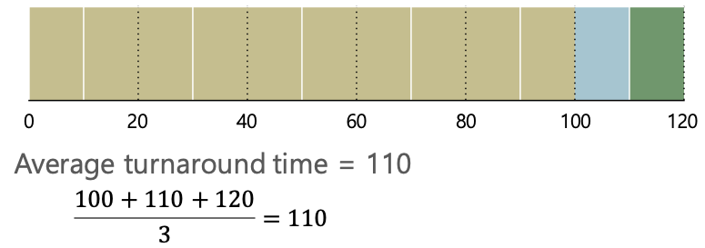
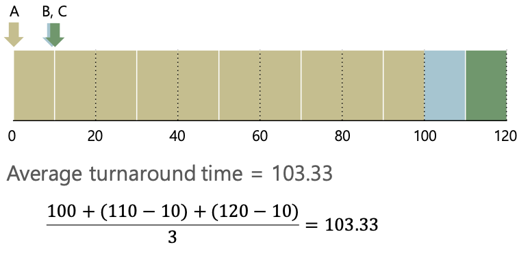
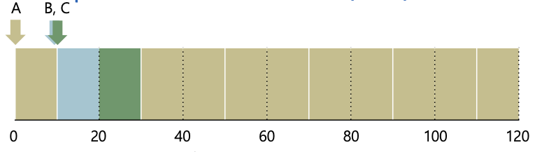
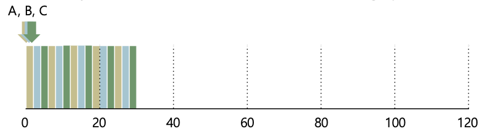
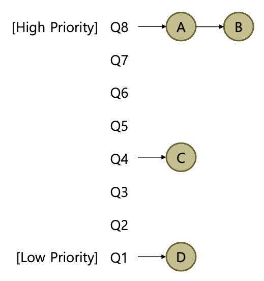

# CPU 스케줄링
> 컨텍스트 스위칭이 일어나면 CPU 스케줄러가 다음에 실행될 프로세스를 선택한다.   
> 프로세스 선택 방법에 따라 처리 효율이 달라지거나 사용자 반응이 좋아질 수 있다.  
> 반면 아무렇게나 프로세스를 선택하게 되면 효율이 떨어진다. 즉 CPU를 효율적으로 잘 사용하기 위해서 좋은 스케줄링 알고리즘이 필요한 것이다.  

## 스케줄링 정책 평가의 기준
### Turnaround Time
Turnaround Time = Completion Time - Arrival Time

* 프로세스가 종료된 시각에서 도착한 시각을 뺀 시간
* 즉 프로세스가 완료되기까지 걸린 시간

### Response Time
Response Time = First Run Time - Arrival Time

* 프로세스가 처음으로 실행된 시각에서 도착한 시각을 뺀 시간
* 즉 프로세스의 첫 응답시간

## 여러가지 스케줄링 알고리즘
### FIFO (FCFS) 알고리즘
* 먼저 들어온 순서대로 스케줄링 하는 방식
* 구현이 아주 간단하다.
* 작업시간이 긴 프로세스가 먼저 실행되면 다른 프로세스들이 기다리느라 전체 평균 Turnaround Time이 증가한다. -> Convoy 효과

### SJF (Shortest Job First) 알고리즘
* Non Preemptive 알고리즘
* 수행시간이 짧은 순서대로 스케줄링
* 비 선점 방식 알고리즘이기 때문에 수행시간이 긴 프로세스가 일단 실행되고 나면 수행시간이 짧은 프로세스가 들어와도 중간에 실행이 넘어가지 않음
	* 즉 이 경우 Convoy 효과를 막을 수 없음
	

### STCF (Shortest Time to Completion First) 알고리즘
* Preemptive 알고리즘
* Convoy 문제 해결
* Response Time은 좋지 못할 수 있음

### RR (Round Robin) 알고리즘
* 프로세스를 설정된 time slice 만큼만 실행시키는 방식
* time slice가 끝날 때 마다 스케줄러가 동작
* 프로세스의 수행 시간을 알지 못할 때 적용할 수 있는 현실적인 알고리즘
* Response Time이 아주 짧은 반면 Turnaround Time은 좋지 못함 
* time slice가 너무 크면 Response Time이 나빠지고 너무 작으면 컨텍스트 스위치로 인한 오버헤드가 크다.

### MLFQ (Multi Level Feedback Queue) 알고리즘
* 여러 개의 큐가 각자의 priority level을 가지고 있다.

기본적인 규칙
1. 프로세스 A의 우선순위가 프로세스 B 보다 높다면 A가 실행된다.
2. 프로세스 A와 프로세스B의 우선순위가 같다면 (같은 큐에 들어있다면) RR 스케줄링을 따른다.

**우선순위를 부여하는 방법**
프로세스를 다음과 같이 두 가지로 분류한다.
* I/O bound job: CPU를 짧게 쓰고 interactive한 작업이 많은 job
* CPU bound job: CPU를 길게 쓰는 계산 집중적인 job

프로세스의 동작에 따라 우선순위를 구분한다.
* 계속 I/O 요청 등으로 CPU를 양보한다면 우선순위를 높게 유지
* 주어진 time slice를 모두 사용하면 우선순위를 낮춤

**생길 수 있는 문제점**
* Starvation
	* I/O bound job이 많으면 우선순위에 밀려 CPU bound job이 실생 순서를 받지 못하는 문제 발생
* Changing behavior
	* job이 시간이 흐름에 따라 I/O bound <-> CPU bound 로 변할 수 있음
	
해결책: 주기적으로 모든 프로세스를 최상위 큐로 올림

## 멀티 스레드 스케줄링
* 멀티 스레드 스케줄링 이라고 해서 일반적인 프로세스 스케줄링 방식과 크게 다르지 않다.
* 사실 대부분의 OS는 task 단위로 스케줄링 한다.
* 이때 말하는 task는 스레드 일 수도, 프로세스 일 수도 있다.

#CS 스터디/운영체제/CPU 스케줄링#