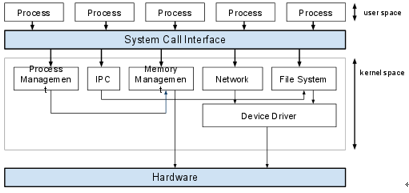

# IPC

## IPC란?

**Inter Process Communication**의 약자로 프로세스들끼리 서로 데이터를 주고 받는 행위 또는 그에 대한 방법을 말한다.

위 그림처럼 **프로세스는 완전히 독립된 실행체**입니다. 서로 독립되어 있다는 것은 **다른 프로세스의 영향을 받지 않는다**는 장점이 있습니다. 하지만 독립되어 있는 만큼 **별도의 설비가 없이는 서로간에 통신이 어렵다**는 문제가 있게 된다.

이를 위해서 커널 영역에서 IPC라는 내부 프로세스간 통신을 제공하게 되고, 프로세스는 커널이 제공하는 IPC설비를 이용해서 프로세스간 통신을 할 수 있게 된다.

## IPC의 종류

1. 메시지 전달 (Message Passing)
    커널이 제공하는 API를 이용해서 커널 공간을 통해 통신한다. 메시지 큐(Mesage Queue)를 사용하여 송신 프로세스는 큐에 enqueue, 수신 프로세스는 큐에 dequeue 하며 상호간 통신한다. 메시지 큐는 커널 단에서 관리된다.
    > 파이프 (쉘에서 사용하는 그 파이프임)
    소켓 (TCP/IP) - 로컬에서도 통신이 가능하며 원격에서도 통신이 가능하다. (IP : 127.0.0.1일 경우 로컬에서 패킷을 통해 프로세스끼리 통신하기도 한다.)
2. 메모리 공유 (Shared Memory)
    프로세스끼리 특정 공통의 메모리 영역을 공유하며 상호간 통신하는 방법이다.
    데이터 자체를 공유하도록 지원하며, 한 프로세스에서 변경한 메모리 공간의 내용을 다른 프로세스에서 접근할 수 있다. 공유 메모리는 커널에서 관리된다.

## 다양한 IPC들

1) PIPE (익명 PIPE)
   - 파이프는 두 개의 프로세스를 연결하게 되고, 하나의 프로세스는 데이터를 쓰기만, 다른 하나는 데이터를 읽기만 할 수 있습니다.
   - 통신을 할 프로세스가 명확하게 알 수 있는 경우 사용합니다.
   - 전이중 통신을 하려면 2개를 만들어야한다.
2) Named PIPE(FIFO)
   - Named PIPE는 전혀 모르는 상태의 프로세스들 사이의 통신의 경우 사용합니다.
   - PIPE는 같은 부모의 PPID를 가진 프로세스 안에서만 통신 가능하지만 FIFO은 아니다.
   - 읽기/쓰기가 동시에 가능하지 않다.
   - 전이중 통신을 하려면 2개를 만들어야한다.
3) Message Queue
   - 입출력 방식은 Named 파이프와 동일함
   - Name PIPE가 데이터의 흐름이라면 메시지 큐는 메모리 공간이다.
   - 메시지 큐에 쓸 데이터에 번호를 붙임으로써 여러 개의 프로세스가 동시에 데이터를 쉽게 다룰 수 있다.
4) Shared Memory(공유 메모리)
   - 파이프, 메시지 큐가 통신을 이용한 설비라면, 공유 메모리는 데이터 자체를 공유하도록 지원하는 설비다.
   - 프로세스의 메모리 영역은 독립적으로 가지며 다른 프로세스가 접근하지 못하도록 반드시 보호되야한다. 하지만 다른 프로세스가 데이터를 사용하도록 해야하는 상황도 필요할 것이다. 파이프를 이용해 통신을 통해 데이터 전달도 가능하지만, 스레드처럼 메모리를 공유하도록 해준다면 더욱 편할 것이다.
   - 공유 메모리는 프로세스간 메모리 영역을 공유해서 사용할 수 있도록 허용해준다.
   - 프로세스가 공유 메모리 할당을 커널에 요청하면, 커널은 해당 프로세스에 메모리 공간을 할당해주고 이후 모든 프로세스는 해당 메모리 영역에 접근할 수 있게 된다.
   >중개자 없이 곧바로 메모리에 접근할 수 있어서 IPC 중에 가장 빠르게 작동함
5) Memory Map(메모리 맵)
   - 공유 메모리처럼 메모리를 공유해준다. 메모리 맵은 열린 파일을 메모리에 맵핑시켜서 공유하는 방식이다. (즉 공유 매개체가 파일+메모리)
   - 주로 파일로 대용량 데이터를 공유해야 할 때 사용한다.
6) Socket(소켓)
   - 네트워크 소켓 통신을 통해 데이터를 공유한다.
   - 클라이언트와 서버가 소켓을 통해서 통신하는 구조로, 원격에서 프로세스 간 데이터를 공유할 때 사용한다.
   - 서버(bind, listen, accept), 클라이언트(connect)

이러한 IPC 통신에서 프로세스 간 데이터를 동기화하고 보호하기 위해 세마포어와 뮤텍스를 사용한다. (공유된 자원에 한번에 하나의 프로세스만 접근시킬 때)
