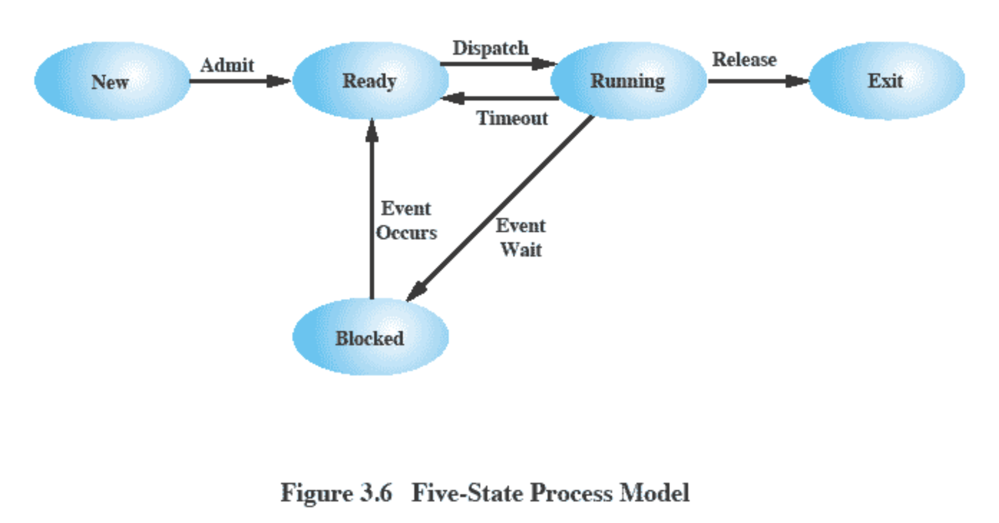
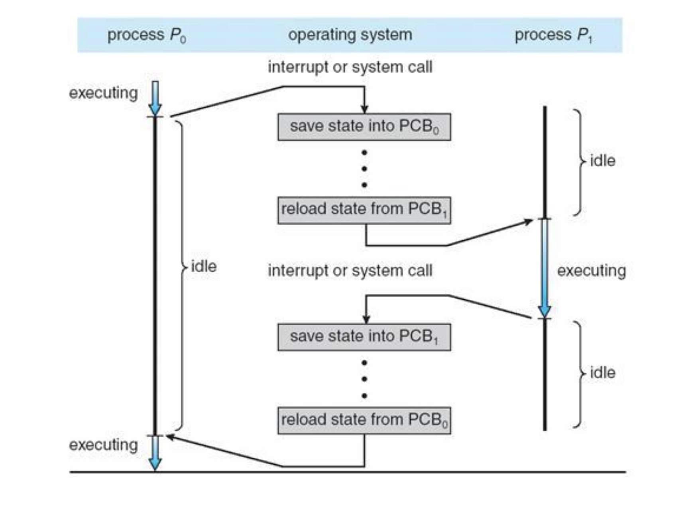

> ## Table of Contents
>
> - [📓 프로세스](#-프로세스)
>   * [📌 프로그램과 프로세스 ✨](#-프로그램과-프로세스-)
>   * [📌 프로그램에서 프로세스로](#-프로그램에서-프로세스로)
>   * [📌 프로세스의 상태 ✨](#-프로세스의-상태-)
>     + [🙋 왜 프로세스의 상태마다 큐를 두고 관리하는 걸까요?](#-왜-프로세스의-상태마다-큐를-두고-관리하는-걸까요)
>     + [🏃 프로세스의 상태 종류](#-프로그램에서-프로세스로)
> - [📓 PCB: Process Control Block](#-pcb-process-control-block)
>   * [📌 프로세스 제어 블록](#-프로세스-제어-블록)
>     + [❗️PCB 구성](#pcb-구성)
>   * [📌 Context Switching ✨](#-context-switching-)
>     + [❗️ Context Switching(문맥 교환)이란](#-context-switching문맥-교환이란)
>     + [❗️ 언제 일어날까?](#-언제-일어날까)
>     + [❗️ 절차](#-절차)
>     + [❗️단점](#단점)
>     + [🙋 오버헤드를 해결할 수 있는 방법이 있을까요?](#-오버헤드를-해결할-수-있는-방법이-있을까요)
>
>
> > ### 여기서도 볼 수 있어요
> > 1. [프로세스의 개요](https://goldggyul.github.io/os-001-process/)
> > 2. [프로세스 제어 블록과 문맥 교환](https://goldggyul.github.io/os-002-pcb/)

----------------------

# 📓 프로세스

## 📌 프로그램과 프로세스 ✨

운영체제에서 `프로세스`는 하나의 작업단위입니다. (그래서 프로세스를 `task`라고도 부릅니다.) 사용자가 마우스를 더블클릭하여 `프로그램`을 실행하면 그 프로그램이 프로세스가 되는 겁니다. 그럼 정확히 둘의 차이는 뭘까요?

- 정적인 상태 vs. 동적인 상태
  - 프로그램은 저장장치에 보관되어 있습니다. 그리고 프로그램이 실행된다는 건 프로그램 코드가 `메모리`에 올라와서 작업이 진행되는 것입니다. 그리고 이렇게 메모리에 올라온 것이 프로세스라고 할 수 있습니다. 
- 프로그램은 작업 절차를 쭉 적어놓은 것이고, 프로세스는 그 작성된 작업 절차를 실제로 실행하는 것입니다.
  - 예를 들자면, 요리할 때 레시피를 보고 레시피를 순서대로 실행하면서 요리를 하는 것과 같습니다. 이 때 레시피가 프로그램이고, 요리를 하는 것은 프로세스가 명령을 실행하는 것이라고 할 수 있습니다.
  - 이 때, 레스토랑에서 요리하는 요리사를 생각해봅시다. 계속해서 여러 요리 주문이 들어오겠죠? 근데 요리사가 한 번에 한 요리만 요리하면 어떨까요? 손님들도 오래 기다리고, 비효율적으로 요리를 하게 되겠죠? 프로세스도 마찬가지입니다. CPU가 한 프로세스가 종료될 때까지 다른 프로세스를 실행하지 못한다면 비효율적입니다. 그래서 실제로 프로세스 역시 `Context Switching(문맥 교환)`을 통해 여러 프로세스가 번갈아가며 실행되게 됩니다.

## 📌 프로그램에서 프로세스로

둘의 차이는 알겠습니다. 그럼 프로그램에서 정확히 어떻게 프로세스로 전환되는 걸까요?

우선 명령어를 실행하기 위해서는 프로그램을 메모리에 올려야 하겠죠? 그래서 프로그램을 메모리의 적당한 위치로 가져옵니다. 메모리에 가져오기만 하면 끝일까요?

작업을 진짜로 하는 건 CPU입니다. CPU가 프로세스를 실행하기 위해서는 프로세스가 메모리 어디에 올라와 있는 지를 알아야할 것입니다. 또, 위에서 Context Switching을 통해 여러 프로세스가 번갈아가며 실행된다고 했습니다. 그렇다면 이전에 프로세스가 어디까지 실행됐는 지 정보도 필요합니다. 또 여러 프로세스가 실행되고 있으니, 프로세스마다 이름이 있어야 서로 구분하고 원하는 걸 실행할 수도 있을 것입니다.

<u>즉, 메모리에 올리는 것 뿐만 아닌 이런 프로세스를 실행하는 데 필요한 각종 정보들을 저장해놔야 합니다.</u> 이 정보들을 운영체제는 `PCB(Process Control Block)`를 생성해서 관리합니다.

## 📌 프로세스의 상태 ✨

여러 프로세스를 번갈아가며 실행한다면, 현재 실행 중인 프로세스도 있을것이고, 대기 중이거나, 실행을 기다리는 프로세스가 있을 것입니다. OS는 이런 프로세스의 상태를 관리해야 다음에 어떤 프로세스를 실행할 지 알 수 있겠죠? 

이런 <u>프로세스의 상태마다 OS는 여러 타입의 queue를 두고 관리</u>합니다.

- 여기선 queue라고 했지만, 실제로는  OS마다 다르게 구현될 수 있습니다. 예를 들어 linux는 Red Black Tree를 이용합니다.

그리고 이 queue에 PCB를 넣어서 관리하는 것입니다.

> ### 🙋 왜 프로세스의 상태마다 큐를 두고 관리하는 걸까요?

### 🏃 프로세스의 상태 종류

크게는 Run, Ready, Waiting 3가지 상태로 볼 수도 있고, 이외에도 여러 프로세스 상태 모델이 있는데, 5가지 상태의 프로세스 모델을 살펴보겠습니다.

1. 생성 상태 `create`
   - 프로세스가 메모리에 올라와 실행 준비를 완료한 상태입니다.
   - 이 때 PCB도 생성됩니다.
2. 준비 상태 `ready`
   - 생성된 프로세스가  CPU를 얻을 때까지 기다리는 상태. 자기 실행 순서가 될 때까지 프로세스는 준비 상태에서 기다려야 합니다.
   - CPU scheduler가 준비 큐를 관리합니다. CPU 스케줄러는 Context Switching이 일어날 때 어떤 프로세스를 running 시킬 지 결정합니다. 더 자세한 건 스케줄러 관련해서 따로 정리하겠습니다.
3. 실행 상태 `running`
   - 준비 상태에 있는 프로세스 중 하나가 CPU를 얻어 실제 작업을 수행하는 상태입니다.
   - 일정 시간동안 CPU를 사용한 권리를 갖는다. 주어진 시간동안 작업이 끝나지 않았다면 다시 준비 상태로 돌아갑니다.
4. 완료 상태 `terminate` `exit`
   - 주어진 시간동안 작업을 완료한 상태입니다.
   - 이 때 PCB도 폐기하고, 코드와 사용했던 데이터를 메모리에서 삭제합니다.
   - 정상적 종료라면 exit()로 간단하게 처리되지만, 오류나 다른 프로세스에 의해 비정상적으로 종료되는 강제 종료(abort)를 만나면 디버깅하기 위해 강제 종료 직전의 메모리 상태를 저장장치로 옮깁니다. 이를 코어 덤프(core dump)라고 합니다.
5. 대기 상태 `blocking`  `waiting`
   - 프로세스가 입출력을 요구하면, CPU가 직접 데이터를 가져오는 것이 아니고 입출력 관리자에게 명령을 내립니다. 이 상태에서 프로세스가 요청한 작업이 끝날 때까지 CPU가 아무 작업도 하지 않고 기다리면 효율성이 떨어지겠죠?
   - 따라서 입출력을 요구한 프로세스가 입출력이 완료될 때까지 기다리는 상태입니다.
   - 대기 상태의 프로세스는 요청한 입출력이 완료되면 입출력 관리자로부터 인터럽트를 받습니다. 현재 실행 중인 프로세스가 있기 때문에, 대기 상태의 프로세스는 바로 실행 상태로 돌아가지 않고, 준비 상태로 돌아가서 다시 자기 차례를 기다립니다.

# 📓 PCB: Process Control Block

## 📌 프로세스 제어 블록

[프로세스의 개요](https://goldggyul.github.io/os-001-process/)에서 프로세스를 실행하는 데 메모리만 필요한 것이 아니고, 관리하기 위한 자료 구조로 PCB가 필요하다고 했죠? PCB에 대해 더 알아봅시다.

- 프로세스를  Task라고도 하는 것처럼, PCB 역시 TCB라고도 부릅니다.

### ❗️PCB 구성

<table style="text-align: center;">
  <tr>
    <td><strong>포인터</strong></td>
    <td>프로세스 상태</td>
  </tr>
  <tr>
    <td colspan="2">Process ID</td>
  </tr>
  <tr>
    <td colspan="2">Process Priority</td>
  </tr>
    <tr>
    <td colspan="2">Program Counter</td>
  </tr>
  <tr>
    <td colspan="2">각종 CPU Registers 정보</td>
  </tr>
  <tr>
    <td colspan="2">메모리 관리 정보</td>
  </tr>
  <tr>
    <td colspan="2">할당된 자원 정보</td>
  </tr>
  <tr>
    <td colspan="2">PPID와 CPID</td>
  </tr>

</table>

1. 포인터
   - [프로세스의 개요](https://goldggyul.github.io/os-001-process/)에서 프로세스의 상태에 따라 큐로 운영된다고 했습니다. 이 때 queue에서 PCB를 연결할 때 포인터를 사용합니다.
   
2. 프로세스 상태
   - Run, Ready, Waiting 등의 상태
   
3. 프로세스 ID
   - 프로세스를 구별하기 위한 구분자
   
4. 프로그램 우선순위
   - CPU Scheduling이 일어나서 스케줄러가 준비 상태에 있는 프로세스 중 실행 상태로 옮겨야 할 프로세스를 어떻게 선택할까요?
   - 프로세스 우선순위를 기준으로 삼아서, 높은 우선순위의 프로세스를 먼저 실행하게 됩니다. 이에 관한건 스케줄링만 다룰 때 더 자세히 살펴보겠습니다.
   
5. 프로그램 카운터
   - 다음에 실행될 명령어의 위치를 가리키는 프로그램 카운터 값을 저장해놓습니다. 이게 있어야 Context Switching이 일어나서 다시 프로세스가 실행될 때 어디를 실행해야할 지 알 수 있겠죠?
   
6. 각종 레지스터 정보
   - 프로세스가 실행되면서 함수를 호출할 때마다 지역 변수는 스택에 저장되죠? 그럼 이 스택이 어딨는 지를 알아야 저장을 할 수 있습니다. 이 때 `스택 포인터`도 이 레지스터 정보에 포함됩니다.
   - 이 값을 저장해놔야 다음에 실행할 때 이어서 실행할 수 있을 거에요.

7. 메모리 관리 정보
   - 할당받았던 메모리가 어디 있는지 나타내는 위치 정보, `segmentation table`, `page table`의 정보도 보관합니다. 더 자세한 건 가상 메모리에 대해 다룰 때 정리하겠습니다.
   
8. 할당된 자원 정보
   - 프로세스가 실행 중에 사용하는 파일, 입출력 장치 같은 리소스는 처음 사용될 때 OS가 리소스 번호를 할당합니다. 이 때 이 번호는 양의 정수로서, PCB의 file descriptor table에 등록됩니다. 
   - 참고: [bash-shell/file_descriptors](https://mug896.github.io/bash-shell/file_descriptors.html)
   
9. PPID와 CPID
   - 부모 프로세스를 가리키는 PPID, 자식 프로세스(들)를 가리키는 CPID 정보도 저장됩니다.
   
     >예를 들어 `fork()` 시스템 호출로 프로세스가 복사됩니다. 이 때 원래 실행하던 프로세스는 부모 프로세스, 새로 생긴 프로세스는 자식 프로세스로 부모-자식 관계가 됩니다.

## 📌 Context Switching ✨

CPU가 한 프로세스가 끝날 때까지 다른 프로세스를 실행하지 않으면 비효율적이어서  여러 프로세스를 번갈아가면서 실행하고, 그 때 프로세스의 정보들을 PCB에 저장해서 관리한다고 했습니다. 그럼 <u>어떻게 번갈아가면서 실행할까요?</u>

### ❗️ Context Switching(문맥 교환)이란

Context Switching이란 CPU를 차지하던 프로세스가 나가고 새로운 프로세스를 받아들이는 작업입니다. 이 때 실행 상태에서 나가는 PCB에는 지금까지의 작업 내용을 저장하고, 반대로 실행 상태로 들어오는 PCB의 내용을 읽어서 레지스터에 적재하여 CPU가 세팅됩니다. 그래야 들어오는 프로세스가 계속해서 이어서 작업을 할 수 있겠죠?

즉, 이와 같이 두 프로세스의  PCB를 교환하는 작업이 Context Switching입니다. 그리고 이 때 교체되는 새로운 프로세스는 CPU 스케줄러에 의해 결정됩니다.

### ❗️ 언제 일어날까?

인터럽트가 발생했을 때 일어납니다.

- 일반적으로는 프로세스가 주어진 CPU 사용 허가 시간을 모두 소진할 때

- 입출력을 위해 대기할 때

- 자식 프로세스를 만들 때
- 인터럽트 처리를 기다릴 때

### ❗️ 절차

프로세스 P1과  P2의 Context switching 과정을 좀 더 살펴봅시다.

| 단계 | 절차                          | 설명                                                         |
| ---- | ----------------------------- | ------------------------------------------------------------ |
| 1    | 인터럽트/ 시스템 호출         | 어떤 이유로 인터럽트가 발생합니다. 예를 들어, 실행 상태에 있는 프로세스 P1이 주어진 시간을 다 사용하여 운영체제에서 스케줄러에 의해 인터럽트가 발생합니다. |
| 2    | 커널 모드 전환                | P1이 유저 모드에서 커널 모드로 전환, P1은 준비 상태          |
| 3    | 현재 프로세스 상태 PCB에 저장 | P1의 현재 프로세스 상태 PCB에 저장                           |
| 4    | 다음 실행 프로세스 로드       | P2의 PCB 정보를 통해 CPU 레지스터 정보를 채움  이 때 Program Counter를 통해 어느 명령어를 실행할 지를 알 수 있고, Stack Pointer를 통해 프로세스의 스택 영역 마지막 주소를 알 수 있습니다. |
| 5    | 유저 모드 전환                | P2 프로세스 커널 모드에서 유저 모드로 전환되어 실행          |

### ❗️단점

Context Switching이 너무 잦으면 오버헤드가 발생해서 성능이 떨어집니다.

- 커널 모드, 유저 모드 전환하면서 상태 저장하고 레지스터값 다시 불러오고..
- 그 외에도 캐시 메모리도 비워야 하고..
- 이러는 동안  CPU는 다른 작업을 하지 못합니다.

그럼에도 불구하고 CPU를 그냥 놀게 놔두는 것보다 다른 프로세스를 수행시키는 것이 더 효율적일 때 스케줄러는 Context Switching을 합니다.

> ### 🙋 오버헤드를 해결할 수 있는 방법이 있을까요?

-----------------------

> 👀 다음을 참고하여 작성했습니다.
>
> - [쉽게 배우는 운영체제](http://www.yes24.com/Product/Goods/62054527)
> - 학부 수업
> - [@gyoogle/tech-interview-for-developer](https://github.com/gyoogle/tech-interview-for-developer/)
