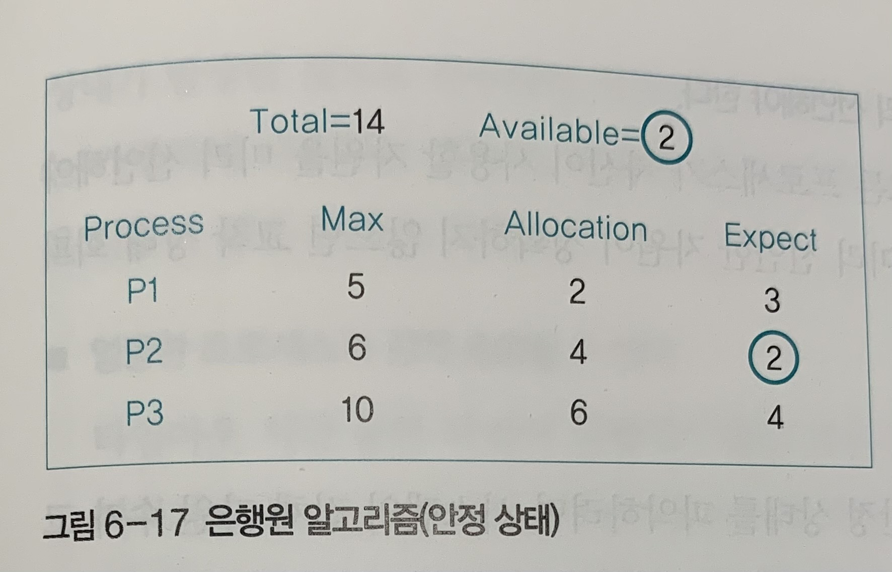
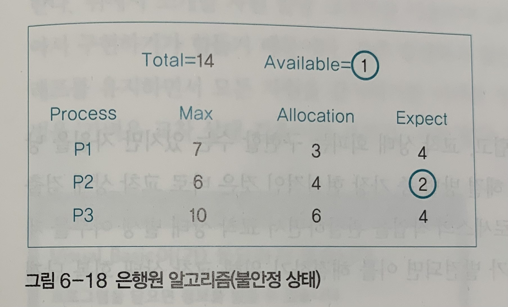

> ### Table of Contents
>
> - [📓 데드락(deadlock) | 교착 상태](#-데드락deadlock--교착-상태)
>   * [📌 데드락이란?](#-데드락이란)
>     + [starvation](#starvation)
>   * [📌 데드락이 발생하는 경우](#-데드락이-발생하는-경우)
>     + [1. 시스템 자원을 사용하는 경우](#1-시스템-자원을-사용하는-경우)
>     + [2. 공유 변수](#2-공유-변수)
>     + [3. 응용 프로그램](#3-응용-프로그램)
>     + [식사하는 철학자 문제 (Dining Philosophers)](#식사하는-철학자-문제-dining-philosophers)
>   * [📌  데드락 발생 <u>**필요**</u>조건 4가지](#--데드락-발생-필요조건-4가지)
>     + [1. 상호 배제 `Mutual exclusion`](#1-상호-배제-mutual-exclusion)
>     + [2. 비선점 `No preemption`](#2-비선점-no-preemption)
>     + [3. 점유와 대기 `Hold-and-wait`](#3-점유와-대기-hold-and-wait)
>     + [4. 원형 대기 `Circular wait`](#4-원형-대기-circular-wait)
> - [📓 데드락 해결 방법](#-데드락-해결-방법)
>   * [📌 예방하기 (Prevention)](#-예방하기-prevention)
>     + [1. 상호 배제 예방](#1-상호-배제-예방)
>     + [2. 비선점 예방](#2-비선점-예방)
>     + [3. 점유와 대기 예방](#3-점유와-대기-예방)
>     + [4. 원형 대기 예방](#4-원형-대기-예방)
>   * [📌  회피하기 (Avoidance)](#--회피하기-avoidance)
>     + [은행원 알고리즘](#은행원-알고리즘)
>     + [문제점](#문제점)
>   * [📌 검출 및 회복하기](#-검출-및-회복하기)
>     + [검출](#검출)
>     + [회복](#회복)
>
> > ### 여기서도 볼 수 있어요
> >
> > [데드락(deadlock) | 교착 상태](https://goldggyul.github.io/os-003-deadlock/)

------------------------------------------
# 📓 데드락(deadlock) | 교착 상태

시스템 내의 임계 구역(critical section)이 존재할 경우, 프로세스 간 상호 배제(mutual exclusion)를 보장해야 합니다. 이를 보장하기 위해 잠금(lock)을 사용하다보면 작업이 더 이상 진행되지 않는 교착상태(deadlock)에 빠지는 경우가 있습니다. 이 때 이 데드락은 무엇이고, 왜 발생하고, 어떻게 해결할까요?

## 📌 데드락이란? 

- 두 개 이상의 프로세스가 <u>**다른 프로세스의 작업이 끝나기만 기다리며 작업을 더 이상 진행하지 못하는 상태**</u>입니다.

  - 이 때, '더 이상 진행하지 못하는 상태'라는 이유로 `아사 현상(starvation)`과 헷갈리기 쉬우므로 주의해야합니다

    > ### starvation
    >
    > 작업을 해야 하는 프로세스가 <u>**프로세서(CPU)를 할당받지 못해 Ready 상태에서 더 이상 진행하지 못하는 상태**</u>입니다. 스케줄링에 대해 공부하다가 나오는 개념입니다.
    >
    > starvation은 운영체제가 잘못된 정책을 사용하여 특정 프로세스의 작업이 지연되는 문제고, deadlock은 여러 프로세스가 작업을 진행하다 보니 자연적으로 일어나는 문제입니다.
    >
    > 또한 starvation은 프로세서를 할당받아야 running 상태로 진행될 수 있지만, deadlock은 필요한 공유 자원(자원, 변수 등)을 얻어야 ready 상태가 되어 프로세서를 할당받게 될 수 있는 것입니다.

## 📌 데드락이 발생하는 경우

- 프로세스가 어떨 때 다른 프로세스의 작업이 끝나기를 기다리면서 데드락이 발생할까요?

### 1. 시스템 자원을 사용하는 경우

- 프로세스가 다른 프로세스와 공유할 수 없는 자원을 사용할 때 데드락이 일어날 수 있습니다.
- 예) 시스템 자원으로 **<u>동시에 사용될 수 없는</u>** 프린터, CD 레코더가 있다고 해봅시다. 이 때 프로세스 P1이 프린터를 할당받았고, 프로세스 P2가 CD 레코더를 할당받았습니다. 근데 P1이 CD 레코더를 기다리고, P2가 프린터를 기다린다면 어떨까요? 더 이상 진행되지 않고 데드락이 발생할 것입니다.

### 2. 공유 변수

- 한 공유 변수를 할당받은 상태에서 다른 공유 변수를 기다릴 때 교착 상태가 발생할 수 있습니다.

- critical section에 진입하려 하는 두 프로세스가 있고, 공유 데이터에 의해 race condition을 방지하기 위해 lock이 사용됐다고 생각해봅시다. 이 때 P1이 lock1을 얻고, P2이 lock2를 얻었습니다. 근데 P1이 lock2를 얻으려고 대기하고, P2가 lock1을 얻으려고 대기합니다. 그럼 둘 모두 critical section에 들어가지 못하고 계속 기다리게 되어 데드락이 발생하게 됩니다.

### 3. 응용 프로그램

- 데이터베이스 같은 응용 프로그램에서도 교착 상태가 발생합니다. 여러 프로세스가 데이터베이스를 접근하므로 데이터베이스 역시 데이터 일관성을 위해서 락을 사용합니다. 이 때 역시 데드락이 발생할 수 있습니다.

### 식사하는 철학자 문제 (Dining Philosophers)

- 데드락을 설명하기 위한 유명한 문제입니다.

  

- 위 그림처럼 5명의 철학자가 둥그런 식탁에 둘러앉아서 식사를 합니다. 이 때 식사하기 위해 <u>젓가락을 집어야 하는데, 반드시 왼쪽에 있는 젓가락을 집은 뒤에 오른쪽에 있는 젓가락을 집어야 합니다.</u>

- 자 그럼 모두 왼쪽 젓가락을 집었습니다. 이제 그 다음 오른쪽에 있는 젓가락을 집어봅시다. 그런데 집을 수 있을까요? 이미 오른쪽에 있는 젓가락은, 오른쪽 철학자의 왼손에 있는 상태일 것입니다. 그럼 모두 밥을 먹지 못하고 굶게 될 것입니다.

- 위 상황을 자원 할당 그래프로 나타내면 아래와 같습니다. (자원 할당 그래프 `resource allocation graph`에서는 프로세스는 원으로 자원은 사각형으로 표현합니다.)

  

  - 왼쪽에 있는 젓가락은 각 철학자들에게 할당되어 있지만(Chopstick -> Philosopher로 향하는 선), 모든 철학자가 다른 철학자에게 할당된 젓가락을 기다리고 있는 걸 볼 수 있습니다.

- 철학자 문제를 통해 데드락이 발생하는 조건을 살펴볼 수 있습니다.

  1. 철학자들은 젓가락을 공유할 수 없다. ➡️ 같이 쓸 수 없으므로 자원이 남지 않아 데드락 발생
  2. 철학자는 다른 철학자의 젓가락을 뺏을 수 없다. ➡️ 뺏을 수 없으므로 자원을 놓을 때까지 기다려야 해서 데드락 발생 
  3. 모든 철학자는 왼쪽 젓가락을 먼저 집고 오른쪽 젓가락을 기다린다. ➡️ 이미 하나를 집은(점유한) 상태에서 다른 자원을 기다리므로 데드락 발생
  4. 자원 할당 그래프가 원을 이루고 있다. ➡️ 서로 선후관계가 없고 원형으로 자원을 기다리고 있으므로 데드락 발생 

> <span style="font-size:110%">
>
> 🙋 식사하는 철학자 문제를 어떻게 해결할 수 있을까요?
>
> </span>
>
> 👮 여러 방법이 있습니다.
>
>     1. 모두가 왼쪽을 집고 오른쪽을 집는 게 아닌, 홀수 번호 철학자들은 왼쪽 젓가락 먼저, 짝수 번호 철학자들은 오른쪽 젓가락을 듭니다.
>

## 📌  데드락 발생 <u>**필요**</u>조건 4가지

- 위 식사하는 철학자 문제에서 본 조건과 똑같은 조건이 충족되어야 데드락이 발생됩니다.
- 다만 필요조건이라 하는 이유는, <u>**모든 조건이 충족되어야 데드락이 발생**</u>하기 때문입니다.

### 1. 상호 배제 `Mutual exclusion` 

- Race Condition을 없애고, Critical section을 보호해서 한번에 한 프로세스만 자원을 사용하도록 락을 사용하는 것 같은 방법을 사용하는데, 이로 인해 데드락 발생합니다.

### 2. 비선점 `No preemption`

- 한 프로세스가 사용 중인 자원은 중간에 다른 프로세스가 빼앗을 수 없는 비선점 자원이여야 합니다.

### 3. 점유와 대기 `Hold-and-wait`

- 프로세스가 <u>어떤 자원을 할당받은 상태</u>에서 다른 자원을 기다리는 상태여야 합니다. 작업을 진행하는 쪽과 기다리는 쪽의 선후 관계가 없이 서로 진행을 방해하게 됩니다.

### 4. 원형 대기 `Circular wait`

- 점유와 대기를 하는 프로세스 간의 관계가 원을 이루어야 합니다. (자원 할당 그래프가 원)

---------

위 조건 중 1,2번 상호 배제와 비선점은 <u>**자원의 특징**</u>을 나타냅니다. 한 자원에 동시에 한 프로세스만 이용할 수 있고, 뺏을 수 없는 자원인 것입니다. <u>**critical section을 보호하기 위해 lock을 사용하면 상호 배제와 비선점 조건이 보장**</u>되므로 주의하지 않으면 데드락이 발생할 수 있습니다.

 3, 4번 점유와 대기, 원형 대기는 <u>**프로세스의 행위**</u>입니다. 프로세스가 자원을 점유 대기하는 상태에서 또 서로 원형으로 기다리는 것입니다.

> <span style="font-size:110%">
>
> 👮 위 필요조건 측면에서 식사하는 철학자 문제를 한번 살펴볼까요?
>
> </span>

# 📓 데드락 해결 방법

데드락을 해결하려면 어떻게 해야 할까요? 애초에 <u>**예방**</u>해서 안일어나게 할 수도 있고, 데드락이 발생할 것 같으면 <u>**회피**</u>하거나, 데드락이 일어나면 이를 <u>**검출하여 회복**</u>할 수도 있습니다. 각 방법에 대해서 알아봅시다.

## 📌 예방하기 (Prevention)

- 위에서 데드락 필요조건 4가지를 살펴봤습니다. 그럼 4가지 중 하나라도 발생하지 않으면 교착 상태가 일어나지 않겠죠?
- 하지만 이 방법은 <u>실효성이 적어서 잘 사용되지는 않습니다.</u>
  - 상호 배제, 비선점을 예방하려면 자원을 보호할 수 없고, 점유와 대기, 원형 대기를 막기 위해선 프로세스 작업 방식을 제한하고 자원을 낭비하게 되므로 사용하기 어렵습니다.

### 1. 상호 배제 예방

- 자원이 한번에 한 프로세스만 독점적으로 사용할 수 있기 때문에 발생하는 것입니다. 그렇다면 모든 자원을 공유할 수 있다면 데드락이 발생하지 않을 것입니다.

  - 하지만 현실적으로 이건 불가능합니다.... 분명 공유가 불가능한 자원이 있습니다. 식사하는 철학자 문제에서 젓가락을 같이 사용해서 밥을 먹는 것이 가능할까요? 또한 critical section을 보호하지 못하면 race condition이 발생할 것입니다.

- 혹은  lock을 사용하지 않고, `Lock-free Programming`을 합니다.

  - 일반화된 lock free 알고리즘을 만드는 건 어려우므로 lock free 자료구조를 대신 구현해서 사용한다고 합니다. 

  - lock-free 링크드리스트를 만들어봅시다.  공유되는 링크드리스트에 맨 앞에 새 노드를 삽입할 때를 봐봅시다. 그럼 링크드리스트의 헤드에 새 노드를 이을 때 race condition이 발생할 수 있으므로 원래라면 lock을 사용해야 합니다.

    ```c
    void insert(int value) {
    	node_t *n = malloc(sizeof(node_t));
    	assert(n != NULL);
    	n->value = value;
    	pthread_mutex_lock(listlock); // begin critical section
    	n->next = head;
    	head = n;
    	pthread_mutex_unlock(listlock); // end critical section
    }
    ```

  - 하지만 lock을 사용하므로 lock을 사용하지 않게 다른 방식을 사용해봅시다. 하지만 이 방법은 <u>**하드웨어의 지원이 필요**</u>합니다.

    ```c
    void insert(int value) {
    	node_t *n = malloc(sizeof(node_t));
    	assert(n != NULL);
    	n->value = value;
    	do {
    		n->next = head;
    	} while (CompareAndSwap(&head, n->next, n) == 0);
    }
    ```

    - CompareAndSwap함수를 하드웨어가 함수가 Atomic하도록 지원해줍니다.

      ```c
      int CompareAndSwap(int *address, int expected, int new) {
      	if (*address == expected) {
      		*address = new;
      		return 1; // success
      	}
      	return 0; // failure
      }
      ```

    - 단점은 계속해서 while을 돌면서 확인해야 해서(busy waiting), 자원이 낭비되고 thread가 많을 수록 효율성이 떨어진다는 점이다.

### 2. 비선점 예방

- <u>**모든 자원을 뺏을 수 있게 만들면 됩니다.**</u> 식사하는 철학자 문제에서 옆사람의 젓가락을 빼앗을 수 있다면 데드락이 발생하지 않습니다.

  하지만 critical section 보호를 위해 lock을 사용하면 자원을 뺏을 수가 없습니다. 또한 자원을 뺏을 수 있게 하더라도 어떤 기준으로 뺏고, 뺏은 다음 얼마나 사용할지도 정해야합니다. 또 프로세스의 우선순위에 따라서 자원을 뺏게 한다면, 우선순위가 낮은 프로세스는 `starvation`현상에 빠질 것입니다.

  - starvation은 `에이징`을 통해, 몇 번 자원을 양보하면 그 뒤에 무조건 자원을 사용할 수 있도록 하면 해결할 수 있지만, 이렇게 하면 또 빼앗을 수 없게 되므로 다시 문제가 생깁니다...

- 혹은 빼앗는 것이 아닌 <u>**스스로 갖고 있던 자원을 포기**</u>하게 할 수 있습니다. 예를 들어 두가지 lock을 필요로 한다면, L1을 얻은 후에, L2를 얻어야 합니다. 이 때 L1을 얻고 L2를 얻으려다가 실패하면, <u>**L1까지 포기하고 다시 처음부터**</u> 시도하는 것입니다. 

### 3. 점유와 대기 예방

- 프로세스가 특정 자원을 점유하고 다른 자원을 기다리느라 점유와 대기를 하게 됩니다. 
- 그렇다면 <u>**반드시 전부 할당하거나, 그게 안되면 아예 할당하지 않는 방식**</u>을 이용하면 됩니다. 예를 들어 자원에 대한 여러 lock을 하나의 lock으로 관리하는 방식으로 구현할 수 있습니다.
- 위에 1,2번은 자원에 대한 제약을 풀어버리는 것으로 현실적으로 어렵지만, 이 방식은 프로세스의 방식을 변화시켜 데드락을 처리하므로 좀 더 의미가 있습니다.
  - 하지만 그럼에도 단점이 있습니다.
    1. 프로세스가 자신이 필요한 '모든 자원'을 알기 어렵다. 만약 자원을 모두 확보했는데 또 필요한 다른 자원이 생긴다면?
    2. 자원의 활용성이 떨어진다. <u>**앞으로 사용할**</u> 자원까지 모두 확보해버리므로 그 자원을 필요하는 다른 프로세스는 오래 기다려야 합니다. 당장 사용하지 않을 자원을 선점하므로 자원 낭비가 심합니다.
    3. 많은 자원을 사용하는 프로세스는 모두 확보할 때까지 기다려야합니다. 따라서 적은 자원을 사용하는 프로세스보다 불리해서, 계속 작업이 지연되는 starvation 현상이 발생합니다.

### 4. 원형 대기 예방

- 자원을 한 방향으로만 사용하도록 하면 원형 대기를 예방할 수 있습니다.
- 모든 자원에 숫자를 부여하고, 숫자가 작은 쪽에서 큰 쪽으로만 자원을 할당하도록 해봅시다. 그렇다면 반드시 자원을 순서대로 할당받아야 하므로 원형 대기가 발생하지 않습니다.
  - 예를 들어 L1, L2가 있을 때, 한 프로세스는 L1을 할당받고 L2를 기다리고, 한 프로세스는 L2를 할당받고 L1를 기다리는 일이 생기지 않을 것입니다.
- 단점
  - 번호를 어떻게 부여할 것인지가 문제입니다. 효율적으로 부여해야합니다.
  - 반드시 순서대로 할당받아야 하므로 유연성이 떨어집니다.

## 📌  회피하기 (Avoidance)

- 슬슬 데드락이 일어날 것 같다하는 상태를 파악하고, 그 이하로 자원을 나누어주는 방식입니다.

- 즉, 데드락이 발생하지 않는 범위 내에서만 자원을 할당하고, 데드락이 발생하는 범위에 있으면 프로세스를 대기시키는 방식입니다.

- 시스템 내에 여러 자원이 있는데, 1개의 자원을 할당할 때보다 많은 자원을 할당할 수록 데드락이 발생할 확률이 커지므로 자원의 총수, 현재 할당된 자원의 수를 기준으로 상태를 파악해서 안정 상태를 유지할 수 있는 범위 내에서 자원을 할당하는 것입니다.

  > ### 은행원 알고리즘
  >
  > 이 특성을 이용한 여러 알고리즘 중 다익스트라가 제안한 은행원 알고리즘이 있습니다.
  >
  > 은행원이 대출을 하는 방식을 생각해보면, 대출 금액이 대출 가능한 범위 내이면 대출을 해주고 그렇지 않으면 거부합니다. 이 방법과 유사하게, 미리 결정된 자원들의 최대 할당량을 가지고 시뮬레이션해서 안정 상태에 들 수 있는지를 검사하는 것입니다.
  >
  > 예를 들어 레스토랑에서 예약받는 경우를 생각해봅시다. 레스토랑에 식재료가 우동 10인분, 스파게티 20인분을 만들 수 있는 분량이 있습니다. 그럼 레스토랑은 예약을 받을 때 30명을 받는 것이 아닌 10명을 기준으로 받습니다. 모두 우동을 시킬 수도 있기 때문입니다. 물론 그러지 않을 수도 있지만, 은행원 알고리즘은 최악의 경우를 기준으로 판단해서 데드락을 막습니다.
  >
  > 그렇다면 프로세스에서는 어떻게 적용할까요? `현재 실행 중인 프로세스 가운데 하나라도 끝낼 수 있을 때 가용 자원을 할당하는 것`이 핵심입니다.
  >
  > 각 프로세스는 자신이 사용할 자원 최대 수를 운영체제에게 알려줍니다. 각 자원에 할당된 할당 자원 수가 있을 것입니다. 그렇다면 (자원 최대 수)-(할당 자원 수) = (기대 자원 수)가 됩니다. 또한 운영체제가 (전체 자원 수)-(전체 할당된 자원 수)=(가용 자원 수)를 알 수 있습니다. 
  >
  > 따라서 운영체제는 다음과 같은 방식으로 자원을 할당할 수 있습니다.
  >
  > - 각 프로세스의 기대 자원과 비교해서 가용 자원이 한 프로세스의 기대자원과 하나라도 크거나 같으면 할당합니다.
  >
  >   즉, <u>**안정 상태**</u>라면 할당한다는 뜻입니다.
  >
  >   > 안정 상태? 각 프로세스의 기대 자원과 비교하여 가용 자원이 크거나 같은 경우가 하나라도 있는 경우
  >   >
  >   > 왜 안정 상태라고 하냐면, <u>**그 자원을 이용해서 작업을 끝낼 수 있는 프로세스가 하나라도 있기 때문에**</u> 안정 상태라고 합니다.
  >
  >   안정 상태라면, 해당 자원을 할당받은 프로세스는 작업을 끝낼 수 있기 때문에 작업이 끝나고 사용하던 자원을 반납하고, 반납된 자원을 다른 프로세스가 쓰면서 전체 작업이 완료될 수 있습니다.
  >
  > - 가용 자원이 어떤 기대 자원보다 크지 않으면 할당하지 않습니다.
  >
  >   이 때는 불안정 상태입니다. 현재 자원을 이용해서 작업을 마칠 수 있는 프로세스가 없기 때문입니다.
  >
  > 
  >
  > 

### 문제점

- 하지만 프로세스가 자신이 사용할 자원을 모두 미리 선언해야하고, 굉장히 정확해야 합니다.
- 또한 시스템 전체 자원수가 고정이여야 합니다.
- 자원이 낭비됩니다. 예를 들어, 레스토랑에서 우동만 시킬까봐 걱정돼서 예약을 적게 받으면 스파게티 재료가 낭비됩니다.

## 📌 검출 및 회복하기

- 위에서 본 예방 방법은 실제로 구현하기 어렵고, 회피는 구현하더라도 자원이 낭비되고, 또 모두 어떤 자원을 사용하는 지 미리 알고 정해져있어야해서 어렵습니다.
- 따라서 <u>**가장 현실적인 것은 데드락이 그냥 일어나게 두고(드문 경우니까..) 검출하는 것**</u>입니다. 운영체제가 프로세스의 작업을 관찰하면서 데드락이 발생했는 지를 계속 주시하는 것입니다. 그리고 데드락이 검출되면 회복을 합니다.
  - OS에서 데드락은 굉장히 드물기 때문에, OS가 한번 멈춰버린다면, 그냥 리부팅하고 행복하게 다시 쓰게 할 수도 있겠죠? * ^^ * 이렇게 데드락이 드물 때는 그냥 솔루션을 따로 안두는 것이 더 효율적일 것입니다.
  - 하지만 DB의 경우 대부분 데드락을 검출하고 회복합니다. 주기적으로 deadlock detector가 실행되고, 자원 할당 그래프를 유지하면서 확인합니다. -> DB concerruncy, deadlock, 등등은 나중에 db를 다룰 때 더 자세히..


### 검출

- 타임아웃 이용하기 (가벼운 데드락 검출)

  - 일정 시간 동안 작업이 진행되지 않은 프로세스는 데드락이 발생한 것으로 간주하여 처리하는 방법입니다.

  - 문제점

    - 타임아웃이 지난 다음에 작업이 진행되지 않았다고 무조건 데드락은 아닙니다. 다른 문제가 있었던 것일 수도 있습니다. 따라서 엉뚱한 프로세스가 강제 종료될 수가 있습니다.
    - 모든 시스템에 적용 불가
      - 전체 시스템을 한 번에 감시할 수가 없는 분산 데이터베이스 같은 경우에, 다른 곳에 있는 프로세스가 응답이 없는 것이 데드락 때문인지, 네트워크 때문인지를 알 수 없습니다.

  - 이러한 문제에도 불구하고, 자원 할당 그래프를 유지하면서 감시하는 것은 구현하기가 힘드므로 타임아웃이 더 선호됩니다.

  - 예시

    - 윈도우에서 프로그램이 응답없음 되는 경우가 타임아웃을 이용하는 방법의 대표적인 예입니다.

    - 데이터베이스의 경우 운영체제보다 데드락 처리가 복잡합니다. 데이터베이스는 일관성이 깨지면 안되므로 데이터 조작 시에 lock을 얻고 작업을 하는데, 여러 lock을 얻고 작업을 하다가 프로세스가 종료되면 데이터에 문제가 생길 수 있습니다.

      따라서 이를 해결하기 위해 데이터베이스는 체크포인트와 롤백을 사용합니다. `체크포인트`는 작업을 하다가 문제가 발생하면 그 상태로 되돌아가기 위한 표시입니다. 체크포인트를 설정하면 현재의 시스템 상태를 저장해야겠죠? 이렇게 하드디스크에 저장된 형태를 `snap shot`이라고 합니다. `롤백`은 문제가 발생하면 저장된 스냅샷을 복원해서 시스템을 체크포인트 시점으로 되돌리는 것입니다.

    - 위 방법이 운영체제에도 적용됩니다. 윈도우에서 '시스템 복원'이 스냅샷과 롤백을 이용해서 운영체제를 복원시키는 것입니다.

- 자원 할당 그래프 이용하기 (무거운 데드락 검출)

  - 위에서 언급한 대로, task가 너무 많기 때문에 자주 발생하지 않는 데드락을 찾기 위해 자원 할당 그래프를 유지하면서 모든 자원을 감시하는 것은 어렵습니다. 그래프를 유지하고, 업데이트하고, 사이클이 있는 지 없는 지를 계속해서 확인해야 하기 때문에 오버헤드가 듭니다. (오버헤드를 줄이기 위해서 자원이 할당될 때마다 사이클 검사를 하는 것이 아니고 일정 시간마다 하는 방법도 있습니다.)
  - 자원 할당 그래프를 이용해서 검출할 때 데드락을 검출하려면, <u>**그래프에서 사이클이 있는 지**</u>를 확인하면 됩니다.
  - 하지만 만약 단일 자원이 아닌 여러 프로세스가 동시에 쓸 수 있는 다중 자원인 경우에는 자원 할당 그래프의 사이클만으로는 데드락을 판단할 수 없습니다. <u>**기다리는 자원이 없는, 즉 작업이 끝날 수 있는 프로세스에 대해서 화살표를 지우면서, 모두 지운 후에 사이클이 남아 있는 지**</u>를 확인해야 합니다. (더 자세한 건 다중 자원일 경우 자원 할당 그래프 알아보기... [Multi-instances RAG](https://www.geeksforgeeks.org/resource-allocation-graph-rag-in-operating-system/))

### 회복

- 데드락이 일어난 프로세스를 <u>**강제종료**</u>합니다. 또한 강제 종료된 프로세스가 실행하기 전에 시스템 역시 <u>**복구**</u>해야 합니다. 복구를 할 때는 명령어가 실행될 때 체크 포인트를 만들어서 가장 최근에 검사 시점으로 돌아가는 식으로 합니다. 물론 계속해서 체크 포인트를 만드는 것도 시스템에 부하를 주기 때문에 체크포인트를 무분별하게 사용하지 않고 선택적으로 사용해야 합니다.

- 이 때 <u>**강제종료하는 방법**</u>에도 여러가지가 있습니다.

  1. 전체를 동시에 강제 종료하기

     하지만 종료된 프로세스들이 다시 동시에 작업을 시작하면 또 데드락이 발생할 수가 있습니다. 그러므로 전체 종료된 후에 순차적으로 실행시켜야 하고, 이 때 순서의 기준도 필요합니다.

  2. 하나씩 종료하기

     데드락을 일으킨 프로세스 중 하나를 골라서 순서대로 종료하면서, 또 데드락의 상태 파악을 상태합니다. 그렇다면 이 때도 순서대로 종료하기 위해 기준(우선순위가 낮은 프로세스를 먼저 종료한다든가... 우선순위가 같은 경우 작업시간이 짧은 프로세스.. 혹은 자원을 많이 사용하는 프로세스를 먼저 종료시킨다든가)이 필요합니다.

----

> 👀 다음을 참고하여 작성했습니다.
>
> - [쉽게 배우는 운영체제](http://www.yes24.com/Product/Goods/62054527)
> - 학부 수업
> - [@gyoogle/tech-interview-for-developer](https://github.com/gyoogle/tech-interview-for-developer/)
