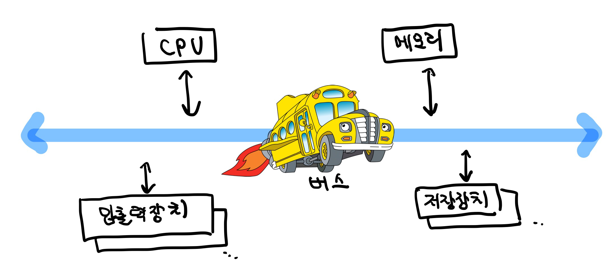
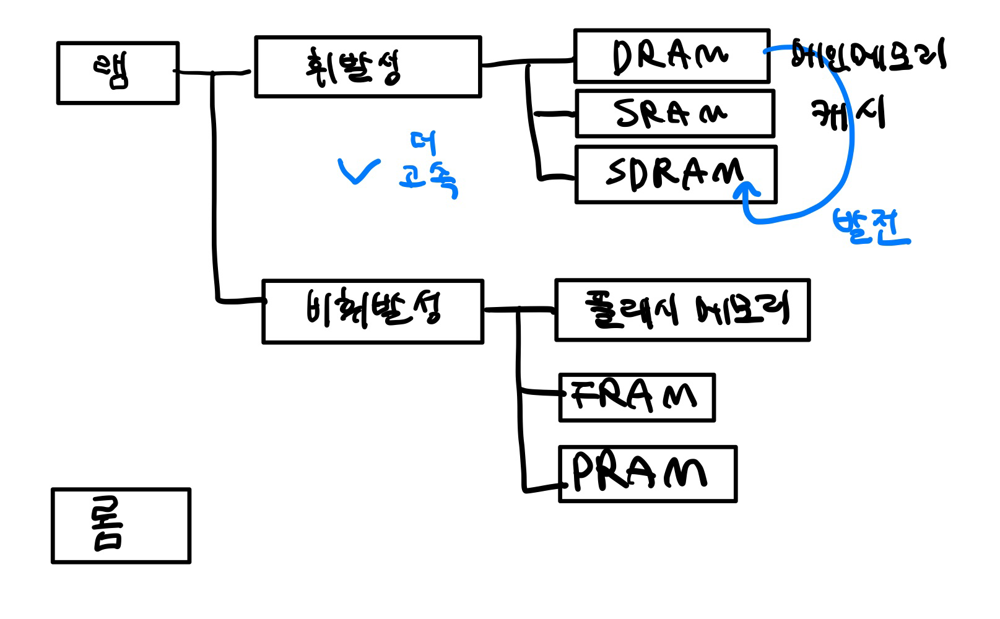
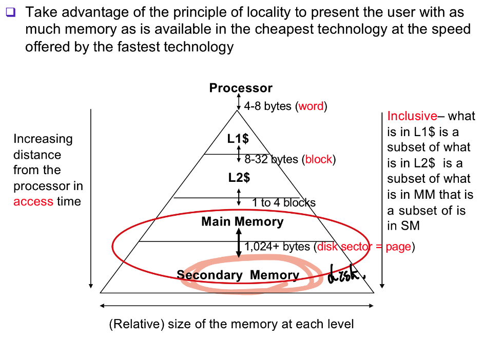

> ## Table of Contents
>
> - [💿 메모리](#-메모리)
>   * [📌 하드웨어의 구성](#-하드웨어의-구성)
>     + [폰노이만 구조 `Von Neumann architecture`](#폰노이만-구조-von-neumann-architecture)
>     + [메모리의 종류](#메모리의-종류)
>   * [📌 메모리 보호](#-메모리-보호)
>   * [📌 MMU: Memory Management Unit](#-mmu-memory-management-unitt)
>     + [TLB: Translation-Lookaside Buffer](#tlb-translation-lookaside-buffer)
>   * [📌 요구 페이징: demand paging](#-요구-페이징-demand-paging)
>     + [page fault: 페이지 부재](#page-fault-페이지-부재)
>     + [page replacement: 페이지 교체](#page-replacement-페이지-교체)
>     + [Dirty bit](#dirty-bit)
>   * [📌 캐시](#-캐시)
>     + [참고: 버스](#참고-버스)
>     + [데이터 가져오기](#데이터-가져오기)
>     + [Caching line: 어떤 데이터가 cache에 있는 지 어떻게 알까요? 그리고 그걸 안다면 어떻게 찾을까요?](#caching-line-어떤-데이터가-cache에-있는-지-어떻게-알까요-그리고-그걸-안다면-어떻게-찾을까요)
>     + [데이터 쓰기](#데이터-쓰기)
>     + [데이터 지역성(Locality), 메모리 지역성](#데이터-지역성locality-메모리-지역성)
>     + [Memory Hierarchy](#memory-hierarchy)
>

----------------------

# 💿 메모리

## 📌 하드웨어의 구성

| 필수 장치                     | 주변 장치                    |
| ----------------------------- | ---------------------------- |
| 중앙처리장치(CPU), 메인메모리 | 입력장치, 출력장치, 저장장치 |

컴퓨터는 중앙처리장치(CPU), 메인메모리, 입력장치, 출력장치, 저장장치로 구성됩니다. 이 때, 컴퓨터로 하는 작업은 <u>**CPU와 메인메모리**</u>의 협업으로 이루어지기 때문에 둘은 `필수 장치`로 분류되고, 나머지는 `주변 장치`로 불립니다.

<u>**메인메모리는 전력이 끊기면 데이터를 잃어버리기 때문에**</u> 데이터를 영구히 보관하려면 하드디스크나 USB 메모리를 사용해야 합니다. 그래서 메인메모리를 제1저장장치, 하드디스크나 USB 메모리 같은 메모리를 제2저장장치, 또는 보조저장장치라고 부른다. 지금부터는 `메인메모리`를 간단히 `메모리`라고 부르고, 보조저장장치를 저장장치라고 하고 설명하겠습니다.

### 폰노이만 구조 `Von Neumann architecture`

오늘날의 컴퓨터는 대부분 폰노이만 구조를 따릅니다. 폰노이만 구조란 그럼 뭘까요?

CPU, 메모리, 입출력장치, 저장장치가 버스로 연결되어 있는 구조를 말합니다.

폰노이만 구조 이전 컴퓨터는 전선을 연결하여 회로를 구성하는 형태였기 때문에 다른 용도로 사용하려면 전선의 연결을 바꿔야 했습니다. 이런 문제를 해결하기 위해 미국의 수학자 존 폰노이만(John von Neumann)은 <u>**메모리를 이용하여 프로그래밍이 가능한 컴퓨터 구조**</u>를 제안했습니다. 즉 이전처럼 하드웨어를 변경하는 것이 아니고, <u>**하드웨어를 그대로 두고 작업을 위한 프로그램만 교체하여 메모리에 올리는 방식**</u>을 제안했습니다.

폰노이만 구조에서 **가장 중요한 특징은 모든 프로그램은 메모리에 올라와야 실행할 수 있다**는 점입니다.

- 따라서 저장장치에 있는 프로그램 역시 실행을 위해선 메모리에 올라와야 하고, 운영체제도 프로그램이므로 메모리에 올라와야 한다.

### 메모리의 종류

메모리에서 데이터를 읽거나 쓸 때는 <u>**워드 단위**</u>로 움직입니다. 버스가 대역폭이 워드 단위기 때문에, 굳이 1bit씩 데이터를 옮길 필요가 없기 때문입니다.

- RAM: Random Access Memory. 읽거나 쓸 수 있습니다.

- ### 휘발성 메모리: 전력이 끊기면 데이터가 사라집니다.

  - DRAM: Dynamic RAM. 동적 램
    - 일정 시간마다 다시 재생시켜야 데이터 유지
  - SRAM: Static RAM. 정적 램
    - 전력이 공급되는 동안에는 데이터 계속 보관 가능
    - 따라서 <u>**계속 재생 시킬 필요가 없어서 속도는 빠르지만 가격이 비쌈.**</u>
  - 메인메모리를 비휘발성 메모리로 만들면 전력이 끊겨도 내용이 유지되니까 편하지 않을까? 라는 생각을 할 수도 있지만, 비휘발성 메모리는 전력이 끊겨도 데이터를 보관해야 하므로 메모리 내부가 복잡하고 속도가 느리며 가격이 비쌉니다.

## 📌 메모리 보호

메모리는 운영체제 영역과 사용자 영역으로 나눠집니다. 현대 운영체제는 여러 프로그램이 <u>**동시에 실행**</u>됩니다. 따라서 메모리에 사용자 영역은 여러 작업 공간으로 나눠집니다. `서로 공간이 침범하지 않게 메모리를 보호`하는 것이 중요한 문제입니다. 

하지만 운영체제도 소프트웨어입니다. 어떤 작업이 다른 공간을 침범하는 지 운영체제가 계속해서 감시할 수가 없습니다. 그렇다면 <u>**하드웨어**</u>가 어떤 작업이 알맞은 영역 안에서만 이루어지는 지 대신 확인해줘야 합니다.

따라서 메모리 보호를 위해, CPU는 현재 진행 중인 작업의 메모리 시작 주소를 경계 레지스터(bound, base register)에 저장하고, 현재 작업이 차지하고 있는 메모리 크기를 한계 레지스터(limit register)에 저장합니다. 그리고 `해당 작업이 데이터를 읽거나 쓸 때마다 범위 안에서 일어나는 지를 검사`합니다. ( base <= x < base + limit)

만약 값을 벗어난다면 `트랩`(소프트웨어 인터럽트)을 발생합니다. 트랩이 발생하면 CPU는 운영체제를 깨우고, `운영체제가 처리`를 합니다. 메모리 영역을 벗어나서 발생한 인터럽트일 경우 운영체제가 프로그램을 강제 종료시킵니다.

## 📌 MMU: Memory Management Unit 

CPU의 일부로, physical 메모리와 virtual 메모리 사이의 주소 변환 역할을 합니다. 그 외에도 메모리 보호나 캐시 관리 등 메모리 접근하는 것을 모두 관리해주는 하드웨어입니다.

### TLB: Translation-Lookaside Buffer

이 때 MMU엔 TLB라는 부분이 있습니다. 매번 메모리에 있는 페이지 테이블에 접근하지 않아도 되도록 페이지 테이블을 캐싱해서 TLB로 접근합니다.

## 📌 요구 페이징: demand paging

메모리의 크기는 한계가 있으므로, 프로그램 시작 시에 프로그램 전체를 디스크 -> physical 메모리로 적재하지 않고, 프로세스 중 필요한 부분만 메모리에 올려 실행합니다. 나머지 부분은 `실행 과정에서 필요할 때 메모리`로 불러옵니다. 실제로 필요할 때 가져오기 때문에, <u>**한 번도 접근되지 않은 페이지는 물리 메모리에 적재되지 않습니다.**</u>

- 진짜 요청할 때만 페이지를 가져오는 `pure demand paging`과 달리 `Pre-Paging`이 있습니다. 요구하지 않아도 OS가 미리 쓸 것 같은 페이지를 메모리로 가져오는 것입니다.
  - 이렇게 미리 가져오는 방식의 대표적인 경우는 캐시입니다. 캐시는 앞으로 필요할 것이라고 예상되는 부분을 메모리에서 캐시로 가져다놓으면서 성능을 향상시킵니다. 하지만 미리 가져온 데이터가 쓸모가 없을 경우 피해가 큽니다. 따라서 현대의 `운영체제는 요구페이징을 기본으로 사용`합니다.

### page fault: 페이지 부재

가상 메모리 시스템에서 사용자의 프로세스는 물리 메모리, 스왑 영역 중 한 곳에 있습니다. 이 때 스왑 영역에는 아직 물리 메모리에 올린 적이 없거나, 메모리가 꽉 차서 스왑 영역으로 옮겨진 페이지가 있습니다. 프로세스가 페이지를 요청했을  때, <u>**해당 페이지가 현재 메모리에 없어서 page fault(페이지 부재)**</u>가 발생하게 되면 OS의 page fault handler가 해당 페이지를 스왑 영역에서 가져오게 됩니다. 이 때 스왑 영역에서 물리 메모리로 데이터를 가져오는 것을 swap-in,메모리에서 스왑 영역으로 내보내는 것을 swap-out이라고 합니다.

이 때 프로세스가 요청한 페이지가 어디 있는지 어떻게 알까요? `Page Table`에 PTE의 유효 비트를 통해 알 수 있습니다.

- 유효 비트(valid bit)

  유효 비트는 페이지가 실제 메모리에 있는지를 나타내는 비트입니다. 1일 경우 현재 메모리에 있다는 의미로, `Present bit`라고도 합니다.

- 동작 과정

  - 찾으려는 페이지가 TLB에 없을 시 TLB miss

     - TLB miss인데 Page table에는 Present bit가 1

        - 현재 메모리에 있다는 뜻 -> TLB에 넣습니다.
        - 그리고 다시 접근

     - TLB miss고 Page table에도 없음

        - 현재 메모리에 없다는 뜻 -> `Page Fault` Exception 발생

          > CISC의 경우 TLB miss를 하드웨어가 관리
          >
          > RISC의 경우 소프트웨어가 관리: TLB miss시 하드웨어가 직접 처리하는 게 아니고 exception을 내서 OS가 처리하도록 함 

          - 해당 페이지 위치를 스왑 영역에서 찾는다.
        
          - 만약 메모리에 빈 프레임이 있을 경우 메모리에서 비어 있는 프레임을 할당 받고 그 공간에 페이지를 읽어옵니다.
          - 빈 프레임이 없을 경우 replace algorithm을 실행시켜서 메모리에 있는 페이지를 swap 공간으로 내보내고 페이지를 읽어와야 합니다.
        
        - 그리고 다시 접근
  
  > ### 🧑‍🏫 그렇다면 페이지가 현재 메모리에 없을 때, 맨 처음 TLB miss일 때부터 TLB hit일 때까지의 과정은 어떻게 될까요?

### page replacement: 페이지 교체 

page fault가 발생했는데 만약 메모리에 빈 프레임이 없다면, 메모리에 있는 프레임 중 하나를 스왑 영역으로 내보내야 페이지를 가져올 수 있습니다. 이 때 어떤 페이지를 내보낼 지 결정하는 알고리즘을 page replacement algorithm(policy), 페이지 교체 알고리즘이라고 합니다.

> **프레임은 물리 메모리를** 일정한 크기로 나눈 블록이고, **페이지는 가상 메모리를** 일정한 크기로 나눈 블록

- ### Page-Replacement Policy

  - 단순하게 FIFO로 맨 처음 올라온 페이지를 내보내는 방법이 있습니다.

  - 사용 빈도가 낮은 것(Least-Frequently-Used, LFU) 혹은 가장 최근 사용 안된 것(Least-Recently Used, LRU)을 내보내는 방법이 있습니다. 하지만 페이지마다 history를 저장해야하는 historical 알고리즘들은 정확히 구현하는 것이 어렵습니다.

  - `Approximating LRU`

    따라서 정확히 구현은 못하더라도, 비슷하게 구현하는 방법이 있습니다.
  
    - `use/reference bit`
      - 참조할 때마다 비트를 1로 세팅, 주기적으로 다 0으로 초기화. 0이면 페이지 교체
    - Clock algorithm
      - 단순한 reference bit을 이용하는 방법에서 발전시킨 방법입니다.
      - 하드웨어의 지원이 필요합니다.
      - 원형 큐를 이용해서 페이지를 관리합니다. 그리고 가장 오래된 페이지를 가리키고 있습니다. 만약 page fault가 발생했는데 빈 프레임이 없다면, 가리키고 있던 페이지의 reference bit를 검사합니다. 만약 reference bit가 0이라면 해당 페이지를 교체합니다. reference bit가 1이라면 0으로 지운 후에 다음 페이지를 가리킵니다. 이 과정을 페이지가 교체될 때까지 반복합니다.

- ### Dirty bit

  - swap out 시에, 해당 페이지에 dirty bit가 1이라면 해당 메모리 영역에 뭔가 쓰인 것이다. 따라서 변경된 내용을 디스크에 저장해야 한다.

## 📌 캐시

캐시는 메모리와 CPU 간 속도 차이를 완화하기 위해 메모리의 데이터를 미리 가져와서 저장해두는 임시 장소입니다. CPU가 앞으로 사용할 것으로 예상되는 데이터를 미리 가져다놓습니다.

캐시는 CPU 안에 있기 때문에 CPU 내부 버스의 속도로 작동합니다. 반면 메모리는 시스템 버스의 속도로 작동하므로 느립니다. 

> ### 참고: 버스
>
> 
>
> - 내부 버스: CPU 내부의 신호. CPU 내 레지스터 연결
>
> - 외부 버스
>
>   - 구조 상 구분할 경우: 시스템 버스(데이터, 주소, 제어 버스), I/O 버스
>
>   - 신호 기능 구분: 데이터 버스, 주소 버스, 제어 버스
>
>     
>
>     - 데이터 버스
>       - CPU와 기타 장치 사이 데이터를 전달하는 통로.
>       - 데이터를 주고받으므로 <u>**양방향**</u>
>       - 기억장치, I/O 장치의 데이터를 CPU로 보내거나 연산 결과를 CPU에서 메모리, I/O로 보내거나…
>     - 주소 버스
>       - CPU가 메모리나 I/O 장치로 주소를 전달하는 통로. 데이터가 어디로 갈 지 주소를 지정해줘야 한다. 주소를 지정해주기만 하면 되므로 CPU → 다른 장치로의 <u>**단방향**</u>
>     - 제어 버스
>       - 데이터 버스, 주소 버스를 제어하기 위해 <u>**제어 신호**</u>를 전송하는 통로

### 데이터 가져오기

캐시는 메모리의 내용 중 일부를 미리 가져옵니다. CPU는 메모리에 접근해야 할 때 바로 메모리를 접근하는 것이 아니고, 캐시를 먼저 방문하여 원하는 데이터가 있는지 찾아봅니다. 이 때 원하는 데이터를 찾았다면 `캐시 히트`라고 하고, 데이터를 바로 사용합니다. 하지만 원하는 데이터가 없으면 메모리로 가서 데이터를 찾습니다. 이 때는 `캐시 미스`라고 합니다. 이 때 전체 캐시 히트 + 미스 경우 중 캐시 히트가 되는 비율을 `캐시 적중률`이라고 하는데, 일반적으로 컴퓨터의 캐시 적중률은 약 90%입니다.

###  Caching line: 어떤 데이터가 cache에 있는 지 어떻게 알까요? 그리고 그걸 안다면 어떻게 찾을까요?

캐시를 메모리와 1:1 매칭시킬 순 없습니다. 캐시가 더 작기 때문입니다. 그렇다면 메모리에 원하는 데이터가 캐시의 어느 위치에 있는지 알 방법이 필요합니다. 캐시의 목적이 뭐였을까요? 프로세서 가까이에 있으면서 자주 사용하는 데이터를 빠르게 접근하기 위한 것입니다. 그런데 그 캐시 안에서 데이터가 어디 있는 지 몰라서 모든 데이터를 찾아야 한다면 오래 걸리게 됩니다.

따라서 캐시에 데이터를 저장할 때 특정 자료구조를 사용하여 묶음으로 저장하게 됩니다. 이를 캐싱 라인이라고 합니다.

캐싱 라인엔 다음과 같은 매핑 방법이 있습니다.

1. Direct Mapping

   - 메인 메모리를 일정한 크기의 블록으로 나누어 각각의 블록을 캐시의 <u>**정해진 위치에 매핑**</u>하는 방식입니다.

   - 한 메모리 블럭이 캐시의 한 블럭에 매핑되므로 빠르게 찾을 수 있지만, 메인 메모리가 더 크므로 캐시 블럭을 공유하게 될 것입니다. 따라서 여러 데이터가 메모리의 동일한 위치에 저장되길 원하므로 miss rate가 증가할 수 있습니다.
   - 따라서 해당하는 캐시 블럭에 접근한 다음, valid한지, Tag가 같은 지 보고 맞으면 Hit, 아니면 Miss
   - 블럭을 키우면 miss rate를 줄일 수 있다. 하지만 block이 커질수록 block 개수가 적어지고 같은 캐시 블럭을 공유하는 경쟁자가 많아져서 또 miss rate가 증가할 수 있다. 또한 cache block을 읽어올 때 더 많이 읽어와야하므로 miss penalty가 커질 수 있다.

2. Fully Associative Mapping

   - 전체 랜덤 액세스로, 모두 비교기가 필요하게 됩니다.
   - Hit rate가 높아지겠지만, 하드웨어 설계가 복잡하고, 전력을 많이 소비합니다.

3. Set Associative Mapping

   - Direct mapping + Fully Associative mapping을 합친 방식입니다.
   - Direct Mapping처럼 특정 공간이 정해져있지만, 한 위치가 아니고 한 Set이 정해져있습니다. 그리고 그 Set 안에서는 랜덤으로 저장합니다.
   - Direct에 비해 검색 속도는 느리지만 (Set 안에 어디인지 찾아야함) miss rate를 줄일 수 있고, Fully에 비해 miss rate가 증가하겠지만 하드웨어가 더 간단하고 전력 소비를 줄일 수 있습니다.

### 데이터 쓰기

만약 캐시에 있는 데이터가 변경되는 경우, 캐시는 메모리의 복사본일 뿐이므로 캐시에 있는 데이터가 변경되면 메모리에 있는 데이터도 변경해야 합니다. 이 때 두 가지 방식이 있습니다.

- 즉시 쓰기(write through)

  캐시에 있는 데이터가 변경되면 즉시 메모리에 반영합니다. 메모리와의 빈번한 데이터 전송으로 성능이 느려집니다.

- 지연 쓰기(write back, copy back)

  변경된 내용을 모아서 주기적으로 반영한다. 메모리와 캐시의 데이터 전송 횟수가 줄어들어서 성능을 향상시킬 수도 있지만 데이터 사이의 불일치가 발생할 수 있다는 것이 단점이다.

### 데이터 지역성(Locality), 메모리 지역성

캐시 적중률이 높아야 컴퓨터의 성능이 좋아질 것입니다. 어떻게 하면 적중률을 높일 수 있을까요? CPU가 앞으로 찾을 데이터를 최대한 가져와야할 것입니다. 이 때 `지역성의 원리`가 사용됩니다. 프로그램은 데이터 지역성을 가지고 있습니다. 모든 코드를 다 균등하게 접근하는 것이 아니고, 어느 한 순간에 <u>**특정 부분을 집중적으로 참조**</u>하는 것입니다.

데이터 지역성은 크게 두 가지 지역성으로 나뉩니다.

1. 시간 지역성(temporal locality): <u>**최근**</u>에 참조한 주소의 내용은 곧 다음에 다시 참조됨
   - 최근에 접근한 건 프로세서 가까이에 두자.
2. 공간 지역성(spartial locality): 참조된 주소와 <u>**인접**</u>한 주소의 내용이 다시 참조됨
   - 프로세서 가까이로 가져올 때 근처 값도 같이 가져오자 → block 단위로 가져옵니다.

### Memory Hierarchy

빠른 저장장치는 비쌉니다. 따라서 가격과 성능의 타협점으로 메모리 계층 구조가 존재합니다.

- ### Multi level Caches

  - CPU에서 가장 가까운 것부터 먼 순서로 L1, L2, L3로 나누어 캐시를 구성하고 그 다음 main memory. 빠를 수록 비싸므로 용량에 제한이 있습니다.

  - L1 접근해서 찾고 없으면 L2, 없으면 … 그 다음 없으면 메인 메모리에 접근합니다.
