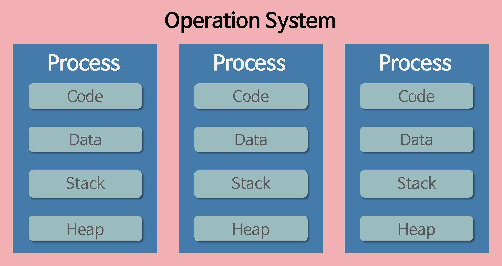
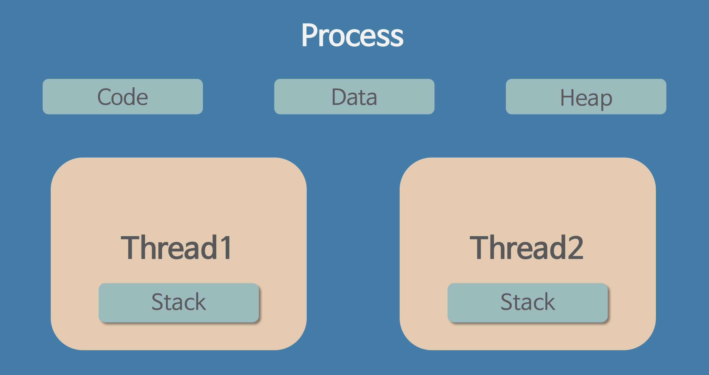

# 프로세스 vs 스레드

## 프로세스

- 실행 중인 프로그램으로 디스크로부터 메모리에 적재되어 CPU의 할당을 받은 작업의 단위다.
- 운영체제로부터 시스템 자원을 할당받는다.

- 할당받는 시스템 자원
  - CPU 시간
  - 운영되기 위한 주소 공간
  - Code, Data, Stack, Heap의 구조로 되어있는 독립된 메모리 영역.

- 기본적으로 프로세스마다 최소 1개의 스레드를 갖는다.(메인 스레드)
- 프로세스는 각각 별도의 메모리 영역(주소 공간)을 할당받는다.  [Code, Data, Stack, Heap]
- 한 프로세스는 다른 프로세스의 변수나 자료구조에 접근할 수 없으며, 접근을 위해서는 IPC 통신이 필요하다.
  - Ex) 파이프, 파일, 소켓 등을 이용한 통신 방법 이용.

## 프로세스 제어 블록(Process Control Block, PCB)

- 특정 프로세스에 대한 중요한 정보를 저장하고 있는 **커널 내의 자료구조**이다.
- OS는 프로세스를 관리하기 위해 프로세스의 생성과 동시에 고유한 PCB를 생성한다.
- 프로세스는 CPU를 할당받아 작업을 처리하다가 프로세스 전환이 발생하면 진행하던 작업을 저장하고 CPU를 반환해야 한다. 이때 작업의 진행 상황을 모두 PCB에 저장한다. 그리고 다시 CPU를 할당받게 되면 PCB에 저장되었던 내용을 불러와 종료되었던 시점부터 다시 작업을 수행한다.

- PCB에 저장되는 정보
  - 프로세스 식별자(Process ID, PID) : 프로세스 식별 번호
  - 프로세스 상태 : new, ready, running, waiting, terminated 등의 상태를 저장
  - 프로그램 카운터(Program Counter, PC) : 프로세스가 다음에 실행할 명령어의 주소를 가리킨다.
  - CPU 레지스터
  - CPU 스케줄링 정보 : 프로세스의 우선순위, 스케줄 큐에 대한 포인터 등
  - 메모리 관리 정보 : 페이지 테이블 또는 세그먼트 테이블 등과 같은 정보를 포함한다.
  - 입출력 상태 정보 : 프로세스에 할당된 입출력 장치들과 열린 파일 목록
  - 어카운팅 정보 : 사용된 CPU 시간, 시간 제한, 계정 번호 등

## 스레드(Thread)

- 프로세스의 실행 단위라고 할 수 있으며, 한 프로세스 내에서 동작되는 여러 실행 흐름으로 프로세스 내의 주소 공간이나 자원을 공유할 수 있다.

- 스레드는 프로세스 내의 Code, Data, Heap 영역은 다른 스레드와 공유하고 Stack 영역을 따로 할당받는다.
- 여러 스레드는 한 프로세스 내의 Code, Data, Heap 영역을 공유하지만, 프로세스 간에는 메모리에 접근할 수 없다.
- 스레드는 별도의 레지스터와 스택을 갖고 있으며, 다른 영역을 공유한다. 따라서 한 스레드가 프로세스의 자원을 변경하면, 다른 스레드도 그 변경 결과를 즉시 확인할 수 있다.

## 예상 질문

스택을 스레드마다 독립적으로 할당하는 이유는 뭘까?

멀티 프로세스 와 멀티 스레드의 장단점을 알려주세요

Thread-safe한 조건에는 무엇이 있을까요?
